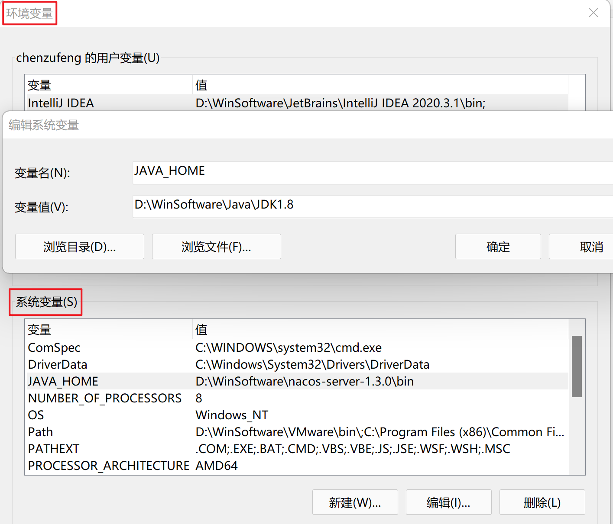

# Nacos 简介

Nacos 致力于帮助用户==发现==、==配置==和==管理==微服务。Nacos 提供了一组简单易用的特性集，帮助用户快速实现动态服务发现、服务配置、服务元数据及流量管理。

Nacos 具有如下特性:

- 服务发现和服务健康监测

    支持基于 DNS 和基于 RPC 的服务发现，支持对服务的实时的健康检查，阻止向不健康的主机或服务实例发送请求；

- 动态配置服务

    动态配置服务可以让用户以中心化、外部化和动态化的方式管理所有环境的应用配置和服务配置；

- 动态 DNS 服务

    动态 DNS 服务支持权重路由，让用户更容易地实现中间层负载均衡、更灵活的路由策略、流量控制以及数据中心内网的简单 DNS 解析服务；

- 服务及其元数据管理

    支持从微服务平台建设的视角，管理数据中心的所有服务及元数据。

# 环境搭建

## Win10 安装与运行 Nacos

- 下载：[https://github.com/alibaba/nacos/releases/tag/1.3.0](https://github.com/alibaba/nacos/releases/tag/1.3.0)

- 配置环境变量

    ```markdown
    D:\Winsoftware\Nacos1.3\bin>startup.cmd -m standalone
    Please set the JAVA_HOME variable in your environment, We need java(x64)! jdk8 or later is better!
    ```

    

    

- cmd 切换到 bin 目录下，启动 Nacos：执行`startup.cmd -m standalone`或者双击`startup.cmd`运行文件

- 访问 Nacos 的 web 服务管理界面：`http://localhost:8848/nacos`，用户名和密码都是 `nacos` 。


## 创建工程

创建全局父项目、维护 Spring Cloud、Alibaba、SpringBoot 父项目依赖。

- 创建 Empty Project；

- 创建 Maven 项目：`File`$$\rightarrow$$`New`$$\rightarrow$$`Module`

    ```xml
    <!--parent-->
    <parent>
        <groupId>org.springframework.boot</groupId>
        <artifactId>spring-boot-starter-parent</artifactId>
        <version>2.2.5.RELEASE</version>
    </parent>
    
    <properties>
        <spring.cloud.version>Hoxton.SR8</spring.cloud.version>
        <spring.cloud.alibaba.version>2.2.1.RELEASE</spring.cloud.alibaba.version>
    </properties>
    
    <!--维护SpringCloud & Alibaba-->
    <dependencyManagement>
        <dependencies>
            <!--SpringCloud-->
            <dependency>
                <groupId>org.springframework.cloud</groupId>
                <artifactId>spring-cloud-dependencies</artifactId>
                <version>${spring.cloud.version}</version>
                <type>pom</type>
                <scope>import</scope>
            </dependency>
            <!--Alibaba-->
            <dependency>
                <groupId>com.alibaba.cloud</groupId>
                <artifactId>spring-cloud-alibaba-dependencies</artifactId>
                <version>${spring.cloud.alibaba.version}</version>
                <type>pom</type>
                <scope>import</scope>
            </dependency>
    
        </dependencies>
    </dependencyManagement>
    ```

# 使用 Nacos 作为注册中心

## 创建 nacos-user-service 模块

### 创建 maven 项目、添加依赖

```xml
<dependencies>
    <dependency>
        <groupId>com.alibaba.cloud</groupId>
        <artifactId>spring-cloud-starter-alibaba-nacos-discovery</artifactId>
    </dependency>

    <dependency>
        <groupId>org.springframework.boot</groupId>
        <artifactId>spring-boot-starter-web</artifactId>
    </dependency>

    <dependency>
        <groupId>org.projectlombok</groupId>
        <artifactId>lombok</artifactId>
    </dependency>
</dependencies>
```

### 创建启动类、添加配置

#### 启动类

```java
package com.example;

import org.springframework.boot.SpringApplication;
import org.springframework.boot.autoconfigure.SpringBootApplication;
import org.springframework.cloud.client.discovery.EnableDiscoveryClient;

@EnableDiscoveryClient
@SpringBootApplication
public class NacosUserServiceApplication {
    public static void main(String[] args) {
        SpringApplication.run(NacosUserServiceApplication.class, args);
    }
}
```

#### 配置文件

```yaml
server:
  port: 8080

spring:
  application:
    name: nacos-user-service
  cloud:
    nacos:
      discovery:
        server-addr: localhost:8848 # 配置 Nacos 地址

management:
  endpoints:
    web:
      exposure:
        include: "*"
```

### 创建实体类

#### User

```java
package com.example.entity;

import lombok.AllArgsConstructor;
import lombok.Data;
import lombok.NoArgsConstructor;

@Data
@AllArgsConstructor
@NoArgsConstructor
public class User {
    private Long id;
    private String userName;
    private String password;
}
```


#### CommonResult

```java
package com.example.entity;

public class CommonResult<T> {
    private T data;
    private String message;
    private Integer code;
    
    public CommonResult() {}

    public CommonResult(T data, String message, Integer code) {
        this.data = data;
        this.message = message;
        this.code = code;
    }
    
    public CommonResult(String message, Integer code) {
        this(null, message,code);
    }
    
    public CommonResult(T data) {
        this(data, "操作成功", 200);
    }

    public T getData() {
        return data;
    }

    public void setData(T data) {
        this.data = data;
    }

    public String getMessage() {
        return message;
    }

    public void setMessage(String message) {
        this.message = message;
    }

    public Integer getCode() {
        return code;
    }

    public void setCode(Integer code) {
        this.code = code;
    }
}
```

### 创建 service

#### UserService 接口

```java
package com.example.service;

import com.example.entity.User;

import java.util.List;

public interface UserService {
    void create(User user);
    
    User getUser(Long id);
    
    void update(User user);
    
    void delete(Long id);
    
    User getByUserName(String userName);
    
    List<User> getUserByIds(List<Long> ids);
}
```


#### UserServiceImpl

添加`@Service`注解：

```java
package com.example.service;

import com.example.entity.User;
import org.springframework.stereotype.Service;
import org.springframework.util.CollectionUtils;

import javax.annotation.PostConstruct;
import java.util.ArrayList;
import java.util.List;
import java.util.stream.Collectors;

@Service
public class UserServiceImpl implements UserService {

    private List<User> userList;

    @PostConstruct
    public void initData() {
        userList = new ArrayList<>();
        userList.add(new User(1L, "chen", "123"));
        userList.add(new User(2L, "zufeng", "456"));
    }

    @Override
    public void create(User user) {
        userList.add(user);
    }

    @Override
    public User getUser(Long id) {
        List<User> userListFond = userList.stream().filter(userItem -> userItem.getId().equals(id)).collect(Collectors.toList());
        if (!CollectionUtils.isEmpty(userListFond)) {
            return userListFond.get(0);
        }
        return null;
    }

    @Override
    public void update(User user) {
        userList.stream().filter(userItem -> userItem.getId().equals(userItem.getId())).forEach(userItem -> {
            userItem.setUserName(user.getUserName());
            userItem.setPassword(user.getPassword());
        });
    }

    @Override
    public void delete(Long id) {
        User user = getUser(id);
        if (user != null) {
            userList.remove(user);
        }
    }

    @Override
    public User getByUserName(String userName) {
        List<User> userListFond = userList.stream().filter(userItem -> userItem.getUserName().equals(userName)).collect(Collectors.toList());
        if (!CollectionUtils.isEmpty(userListFond)) {
            return userListFond.get(0);
        }
        return null;
    }

    @Override
    public List<User> getUserByIds(List<Long> ids) {
        return userList.stream().filter(userItem -> ids.contains(userItem.getId())).collect(Collectors.toList());
    }
}
```

### 创建 controller

```java
package com.example.controller;

import com.example.entity.CommonResult;
import com.example.entity.User;
import com.example.service.UserService;
import lombok.extern.slf4j.Slf4j;
import org.springframework.beans.factory.annotation.Autowired;
import org.springframework.web.bind.annotation.*;

import java.util.List;

@RestController
@RequestMapping("/user")
@Slf4j
public class UserController {

    @Autowired
    private UserService userService;

    @PostMapping("/create")
    public CommonResult create(@RequestBody User user) {
        userService.create(user);
        return new CommonResult("操作成功", 200);
    }

    @GetMapping("/{id}")
    public CommonResult<User> getUser(@PathVariable Long id) {
        User user = userService.getUser(id);
        log.info("根据id获取用户信息，用户名为{}", user.getUserName());
        return new CommonResult<>(user);
    }

    @GetMapping("/getUserByIds")
    public CommonResult<List<User>> getUserByIds(@RequestParam List<Long> ids) {
        List<User> userList = userService.getUserByIds(ids);
        log.info("根据ids获取用户信息，用户列表为{}", userList);
        return new CommonResult<>(userList);
    }

    @GetMapping("/getByUserName")
    public CommonResult<User> getByUserName(@RequestParam String userName) {
        User user = userService.getByUserName(userName);
        return new CommonResult<>("操作成功", 200);
    }
    
    @PostMapping("/update")
    public CommonResult update(@RequestBody User user) {
        userService.update(user);
        return new CommonResult("操作成功", 200);
    }
    
    @PostMapping("/delete/{id}")
    public CommonResult delete(@PathVariable Long id) {
        userService.delete(id);
        return new CommonResult("操作成功", 200);
    }
}
```


## 创建 nacos-ribbon-service 模块（待更新）


### 创建 maven 项目、添加依赖

```xml
<dependencies>
    <dependency>
        <groupId>com.alibaba.cloud</groupId>
        <artifactId>spring-cloud-starter-alibaba-nacos-discovery</artifactId>
    </dependency>

    <dependency>
        <groupId>org.springframework.boot</groupId>
        <artifactId>spring-boot-starter-web</artifactId>
    </dependency>

    <dependency>
        <groupId>org.projectlombok</groupId>
        <artifactId>lombok</artifactId>
    </dependency>
</dependencies>
```

### 创建启动类、添加配置

#### 启动类

```java
package com.example;

import org.springframework.boot.SpringApplication;
import org.springframework.boot.autoconfigure.SpringBootApplication;
import org.springframework.cloud.client.discovery.EnableDiscoveryClient;

@EnableDiscoveryClient
@SpringBootApplication
public class NacosUserServiceApplication {
    public static void main(String[] args) {
        SpringApplication.run(NacosUserServiceApplication.class, args);
    }
}
```

#### 配置文件

```yaml
server:
  port: 8080

spring:
  application:
    name: nacos-user-service
  cloud:
    nacos:
      discovery:
        server-addr: localhost:8848 # 配置 Nacos 地址

management:
  endpoints:
    web:
      exposure:
        include: "*"
```

### 创建实体类

#### User

```java
package com.example.entity;

import lombok.AllArgsConstructor;
import lombok.Data;
import lombok.NoArgsConstructor;

@Data
@AllArgsConstructor
@NoArgsConstructor
public class User {
    private Long id;
    private String userName;
    private String password;
}
```


#### CommonResult

```java
package com.example.entity;

public class CommonResult<T> {
    private T data;
    private String message;
    private Integer code;
    
    public CommonResult() {}

    public CommonResult(T data, String message, Integer code) {
        this.data = data;
        this.message = message;
        this.code = code;
    }
    
    public CommonResult(String message, Integer code) {
        this(null, message,code);
    }
    
    public CommonResult(T data) {
        this(data, "操作成功", 200);
    }

    public T getData() {
        return data;
    }

    public void setData(T data) {
        this.data = data;
    }

    public String getMessage() {
        return message;
    }

    public void setMessage(String message) {
        this.message = message;
    }

    public Integer getCode() {
        return code;
    }

    public void setCode(Integer code) {
        this.code = code;
    }
}
```

### 创建 service

#### UserService 接口

```java
package com.example.service;

import com.example.entity.User;

import java.util.List;

public interface UserService {
    void create(User user);
    
    User getUser(Long id);
    
    void update(User user);
    
    void delete(Long id);
    
    User getByUserName(String userName);
    
    List<User> getUserByIds(List<Long> ids);
}
```


#### UserServiceImpl

添加`@Service`注解：

```java
package com.example.service;

import com.example.entity.User;
import org.springframework.stereotype.Service;
import org.springframework.util.CollectionUtils;

import javax.annotation.PostConstruct;
import java.util.ArrayList;
import java.util.List;
import java.util.stream.Collectors;

@Service
public class UserServiceImpl implements UserService {

    private List<User> userList;

    @PostConstruct
    public void initData() {
        userList = new ArrayList<>();
        userList.add(new User(1L, "chen", "123"));
        userList.add(new User(2L, "zufeng", "456"));
    }

    @Override
    public void create(User user) {
        userList.add(user);
    }

    @Override
    public User getUser(Long id) {
        List<User> userListFond = userList.stream().filter(userItem -> userItem.getId().equals(id)).collect(Collectors.toList());
        if (!CollectionUtils.isEmpty(userListFond)) {
            return userListFond.get(0);
        }
        return null;
    }

    @Override
    public void update(User user) {
        userList.stream().filter(userItem -> userItem.getId().equals(userItem.getId())).forEach(userItem -> {
            userItem.setUserName(user.getUserName());
            userItem.setPassword(user.getPassword());
        });
    }

    @Override
    public void delete(Long id) {
        User user = getUser(id);
        if (user != null) {
            userList.remove(user);
        }
    }

    @Override
    public User getByUserName(String userName) {
        List<User> userListFond = userList.stream().filter(userItem -> userItem.getUserName().equals(userName)).collect(Collectors.toList());
        if (!CollectionUtils.isEmpty(userListFond)) {
            return userListFond.get(0);
        }
        return null;
    }

    @Override
    public List<User> getUserByIds(List<Long> ids) {
        return userList.stream().filter(userItem -> ids.contains(userItem.getId())).collect(Collectors.toList());
    }
}
```

### 创建 controller

```java
package com.example.controller;

import com.example.entity.CommonResult;
import com.example.entity.User;
import com.example.service.UserService;
import lombok.extern.slf4j.Slf4j;
import org.springframework.beans.factory.annotation.Autowired;
import org.springframework.web.bind.annotation.*;

import java.util.List;

@RestController
@RequestMapping("/user")
@Slf4j
public class UserController {

    @Autowired
    private UserService userService;

    @PostMapping("/create")
    public CommonResult create(@RequestBody User user) {
        userService.create(user);
        return new CommonResult("操作成功", 200);
    }

    @GetMapping("/{id}")
    public CommonResult<User> getUser(@PathVariable Long id) {
        User user = userService.getUser(id);
        log.info("根据id获取用户信息，用户名为{}", user.getUserName());
        return new CommonResult<>(user);
    }

    @GetMapping("/getUserByIds")
    public CommonResult<List<User>> getUserByIds(@RequestParam List<Long> ids) {
        List<User> userList = userService.getUserByIds(ids);
        log.info("根据ids获取用户信息，用户列表为{}", userList);
        return new CommonResult<>(userList);
    }

    @GetMapping("/getByUserName")
    public CommonResult<User> getByUserName(@RequestParam String userName) {
        User user = userService.getByUserName(userName);
        return new CommonResult<>("操作成功", 200);
    }
    
    @PostMapping("/update")
    public CommonResult update(@RequestBody User user) {
        userService.update(user);
        return new CommonResult("操作成功", 200);
    }
    
    @PostMapping("/delete/{id}")
    public CommonResult delete(@PathVariable Long id) {
        userService.delete(id);
        return new CommonResult("操作成功", 200);
    }
}
```

## 创建 nacos-ribbon-service 模块


### 创建 maven 项目、添加依赖

```xml
<dependencies>
    <dependency>
        <groupId>com.alibaba.cloud</groupId>
        <artifactId>spring-cloud-starter-alibaba-nacos-discovery</artifactId>
    </dependency>

    <!-- spring-cloud-starter-alibaba-nacos-discovery 中含有
			spring-cloud-starter-netflix-ribbon
    <dependency>
        <groupId>org.springframework.cloud</groupId>
        <artifactId>spring-cloud-starter-netflix-ribbon</artifactId>
    </dependency> -->

    <dependency>
        <groupId>org.springframework.boot</groupId>
        <artifactId>spring-boot-starter-web</artifactId>
    </dependency>

    <dependency>
        <groupId>org.projectlombok</groupId>
        <artifactId>lombok</artifactId>
    </dependency>
</dependencies>
```

### 创建启动类、添加配置

#### 启动类

```java
package com.example;

import org.springframework.boot.SpringApplication;
import org.springframework.boot.autoconfigure.SpringBootApplication;
import org.springframework.cloud.client.discovery.EnableDiscoveryClient;

@SpringBootApplication
@EnableDiscoveryClient
public class NacosRibbonServiceApplication {
    public static void main(String[] args) {
        SpringApplication.run(NacosRibbonServiceApplication.class, args);
    }
}
```

#### 配置文件

```yaml
server:
  port: 8081

spring:
  application:
    name: nacos-ribbon-service
  cloud:
    nacos:
      discovery:
        server-addr: localhost:8848

service-url:
  nacos-user-service: http://nacos-user-service
```

### 创建实体类

#### User

```java
package com.example.entity;

import lombok.AllArgsConstructor;
import lombok.Data;
import lombok.NoArgsConstructor;

@Data
@AllArgsConstructor
@NoArgsConstructor
public class User {
    private Long id;
    private String userName;
    private String password;
}
```


#### CommonResult

```java
package com.example.entity;

public class CommonResult<T> {
    private T data;
    private String message;
    private Integer code;
    
    public CommonResult() {}

    public CommonResult(T data, String message, Integer code) {
        this.data = data;
        this.message = message;
        this.code = code;
    }
    
    public CommonResult(String message, Integer code) {
        this(null, message, code);
    }
    
    public CommonResult(T data) {
        this(data, "操作成功", 200);
    }

    public T getData() {
        return data;
    }

    public void setData(T data) {
        this.data = data;
    }

    public String getMessage() {
        return message;
    }

    public void setMessage(String message) {
        this.message = message;
    }

    public Integer getCode() {
        return code;
    }

    public void setCode(Integer code) {
        this.code = code;
    }
}
```

### 创建 config

```java
package com.example.config;

import org.springframework.cloud.client.loadbalancer.LoadBalanced;
import org.springframework.context.annotation.Bean;
import org.springframework.context.annotation.Configuration;
import org.springframework.web.client.RestTemplate;

@Configuration
public class RibbonConfig {
    @Bean
    @LoadBalanced
    public RestTemplate restTemplate() {
        return new RestTemplate();
    }
}
```


### 创建 controller

```java
package com.example.controller;

import com.example.entity.CommonResult;
import com.example.entity.User;
import org.springframework.beans.factory.annotation.Autowired;
import org.springframework.beans.factory.annotation.Value;
import org.springframework.http.ResponseEntity;
import org.springframework.web.bind.annotation.*;
import org.springframework.web.client.RestTemplate;

@RestController
@RequestMapping("/user")
public class UserRibbonController {
    @Autowired
    private RestTemplate restTemplate;

    // org.springframework.beans.factory.annotation.Value
    @Value("${service-url.nacos-user-service}")
    private String userServiceUrl;

    @GetMapping("/{id}")
    public CommonResult getUser(@PathVariable Long id) {
        return restTemplate.getForObject(userServiceUrl + "/user/{1}", CommonResult.class, id);
    }

    @GetMapping("/getByUserName")
    public CommonResult getByUserName(@RequestParam String userName) {
        return restTemplate.getForObject(userServiceUrl + "/user/getByUserName?userName={1}", CommonResult.class, userName);
    }

    @GetMapping("/getEntityByUserName")
    public CommonResult getEntityByUserName(@RequestParam String userName) {
        ResponseEntity<CommonResult> entity
                = restTemplate.getForEntity(userServiceUrl + "/user/getByUserName?userName={1}", CommonResult.class, userName);
        if (entity.getStatusCode().is2xxSuccessful()) {
            return entity.getBody();
        } else {
            return new CommonResult("操作失败", 500);
        }
    }

    @PostMapping("/create")
    public CommonResult create(@RequestBody User user) {
        return restTemplate.postForObject(userServiceUrl + "/user/create", user, CommonResult.class);
    }

    @PostMapping("/update")
    public CommonResult update(@RequestBody User user) {
        return restTemplate.postForObject(userServiceUrl + "/user/update", user, CommonResult.class);
    }

    @PostMapping("/delete/{id}")
    public CommonResult delete(@PathVariable Long id) {
        return restTemplate.postForObject(userServiceUrl + "/user/delete/{1}", null, CommonResult.class, id);
    }
}
```


## 负载均衡实现

- 运行两个 nacos-user-service 和一个 nacos-ribbon-service

- 多次调用接口：http://localhost:8308/user/1 ，可以发现两个nacos-user-service的控制台交替打印如下信息：

    ```markdown
    [nio-8080-exec-3] com.example.controller.UserController    : 根据id获取用户信息，用户名为chen
    
    [nio-8081-exec-2] com.example.controller.UserController    : 根据id获取用户信息，用户名为chen
    
    [nio-8080-exec-1] com.example.controller.UserController    : 根据id获取用户信息，用户名为chen
    
    [nio-8081-exec-3] com.example.controller.UserController    : 根据id获取用户信息，用户名为chen
    ```

    

# 使用 Nacos 作为配置中心

## 创建 nacos-config-client 模块

### 创建 maven 子项目、添加依赖

```xml
<dependencies>
    <dependency>
        <groupId>com.alibaba.cloud</groupId>
        <artifactId>spring-cloud-starter-alibaba-nacos-config</artifactId>
    </dependency>

    <dependency>
        <groupId>com.alibaba.cloud</groupId>
        <artifactId>spring-cloud-starter-alibaba-nacos-discovery</artifactId>
    </dependency>

    <dependency>
        <groupId>org.springframework.boot</groupId>
        <artifactId>spring-boot-starter-web</artifactId>
    </dependency>
</dependencies>
```

### 创建配置文件

- 添加配置文件`application.yml`，启用的是 dev 环境的配置：

    ```yaml
    spring:
      profiles:
        active: dev
    ```

    

- 添加配置文件`bootstrap.yml`，主要是对 Nacos 的作为配置中心的功能进行配置：

    ```yaml
    server:
      port: 8081
    
    spring:
      application:
        name: nacos-config-client
      cloud:
        nacos:
          discovery:
            server-addr: localhost:8848 # Nacos 地址
          config:
            server-addr: localhost:8848 # Nacos 地址
            file-extension: yaml # 获取的 yaml 格式的配置
    ```

    

### 添加入口类

```java
package com.example;

import org.springframework.boot.SpringApplication;
import org.springframework.boot.autoconfigure.SpringBootApplication;
import org.springframework.cloud.client.discovery.EnableDiscoveryClient;

@SpringBootApplication
@EnableDiscoveryClient
public class NacosConfigClientApplication {
    public static void main(String[] args) {
        SpringApplication.run(NacosConfigClientApplication.class, args);
    }
}
```


### 创建 ConfigClientController

创建 ConfigClientController，从 Nacos 配置中心中获取配置信息：

```java
package com.example.controller;

import org.springframework.beans.factory.annotation.Value;
import org.springframework.cloud.context.config.annotation.RefreshScope;
import org.springframework.web.bind.annotation.GetMapping;
import org.springframework.web.bind.annotation.RestController;

@RestController
@RefreshScope
public class ConfigClientController {
    @Value("${config.info}")
    private String configInfo;
    
    @GetMapping("/configInfo")
    public String getConfigInfo() {
        return configInfo;
    }
}
```


## 在 Nacos 中添加配置

Nacos 中的 dataid 的组成格式及与 SpringBoot 配置文件中的属性对应关系：

```markdown
${spring.application.name}-${spring.profiles.active}.${spring.cloud.nacos.config.file-extension}
```

要获取应用名称为`nacos-config-client`的应用在`dev`环境下的`yaml`配置，dataid 如下：

```markdown
nacos-config-client-dev.yaml
```


按照以上 dataid 添加如下配置（配置管理$\rightarrow$配置列表）：Data-nacos-config-client-dev.yaml

```markdown
config:
  info: "config info for dev"
```


启动 nacos-config-client，调用接口查看配置信息：[http://localhost:8081/configInfo]()，获取

```markdown
config info for dev
```


## Nacos 的动态刷新配置

只要修改下 Nacos 中的配置信息，再次调用查看配置的接口，就会发现配置已经刷新。Nacos 和 Consul 一样都支持动态刷新配置。当在 Nacos 页面上修改配置并发布后，应用会刷新配置并打印如下信息：

```markdown
config changed. dataId=nacos-config-client-dev.yaml, group=DEFAULT_GROUP
get changedGroupKeys:[nacos-config-client-dev.yaml+DEFAULT_GROUP]
......
The following profiles are active: dev
Started application in 0.541 seconds (JVM running for 157.934)
Refresh keys changed: [config.info]
```
