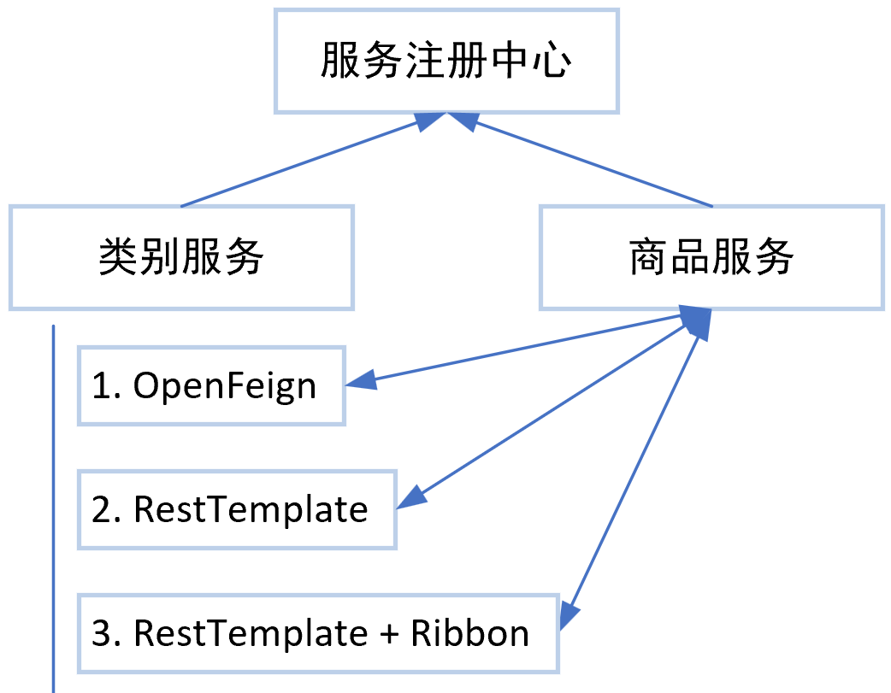
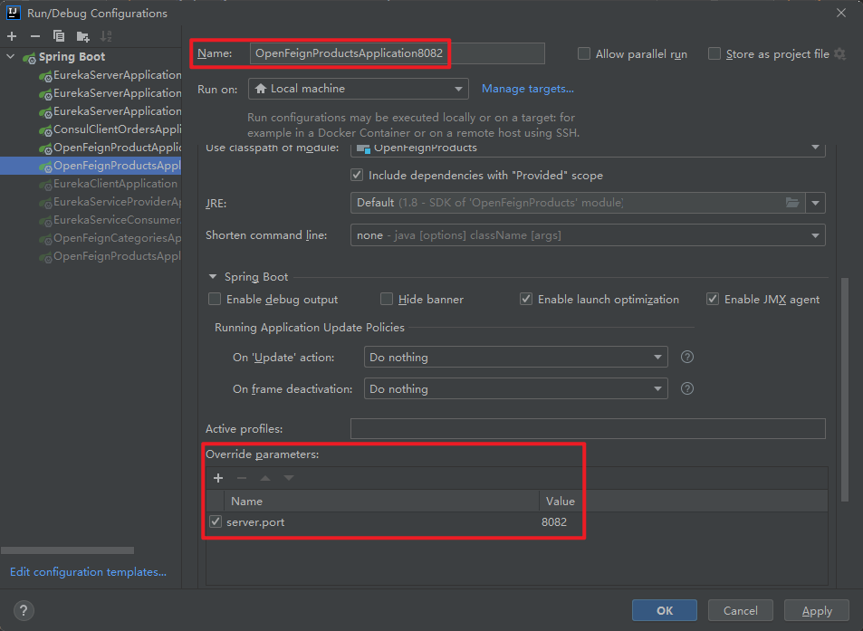
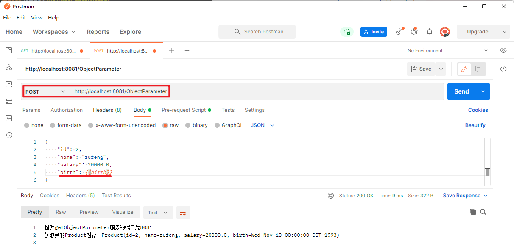
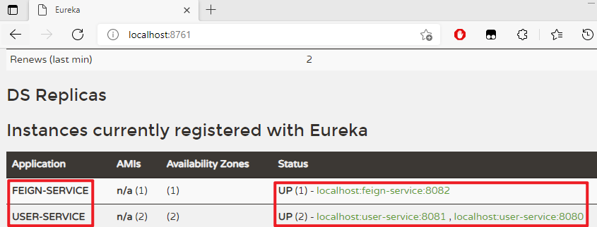

# Feign 简介

Feign 是==声明式的服务调用工具==，只需==创建一个接口并用注解的方式来配置它，就可以实现对某个服务接口的调用（服务间的通信）==，简化了直接使用 RestTemplate 来调用服务接口的开发量。

Feign 具备可插拔的注解支持，同时支持 Feign 注解、JAX-RS 注解及 SpringMVC 注解。当使用 Feign 时，Spring Cloud 集成了 Ribbon 和 Eureka 以提供==负载均衡的服务调用==、基于 Hystrix 的==服务容错保护==功能。

# 基于 OpenFeign 的服务调用实例

- 创建两个服务，并注册到服务注册中心；
- 使用 OpenFeign 进行服务调用：【类别服务】调用【商品服务】。



- RestTemplate：没有负载均衡；
- RestTemplate + Ribbon：路径写死。

项目地址：D:\Learning\SpringCloud\SpringCloudCode\SpringCloudDemo\SpringCloudDemoParent

父项目配置：

```xml
<properties>
    <maven.compiler.source>8</maven.compiler.source>
    <maven.compiler.target>8</maven.compiler.target>
    <spring.cloud-version>Hoxton.SR8</spring.cloud-version>
</properties>

<parent>
    <groupId>org.springframework.boot</groupId>
    <artifactId>spring-boot-starter-parent</artifactId>
    <version>2.2.5.RELEASE</version>
</parent>

<dependencyManagement>
    <dependencies>
        <dependency>
            <groupId>org.springframework.cloud</groupId>
            <artifactId>spring-cloud-dependencies</artifactId>
            <version>${spring.cloud-version}</version>
            <type>pom</type>
            <scope>import</scope>
        </dependency>
    </dependencies>
</dependencyManagement>
```


## OpenFeignCategories

### 创建 Maven 项目、引入依赖

==服务调用方==（类别服务）引入 OpenFeign 依赖：

```xml
<!--Open Feign依赖-->
<dependency>
    <groupId>org.springframework.cloud</groupId>
    <artifactId>spring-cloud-starter-openfeign</artifactId>
</dependency>
```

OpenFeignCategories 的完整依赖为：

```xml
<dependencies>
    <!--SpringBootWeb-->
    <dependency>
        <groupId>org.springframework.boot</groupId>
        <artifactId>spring-boot-starter-web</artifactId>
    </dependency>

    <!--引入Consul依赖-->
    <dependency>
        <groupId>org.springframework.cloud</groupId>
        <artifactId>spring-cloud-starter-consul-discovery</artifactId>
    </dependency>

    <!--引入健康检查依赖-->
    <dependency>
        <groupId>org.springframework.boot</groupId>
        <artifactId>spring-boot-starter-actuator</artifactId>
    </dependency>

    <!--OpenFeign 依赖-->
    <dependency>
        <groupId>org.springframework.cloud</groupId>
        <artifactId>spring-cloud-starter-openfeign</artifactId>
    </dependency>

    <!-- https://mvnrepository.com/artifact/com.alibaba/fastjson -->
    <dependency>
        <groupId>com.alibaba</groupId>
        <artifactId>fastjson</artifactId>
        <version>1.2.76</version>
    </dependency>

    <dependency>
        <groupId>org.projectlombok</groupId>
        <artifactId>lombok</artifactId>
    </dependency>
</dependencies>
```

### 入口类加入注解

==服务调用方==（类别服务）入口类加入注解（`@EnableFeignClients`）开启 OpenFeign 支持：

```java
package com.example;

import org.springframework.boot.SpringApplication;
import org.springframework.boot.autoconfigure.SpringBootApplication;
import org.springframework.cloud.client.discovery.EnableDiscoveryClient;
import org.springframework.cloud.openfeign.EnableFeignClients;

/**
 * @author chenzufeng
 * @date 2021/8/1
 * @usage OpenFeignCategoriesApplication 入口类
 * @EnableDiscoveryClient 启动服务注册、发现功能
 * @EnableFeignClients 【开启 OpenFeign 客户端调用】
 */
@SpringBootApplication
@EnableDiscoveryClient
@EnableFeignClients
public class OpenFeignCategoriesApplication {
    public static void main(String[] args) {
        SpringApplication.run(OpenFeignCategoriesApplication.class, args);
    }
}
```

### 写配置

```properties
server.port=8080
spring.application.name=OpenFeignCategories

spring.cloud.consul.port=8500
spring.cloud.consul.host=localhost
```

### 初步验证

- 开启 Consul 服务注册中心：`consul agent -dev`
- 启动 OpenFeignCategories；
- 登录 Consul：http://localhost:8500/，检查服务是否已经注册到 Consul。

### 创建 feign_client 接口

```java
package com.example.feign_client;

import org.springframework.cloud.openfeign.FeignClient;
import org.springframework.web.bind.annotation.GetMapping;

/**
 * @author chenzufeng
 * @date 2021/8/1
 * @usage ProductClient 【类别服务】调用【商品服务】的接口
 * @FeignClient("OpenFeignProducts") 明确调用哪个服务
 */
@FeignClient("OpenFeignProducts")
public interface ProductClient {

    /**
     * 调用【商品服务】
     * 建议与OpenFeignProductsController.java中方法名一致
     * 但【返回值】和【形参列表】以及【路径OpenFeignProducts】必须要一致
     * @return String
     */
    @GetMapping("/Product")
    String getProduct();
}
```

底层调用：

```markdown
[GET] to [http://OpenFeignProducts/Product]
```


### OpenFeignCategoriesController

```java
package com.example.controller;

import com.example.feign_client.ProductClient;
import lombok.extern.slf4j.Slf4j;
import org.springframework.beans.factory.annotation.Autowired;
import org.springframework.web.bind.annotation.GetMapping;
import org.springframework.web.bind.annotation.RestController;

/**
 * @author chenzufeng
 * @date 2021/8/1
 * @usage OpenFeignCategoriesController
 */
@RestController
@Slf4j
public class OpenFeignCategoriesController {

    @Autowired
    private ProductClient productClient;

    @GetMapping("/Category")
    public String categoryCallProduct() {
        log.info("==================================");
        log.info("进入类别服务......");

        String product = productClient.getProduct();
        log.info("类别服务调用商品服务中getProduct方法：{}", product);
        return "类别服务调用商品服务中getProduct方法：" + product;
    }
}
```


## OpenFeignProducts

### 创建 Maven 项目、引入依赖

```xml
<dependencies>
    <!--SpringBootWeb-->
    <dependency>
        <groupId>org.springframework.boot</groupId>
        <artifactId>spring-boot-starter-web</artifactId>
    </dependency>

    <!--引入Consul依赖-->
    <dependency>
        <groupId>org.springframework.cloud</groupId>
        <artifactId>spring-cloud-starter-consul-discovery</artifactId>
    </dependency>

    <!--引入健康检查依赖-->
    <dependency>
        <groupId>org.springframework.boot</groupId>
        <artifactId>spring-boot-starter-actuator</artifactId>
    </dependency>

    <!-- https://mvnrepository.com/artifact/com.alibaba/fastjson -->
    <dependency>
        <groupId>com.alibaba</groupId>
        <artifactId>fastjson</artifactId>
        <version>1.2.76</version>
    </dependency>

    <dependency>
        <groupId>org.projectlombok</groupId>
        <artifactId>lombok</artifactId>
    </dependency>
</dependencies>
```

### 入口类

```java
package com.example;

import org.springframework.boot.SpringApplication;
import org.springframework.boot.autoconfigure.SpringBootApplication;
import org.springframework.cloud.client.discovery.EnableDiscoveryClient;
import org.springframework.cloud.openfeign.EnableFeignClients;

/**
 * @author chenzufeng
 * @date 2021/8/1
 * @usage OpenFeignCategoriesApplication 入口类
 * @EnableDiscoveryClient 启动服务注册、发现功能
 */
@SpringBootApplication
@EnableDiscoveryClient
public class OpenFeignCategoriesApplication {
    public static void main(String[] args) {
        SpringApplication.run(OpenFeignCategoriesApplication.class, args);
    }
}
```

### 写配置

```properties
server.port=8081
spring.application.name=OpenFeignProducts

spring.cloud.consul.port=8500
spring.cloud.consul.host=localhost
```

### 初步验证

- 开启 Consul 服务注册中心：`consul agent -dev`
- 启动 OpenFeignProducts；
- 登录 Consul：http://localhost:8500/，检查服务是否已经注册到 Consul。

### OpenFeignProductsController

```java
package com.example.controller;

import lombok.extern.slf4j.Slf4j;
import org.springframework.beans.factory.annotation.Value;
import org.springframework.web.bind.annotation.GetMapping;
import org.springframework.web.bind.annotation.RestController;

/**
 * @author chenzufeng
 * @date 2021/8/1
 * @usage OpenFeignProductsController
 */
@RestController
@Slf4j
public class OpenFeignProductsController {
    /**
     * org.springframework.beans.factory.annotation.Value;
     */
    @Value("${server.port}")
    private int port;

    @GetMapping("/Product")
    public String getProduct() {
        log.info("=====================================");
        log.info("进入商品服务......");
        log.info("提供当前服务的端口：{}", port);
        log.info("=====================================");
        return "提供getProduct()商品服务的端口为" + port;
    }
}
```

## 调用服务测试

- 开启 Consul 服务注册中心：`consul agent -dev`

- 启动 OpenFeignCategories、OpenFeignProducts；

- 登录 Consul：http://localhost:8500/，检查服务是否已经注册到 Consul。

- 调用http://localhost:8080/Category

  - 页面输出：

  ```markdown
  类别服务调用商品服务中getProduct方法：提供getProduct()商品服务的端口为8081
  ```


## 负载均衡验证

- 开启 Consul 服务注册中心：`consul agent -dev`

- 启动 OpenFeignCategories、OpenFeignProducts8081、OpenFeignProducts8082（在IDEA中设置`Override parameters#server.port`）；

- 登录 Consul：http://localhost:8500/，检查服务是否已经注册到 Consul。

- 调用http://localhost:8080/Category

  - `OpenFeignCategoriesApplication :8080/`控制台输出：

    ```markdown
    ==================================
    进入类别服务......
    类别服务调用商品服务中getProduct方法：提供getProduct()商品服务的端口为8081
    ==================================
    进入类别服务......
    类别服务调用商品服务中getProduct方法：提供getProduct()商品服务的端口为8082
    ......
    ```

    



# 参数传递

服务间通信手段：HTTP 协议。Spring Cloud 采用两种方法：

- RestTemplate + Ribbon
- OpenFeign（推荐）

服务和服务之间通信，不仅仅是调用，往往在调用过程中还伴随着参数传递

- 传递零散类型参数：
  - `Query String`方式传递参数：`?value=1`
  - 路径传递参数：`/value/1`
- 传递对象类型
- 数组或集合类型参数

## 传递简单参数

==使用 GET 方式==调用服务传递参数。

### 在服务调用者中定义参数接收接口

在==类别服务==中的`ProductClient`中定义接收零星参数的接口：

```java
@GetMapping("/ParameterQueryString")
String getParameterQueryString(String name, Integer age);
```

具体的：

```java
package com.example.feign_client;

import org.springframework.cloud.openfeign.FeignClient;
import org.springframework.web.bind.annotation.GetMapping;

/**
 * @author chenzufeng
 * @date 2021/8/1
 * @usage ProductClient 【类别服务】调用【商品服务】的接口
 * @FeignClient("OpenFeignProducts") 明确调用哪个服务
 */
@FeignClient("OpenFeignProducts")
public interface ProductClient {

    /**
     * 调用【商品服务】
     * 建议与OpenFeignProductsController.java中方法名一致
     * 但【返回值】和【形参列表】要一致
     * @return String
     */
    @GetMapping("/Product")
    String getProduct();

    /**
     *  没有明确传参方式
     * @param name name
     * @param age age
     * @return String
     */
    @GetMapping("/ParameterQueryString")
    String getParameterQueryString(String name, Integer age);
}
```

### 服务调用者调用服务

在==类别服务==`OpenFeignCategoriesController.java`中调用服务并传参：

```java
String parameterQueryString =
                productClient.getParameterQueryString("chenzf", 27);
```

具体的：

```java
package com.example.controller;

import com.example.feign_client.ProductClient;
import lombok.extern.slf4j.Slf4j;
import org.springframework.beans.factory.annotation.Autowired;
import org.springframework.web.bind.annotation.GetMapping;
import org.springframework.web.bind.annotation.RestController;

/**
 * @author chenzufeng
 * @date 2021/8/1
 * @usage OpenFeignCategoriesController
 */
@RestController
@Slf4j
public class OpenFeignCategoriesController {

    @Autowired
    private ProductClient productClient;

    @GetMapping("/Category")
    public String categoryCallProduct() {
        log.info("===========================================");
        log.info("进入类别服务......");

        log.info("==================================");
        String product = productClient.getProduct();
        log.info("类别服务调用商品服务中getProduct方法：{}", product);
        log.info("==================================");

        String parameterQueryString =
                productClient.getParameterQueryString("chenzf", 27);
        log.info("类别服务调用商品服务中getParameterQueryString方法：{}", parameterQueryString);
        log.info("==================================");

        return "类别服务调用商品服务中"+ "\n"
                + "getProduct方法：" + product + "；\n"
                + " getParameterQueryString方法：" + parameterQueryString;
    }
}
```

### 服务提供者实现对应服务

在==商品服务==中实现对应方法：

```java
public String getParameterQueryString(String name, Integer age) {......}
```

具体的：

```java
package com.example.controller;

import lombok.extern.slf4j.Slf4j;
import org.springframework.beans.factory.annotation.Value;
import org.springframework.web.bind.annotation.GetMapping;
import org.springframework.web.bind.annotation.RestController;

/**
 * @author chenzufeng
 * @date 2021/8/1
 * @usage OpenFeignProductsController
 */
@RestController
@Slf4j
public class OpenFeignProductsController {
    /**
     * org.springframework.beans.factory.annotation.Value;
     */
    @Value("${server.port}")
    private int port;

    @GetMapping("/Product")
    public String getProduct() {
        log.info("=====================================");
        log.info("进入商品服务......");
        log.info("==========================");
        log.info("提供getProduct服务的端口：{}", port);
        log.info("==========================");
        return "提供getProduct服务的端口为" + port;
    }
    
    @GetMapping("/ParameterQueryString") // 一定要有
    public String getParameterQueryString(String name, Integer age) {
        log.info("提供getParameterQueryString服务，name：{}，age：{}", name, age);
        log.info("==========================");
        return "提供getParameterQueryString服务的端口为" + port;
    }
}
```

### 没有明确传参方式

- 开启 Consul 服务注册中心：`consul agent -dev`

- 启动 OpenFeignCategories，控制台报错：

  ```markdown
  Caused by: org.springframework.beans.factory.BeanCreationException: Error creating bean with name 'com.example.feign_client.ProductClient': FactoryBean threw exception on object creation; nested exception is java.lang.IllegalStateException: Method has too many Body parameters: public abstract java.lang.String com.example.feign_client.ProductClient.getParameterQueryString(java.lang.String,java.lang.Integer)
  ```

- ==传参数时，没有明确告知 OpenFeign 的传参方式==（QueryString 还是路径传参），因此不知道该如何组合多参数！

### Query String 方式传参

使用 Query String 方式传参（`?name=chen`）：在 ==OpenFeign 接口==（`ProductClient`）声明中必须给参数加入注解`@RequestParam`：

```java
@GetMapping("/ParameterQueryString")
    String getParameterQueryString(@RequestParam("name") String name, @RequestParam("age") Integer age);
```

具体的：

```java
package com.example.feign_client;

import org.springframework.cloud.openfeign.FeignClient;
import org.springframework.web.bind.annotation.GetMapping;
import org.springframework.web.bind.annotation.PathVariable;
import org.springframework.web.bind.annotation.RequestParam;

/**
 * @author chenzufeng
 * @date 2021/8/1
 * @usage ProductClient 【类别服务】调用【商品服务】的接口
 * @FeignClient("OpenFeignProducts") 明确调用哪个服务
 */
@FeignClient("OpenFeignProducts")
public interface ProductClient {

    /**
     * 调用【商品服务】
     * 建议与OpenFeignProductsController.java中方法名一致
     * 但【返回值】和【形参列表】要一致
     * @return String
     */
    @GetMapping("/Product")
    String getProduct();

    /**
     * Query String方式传递参数：'/ParameterQueryString?XX=xxx'
     * @param name name
     * @param age age
     * @return String
     */
    @GetMapping("/ParameterQueryString")
    String getParameterQueryString(@RequestParam("name") String name, @RequestParam("age") Integer age);
}
```


### 路径传参

使用==路径传参==（`/name/chen`）：在 OpenFeign 接口（`ProductClient`）声明中必须给参数加入注解`@PathVariable`：

```java
@GetMapping("/ParameterPath/{name}/{age}")
String getParameterPath(@PathVariable("name") String name, @PathVariable("age") Integer age);
```

具体的：

```java
package com.example.feign_client;

import org.springframework.cloud.openfeign.FeignClient;
import org.springframework.web.bind.annotation.GetMapping;
import org.springframework.web.bind.annotation.PathVariable;
import org.springframework.web.bind.annotation.RequestParam;

/**
 * @author chenzufeng
 * @date 2021/8/1
 * @usage ProductClient 【类别服务】调用【商品服务】的接口
 * @FeignClient("OpenFeignProducts") 明确调用哪个服务
 */
@FeignClient("OpenFeignProducts")
public interface ProductClient {

    /**
     * 调用【商品服务】
     * 建议与OpenFeignProductsController.java中方法名一致
     * 但【返回值】和【形参列表】要一致
     * @return String
     */
    @GetMapping("/Product")
    String getProduct();

    /**
     * Query String方式传递参数：'/ParameterQueryString?XX=xxx'
     * @param name name
     * @param age age
     * @return String
     */
    @GetMapping("/ParameterQueryString")
    String getParameterQueryString(@RequestParam("name") String name, @RequestParam("age") Integer age);

    /**
     * 路径传参：'/ParameterPath/chenzf/27'
     * @param name name
     * @param age age
     * @return String
     */
    @GetMapping("/ParameterPath/{name}/{age}")
    String getParameterPath(@PathVariable("name") String name, @PathVariable("age") Integer age);
}
```


### 明确商品服务传参方式

在==商品服务==的`OpenFeignProductsController`中明确传参方式：

```java
package com.example.controller;

import lombok.extern.slf4j.Slf4j;
import org.springframework.beans.factory.annotation.Value;
import org.springframework.web.bind.annotation.GetMapping;
import org.springframework.web.bind.annotation.PathVariable;
import org.springframework.web.bind.annotation.RestController;

/**
 * @author chenzufeng
 * @date 2021/8/1
 * @usage OpenFeignProductsController
 */
@RestController
@Slf4j
public class OpenFeignProductsController {
    /**
     * org.springframework.beans.factory.annotation.Value;
     */
    @Value("${server.port}")
    private int port;

    @GetMapping("/Product")
    public String getProduct() {
        log.info("=====================================");
        log.info("进入商品服务......");
        log.info("==========================");
        log.info("提供getProduct服务的端口：{}", port);
        log.info("==========================");
        return "提供getProduct服务的端口为" + port;
    }

    /**
     * Query String方式传递参数：'/ParameterQueryString?XX=xxx'
     */
    @GetMapping("/ParameterQueryString")
    public String getParameterQueryString(String name, Integer age) {
        log.info("提供getParameterQueryString服务，name：{}，age：{}", name, age);
        log.info("==========================");
        return "提供getParameterQueryString服务的端口为" + port;
    }

    /**
     * 路径传参：'/ParameterPath/chenzf/27'
     */
    @GetMapping("/ParameterPath/{name}/{age}")
    public String getParameterPath(@PathVariable("name") String name, @PathVariable("age") Integer age) {
        log.info("提供getParameterPath服务，name：{}，age：{}", name, age);
        log.info("==========================");
        return "提供getParameterPath服务的端口为" + port;
    }
}
```

### 服务调用者调用服务

在==类别服务==`OpenFeignCategoriesController.java`中调用服务并传参：

```java
package com.example.controller;

import com.example.feign_client.ProductClient;
import lombok.extern.slf4j.Slf4j;
import org.springframework.beans.factory.annotation.Autowired;
import org.springframework.web.bind.annotation.GetMapping;
import org.springframework.web.bind.annotation.RestController;

/**
 * @author chenzufeng
 * @date 2021/8/1
 * @usage OpenFeignCategoriesController
 */
@RestController
@Slf4j
public class OpenFeignCategoriesController {

    @Autowired
    private ProductClient productClient;

    @GetMapping("/Category")
    public String categoryCallProduct() {
        log.info("===========================================");
        log.info("进入类别服务......");

        log.info("==================================");
        String product = productClient.getProduct();
        log.info("类别服务调用商品服务中getProduct方法：{}", product);
        log.info("==================================");

        String parameterQueryString =
                productClient.getParameterQueryString("chenzf", 27);
        log.info("类别服务调用商品服务中getParameterQueryString方法：{}", parameterQueryString);
        log.info("==================================");

        String parameterPath = productClient.getParameterPath("chenzufeng", 27);
        log.info("类别服务调用商品服务中getParameterPath方法：{}", parameterPath);
        log.info("==================================");

        return "类别服务调用商品服务中"+ "\n"
                + "getProduct方法：" + product + "；\n"
                + "getParameterQueryString方法：" + parameterQueryString + "；\n"
                + "getParameterPath方法：" + parameterPath;
    }
}
```


### 测试

- 开启 Consul 服务注册中心：`consul agent -dev`

- 启动 OpenFeignCategories、OpenFeignProducts8081、OpenFeignProducts8082（在IDEA中设置`Override parameters#server.port`）；

- 登录 Consul：http://localhost:8500/，检查服务是否已经注册到 Consul。

- 调用http://localhost:8080/Category，输出：

  ```markdown
  类别服务调用商品服务中
  getProduct方法：提供getProduct服务的端口为8081；
  getParameterQueryString方法：提供getParameterQueryString服务的端口为8082；
  getParameterPath方法：提供getParameterPath服务的端口为8081
  ```

  

## 传递对象类型参数

==使用 POST 方式==调用服务传递参数！

### 创建实体对象

在【商品】和【类别】项目中创建对象：`entity/Product.java)`：

```java
package com.example.entity;

import lombok.AllArgsConstructor;
import lombok.Data;
import lombok.NoArgsConstructor;

import java.util.Date;

/**
 * @author chenzufeng
 * @date 2021/8/1
 * @usage Product
 */
@Data
@AllArgsConstructor
@NoArgsConstructor
public class Product {
    private Integer id;
    private String name;
    private Double salary;
    private Date birth;
}
```

注意`lombok`三件套：

```java
@Data
@AllArgsConstructor
@NoArgsConstructor
```

### 在服务调用者中定义接口

在==类别服务==的 ProductClient 中==使用`@RequestBody`注解==声明方法：

```java
package com.example.feign_client;

import com.example.entity.Product;
import org.springframework.cloud.openfeign.FeignClient;
import org.springframework.web.bind.annotation.*;

/**
 * @usage ProductClient 【类别服务】调用【商品服务】的接口
 * @FeignClient("OpenFeignProducts") 明确调用哪个服务
 */
@FeignClient("OpenFeignProducts")
public interface ProductClient {

    // ......
    
    /**
     * 定义一个接受【对象类型】参数的接口，传递 Product 对象
     * @RequestBody以Json格式传递
     * @param product product
     * @return String
     */
    @PostMapping("ObjectParameter")
    String getObjectParameter(@RequestBody Product product);
}
```

### 服务调用者调用服务

在类别服务（`OpenFeignCategoriesController`）中调用服务并传递参数：

```java
package com.example.controller;

import com.example.entity.Product;
import com.example.feign_client.ProductClient;
import lombok.extern.slf4j.Slf4j;
import org.springframework.beans.factory.annotation.Autowired;
import org.springframework.web.bind.annotation.GetMapping;
import org.springframework.web.bind.annotation.RestController;

import java.util.Date;

@RestController
@Slf4j
public class OpenFeignCategoriesController {

    @Autowired
    private ProductClient productClient;

    @GetMapping("/Category")
    public String categoryCallProduct() {
        log.info("===========================================");
        log.info("进入类别服务......");
        
        // ......
        
        String objectParameter = productClient.getObjectParameter(new Product(1, "chenzf", 20000.0, new Date()));
        log.info("类别服务调用商品服务中getObjectParameter方法：{}", objectParameter);
        log.info("==================================");

        return "类别服务调用商品服务中的方法："+ "\n\n"
                + "getProduct方法：" + product + "\n"
                + "getParameterQueryString方法：" + parameterQueryString + "\n"
                + "getParameterPath方法：" + parameterPath + "\n"
                + "getObjectParameter方法：" + objectParameter;
    }
}
```

### 在服务提供者中实现服务

==商品服务==加入 POST 方式请求，并使用`@RequestBody`注解接受参数：

```java
package com.example.controller;

import com.example.entity.Product;
import lombok.extern.slf4j.Slf4j;
import org.springframework.beans.factory.annotation.Value;
import org.springframework.web.bind.annotation.*;

@RestController
@Slf4j
public class OpenFeignProductsController {
    /**
     * org.springframework.beans.factory.annotation.Value;
     */
    @Value("${server.port}")
    private int port;

    //......

    /**
     * POST: http://localhost:8081/ObjectParameter
     * Pre-request Script：postman.setGlobalVariable("birth",Date.parse(new Date("1993/11/10")));
     * Body:
     * {
     *     "id": 2,
     *     "name": "zufeng",
     *     "salary": 20000.0,
     *     "birth": {{birth}}
     * }
     * @param product product
     * @return String
     */
    @PostMapping("/ObjectParameter")
    public String getObjectParameter(@RequestBody Product product) {
        log.info("提供getObjectParameter服务，获取Product对象：{}", product);
        log.info("==========================");
        return "提供getObjectParameter服务的端口为" + port + "; \n"
                + "获取到的Product对象：" + product + "\n";
    }
}
```

### 测试

- 开启 Consul 服务注册中心：`consul agent -dev`

- 启动 OpenFeignCategories、OpenFeignProducts8081、OpenFeignProducts8082（在IDEA中设置`Override parameters#server.port`）；

- 登录 Consul：http://localhost:8500/，检查服务是否已经注册到 Consul。

- 调用http://localhost:8080/Category，输出：

  ```markdown
  类别服务调用商品服务中的方法：
  
  getProduct方法：提供getProduct服务的端口为8081
  
  getParameterQueryString方法：提供getParameterQueryString服务的端口为8082：
  name：chenzf；age：27
  
  getParameterPath方法：提供getParameterPath服务的端口为8081：
  name：chenzufeng；age：27
  
  getObjectParameter方法：提供getObjectParameter服务的端口为8082：
  获取到的Product对象：Product(id=1, name=chenzf, salary=20000.0, birth=Sun Aug 01 12:48:50 CST 2021)
  ```

- 调用 http://localhost:8081/ObjectParameter（`Postman` $$\rightarrow$$ `Pre-request Script`）：

  ```markdown
  postman.setGlobalVariable("birth",Date.parse(new Date("1993/11/10")));
  ```



## 传递数组类型参数

传递数组类型参数，只能使用`Query String`形式！

### 在服务调用者中定义接口

在==类别服务==中的`ProductClient`中定义接收数组参数的接口：

```java
package com.example.feign_client;

import com.example.entity.Product;
import org.springframework.cloud.openfeign.FeignClient;
import org.springframework.web.bind.annotation.*;

/**
 * @usage ProductClient 【类别服务】调用【商品服务】的接口
 * @FeignClient("OpenFeignProducts") 明确调用哪个服务
 */
@FeignClient("OpenFeignProducts")
public interface ProductClient {

    //......

    /**
     * 声明调用【商品服务】中getArrayParameter接口，传递数组类型参数
     * @param ids ids
     * @return String
     */
    @GetMapping("/ArrayParameter")
    String getArrayParameter(@RequestParam("ids") String[] ids);
}
```

### 服务调用者调用服务

在类别服务（`OpenFeignCategoriesController`）中调用服务并传递参数：

```java
package com.example.controller;

import com.example.entity.Product;
import com.example.feign_client.ProductClient;
import lombok.extern.slf4j.Slf4j;
import org.springframework.beans.factory.annotation.Autowired;
import org.springframework.web.bind.annotation.GetMapping;
import org.springframework.web.bind.annotation.RestController;

import java.util.Date;

@RestController
@Slf4j
public class OpenFeignCategoriesController {

    @Autowired
    private ProductClient productClient;

    @GetMapping("/Category")
    public String categoryCallProduct() {
        log.info("===========================================");
        log.info("进入类别服务......");

        // ......

        String arrayParameter = productClient.getArrayParameter(new String[]{"chen", "zu", "feng"});
        log.info("类别服务调用商品服务中getArrayParameter方法：{}", arrayParameter);
        log.info("==================================");

        return "类别服务调用商品服务中的方法："+ "\n\n"
                + "getProduct方法：" + product + "\n"
                + "getParameterQueryString方法：" + parameterQueryString + "\n"
                + "getParameterPath方法：" + parameterPath + "\n"
                + "getObjectParameter方法：" + objectParameter + "\n"
                + "getArrayParameter方法：" + arrayParameter;
    }
}
```

### 服务提供者实现服务

使用`Arrays.asList`将`数组`转化成`List`：

```java
package com.example.controller;

import com.example.entity.Product;
import lombok.extern.slf4j.Slf4j;
import org.springframework.beans.factory.annotation.Value;
import org.springframework.web.bind.annotation.*;

@RestController
@Slf4j
public class OpenFeignProductsController {
    /**
     * org.springframework.beans.factory.annotation.Value;
     */
    @Value("${server.port}")
    private int port;

    // ......
    
    @GetMapping("/ArrayParameter")
    public String getArrayParameter(@RequestParam("ids") String[] ids) {
        log.info("提供getArrayParameter服务，获取ids字符串数组：");
        for (String id : ids) {
            log.info("id：{}", id);
        }
        log.info("==========================");
        // sout(ids)：[Ljava.lang.String;@65885265
        List<String> stringList = Arrays.asList(ids);
        return "提供getArrayParameter服务的端口为" + port + "：\n"
                + "获取ids字符串数组：" + stringList + "\n";
    }
}
```

要加注解`@GetMapping("/ArrayParameter")`，否则报错：

```markdown
[GET] to [http://OpenFeignProducts/ArrayParameter?ids=chen%2Czu%2Cfeng]
```


### 测试

- 开启 Consul 服务注册中心：`consul agent -dev`

- 启动 OpenFeignCategories、OpenFeignProducts8081、OpenFeignProducts8082（在IDEA中设置`Override parameters#server.port`）；

- 登录 Consul：http://localhost:8500/，检查服务是否已经注册到 Consul。

- 调用http://localhost:8080/Category，输出：

  ```markdown
  类别服务调用商品服务中的方法：
  
  getProduct方法：提供getProduct服务的端口为8082
  
  getParameterQueryString方法：提供getParameterQueryString服务的端口为8081：
  name：chenzf；age：27
  
  getParameterPath方法：提供getParameterPath服务的端口为8082：
  name：chenzufeng；age：27
  
  getObjectParameter方法：提供getObjectParameter服务的端口为8081：
  获取到的Product对象：Product(id=1, name=chenzf, salary=20000.0, birth=Sun Aug 01 15:26:57 CST 2021)
  
  getArrayParameter方法：提供getArrayParameter服务的端口为8082：
  获取ids字符串数组：获取ids字符串数组：[chen, zu, feng]
  ```

  

## 传递集合类型参数

### 在服务调用者中定义接口

在`ProductClient`中声明调用【商品服务】的`getListParameter`接口，传递一个 List 集合类型参数：

```java
package com.example.feign_client;

import com.example.entity.Product;
import org.springframework.cloud.openfeign.FeignClient;
import org.springframework.web.bind.annotation.*;

/**
 * @author chenzufeng
 * @date 2021/8/1
 * @usage ProductClient 【类别服务】调用【商品服务】的接口
 * @FeignClient("OpenFeignProducts") 明确调用哪个服务
 */
@FeignClient("OpenFeignProducts")
public interface ProductClient {

    //......

    /**
     * 声明调用【商品服务】中getArrayParameter接口，传递数组类型参数
     * @param ids ids
     * @return String
     */
    @GetMapping("/ArrayParameter")
    String getArrayParameter(@RequestParam("ids") String[] ids);

    /**
     * 声明调用【商品服务】中getListParameter接口，传递List类型参数
     * @param ids ids
     * @return String
     */
    @GetMapping("ListParameter")
    String getListParameter(@RequestParam("ids") String[] ids);
}
```

### 服务调用者调用服务

```java
package com.example.controller;

import com.example.entity.Product;
import com.example.feign_client.ProductClient;
import lombok.extern.slf4j.Slf4j;
import org.springframework.beans.factory.annotation.Autowired;
import org.springframework.web.bind.annotation.GetMapping;
import org.springframework.web.bind.annotation.RestController;

import java.util.Date;

/**
 * @author chenzufeng
 * @date 2021/8/1
 * @usage OpenFeignCategoriesController
 */
@RestController
@Slf4j
public class OpenFeignCategoriesController {

    @Autowired
    private ProductClient productClient;

    @GetMapping("/Category")
    public String categoryCallProduct() {
        log.info("===========================================");
        log.info("进入类别服务......");

        // ......

        String arrayParameter = productClient.getArrayParameter(new String[]{"chen", "zu", "feng"});
        log.info("类别服务调用商品服务中getArrayParameter方法：{}", arrayParameter);
        log.info("==================================");

        String listParameter = productClient.getListParameter(new String[]{"zu", "feng"});
        log.info("类别服务调用商品服务中getListParameter方法：{}", listParameter);
        log.info("==================================");

        return "类别服务调用商品服务中的方法："+ "\n\n"
                + "getProduct方法：" + product + "\n"
                + "getParameterQueryString方法：" + parameterQueryString + "\n"
                + "getParameterPath方法：" + parameterPath + "\n"
                + "getObjectParameter方法：" + objectParameter + "\n"
                + "getArrayParameter方法：" + arrayParameter + "\n"
                + "getListParameter方法：" + listParameter;
    }
}
```


### 创建数据对象

在`OpenFeignProduct/vos`包中创建`CollectionValueObject`（VO：Value Object，用来传递数据对象）：

```java
package com.example.vos;

import java.util.List;

/**
 * @author chenzufeng
 * @date 2021/8/1
 * @usage CollectionValueObject 定义用来接收集合类型参数的对象
 */
public class CollectionValueObject {
    private List<String> ids;
    
    public List<String> getIds() {
        return ids;
    }
    
    public void setIds(List<String> ids) {
        this.ids = ids;
    }
}
```

### 服务提供者提供服务

在`OpenFeignProducts`中接收集合类型参数：

```java
package com.example.controller;

import com.example.entity.Product;
import com.example.vos.CollectionValueObject;
import lombok.extern.slf4j.Slf4j;
import org.springframework.beans.factory.annotation.Value;
import org.springframework.web.bind.annotation.*;

import java.util.Arrays;
import java.util.List;

/**
 * @author chenzufeng
 * @date 2021/8/1
 * @usage OpenFeignProductsController
 */
@RestController
@Slf4j
public class OpenFeignProductsController {
    /**
     * org.springframework.beans.factory.annotation.Value;
     */
    @Value("${server.port}")
    private int port;

    // ......
    
    @GetMapping("/ListParameter")
    public String getListParameter(CollectionValueObject collectionValueObject) {
        log.info("提供getListParameter服务，获取集合：{}", collectionValueObject);
        collectionValueObject.getIds().forEach(id -> log.info("id：{}",id));
        return "提供getListParameter服务的端口为" + port + "：\n"
                + "获取集合：" + collectionValueObject + "\n";
    }
}
```

### 测试

- 开启 Consul 服务注册中心：`consul agent -dev`

- 启动 OpenFeignCategories、OpenFeignProducts8081、OpenFeignProducts8082（在IDEA中设置`Override parameters#server.port`）；

- 登录 Consul：http://localhost:8500/，检查服务是否已经注册到 Consul。

- 调用http://localhost:8080/Category，输出：

  ```markdown
  类别服务调用商品服务中的方法：
  
  getProduct方法：提供getProduct服务的端口为8081
  
  getParameterQueryString方法：提供getParameterQueryString服务的端口为8082：
  name：chenzf；age：27
  
  getParameterPath方法：提供getParameterPath服务的端口为8081：
  name：chenzufeng；age：27
  
  getObjectParameter方法：提供getObjectParameter服务的端口为8082：
  获取到的Product对象：Product(id=1, name=chenzf, salary=20000.0, birth=Sun Aug 01 16:34:30 CST 2021)
  
  getArrayParameter方法：提供getArrayParameter服务的端口为8081：
  获取ids字符串数组：[chen, zu, feng]
  
  getListParameter方法：提供getListParameter服务的端口为8082：
  获取集合：com.example.vos.CollectionValueObject@3a8428da
  ```

  

# 响应处理

## 使用 OpenFeign 调用服务并返回对象

==类别服务==根据`id`调用==商品服务==，商品服务再返回查询到的商品对象！

### 在服务调用者中定义接口

在`ProductClient`中声明根据 id 查询商品信息的接口：

```java
package com.example.feign_client;

import com.example.entity.Product;
import org.springframework.cloud.openfeign.FeignClient;
import org.springframework.web.bind.annotation.*;

/**
 * @author chenzufeng
 * @date 2021/8/1
 * @usage ProductClient 【类别服务】调用【商品服务】的接口
 * @FeignClient("OpenFeignProducts") 明确调用哪个服务
 */
@FeignClient("OpenFeignProducts")
public interface ProductClient {

    //......

    /**
     * 声明根据 id 查询商品信息的接口
     * @param id id
     * @return Product
     */
    @GetMapping("/ReturnProduct/{id}")
    Product returnProduct(@PathVariable("id") Integer id);
}
```

### 服务调用者调用服务

```java
package com.example.controller;

import com.example.entity.Product;
import com.example.feign_client.ProductClient;
import lombok.extern.slf4j.Slf4j;
import org.springframework.beans.factory.annotation.Autowired;
import org.springframework.web.bind.annotation.GetMapping;
import org.springframework.web.bind.annotation.RestController;

import java.util.Date;

/**
 * @author chenzufeng
 * @date 2021/8/1
 * @usage OpenFeignCategoriesController
 */
@RestController
@Slf4j
public class OpenFeignCategoriesController {

    @Autowired
    private ProductClient productClient;

    @GetMapping("/Category")
    public String categoryCallProduct() {
        // ......
    }

    @GetMapping("/GetReturnedProduct")
    public Product getReturnedProduct() {
        log.info("===========================================");
        log.info("进入类别服务......");

        log.info("==================================");
        Product returnedProduct = productClient.returnProduct(1);
        log.info("类别服务调用商品服务中returnProduct方法：{}", returnedProduct);
        log.info("==================================");
        
        return returnedProduct;
    }
}
```

### 服务提供者提供服务

```java
@GetMapping("/ReturnProduct/{id}")
public Product returnProduct(@PathVariable("id") Integer id) .....}
```

具体的：

```java
package com.example.controller;

import com.example.entity.Product;
import com.example.vos.CollectionValueObject;
import lombok.extern.slf4j.Slf4j;
import org.springframework.beans.factory.annotation.Value;
import org.springframework.web.bind.annotation.*;

import java.util.Arrays;
import java.util.Date;
import java.util.List;

/**
 * @author chenzufeng
 * @date 2021/8/1
 * @usage OpenFeignProductsController
 */
@RestController
@Slf4j
public class OpenFeignProductsController {
    /**
     * org.springframework.beans.factory.annotation.Value;
     */
    @Value("${server.port}")
    private int port;

    /**
     * Query String方式传递参数：'/ParameterQueryString?XX=xxx'
     */
    @GetMapping("/ParameterQueryString")
    public String getParameterQueryString(String name, Integer age) {
        log.info("提供getParameterQueryString服务，name：{}，age：{}", name, age);
        log.info("==========================");
        return "提供getParameterQueryString服务的端口为" + port + "：\n"
                + "name：" + name + "；age：" + age + "\n";
    }

    /**
     * 路径传参：'/ParameterPath/chenzf/27'
     */
    @GetMapping("/ParameterPath/{name}/{age}")
    public String getParameterPath(@PathVariable("name") String name, @PathVariable("age") Integer age) {
        log.info("提供getParameterPath服务，name：{}，age：{}", name, age);
        log.info("==========================");
        return "提供getParameterPath服务的端口为" + port + "：\n"
                + "name：" + name + "；age：" + age + "\n";
    }

    //......

    @GetMapping("/ReturnProduct/{id}")
    public Product returnProduct(@PathVariable("id") Integer id) {
        log.info("提供returnProduct服务，返回对象的id：{}", id);
        return new Product(1, "祖峰", 20000.0, new Date());
    }
}
```

### 测试

- 开启 Consul 服务注册中心：`consul agent -dev`

- 启动 OpenFeignCategories、OpenFeignProducts8081、OpenFeignProducts8082（在IDEA中设置`Override parameters#server.port`）；

- 登录 Consul：http://localhost:8500/，检查服务是否已经注册到 Consul。

- 调用http://localhost:8080/GetReturnedProduct，输出：

  ```json
  {
      "id": 1,
      "name": "祖峰",
      "salary": 20000.0,
      "birth": "2021-08-01T09:04:09.450+0000"
  }
  ```

  

## 使用 OpenFeign 调用服务并返回 List 对象

类别服务调用商品服务，返回商品对象 List 集合！

### 在服务调用者中定义接口

```java
package com.example.feign_client;

import com.example.entity.Product;
import org.springframework.cloud.openfeign.FeignClient;
import org.springframework.web.bind.annotation.*;

import java.util.List;

/**
 * @author chenzufeng
 * @date 2021/8/1
 * @usage ProductClient 【类别服务】调用【商品服务】的接口
 * @FeignClient("OpenFeignProducts") 明确调用哪个服务
 */
@FeignClient("OpenFeignProducts")
public interface ProductClient {

    //.......

    /**
     * 声明调用【商品服务】中getArrayParameter接口，传递数组类型参数
     * @param ids ids
     * @return String
     */
    @GetMapping("/ArrayParameter")
    String getArrayParameter(@RequestParam("ids") String[] ids);

    /**
     * 声明调用【商品服务】中getListParameter接口，传递List类型参数
     * @param ids ids
     * @return String
     */
    @GetMapping("ListParameter")
    String getListParameter(@RequestParam("ids") String[] ids);

    /**
     * 声明根据 id 查询商品信息的接口
     * @param id id
     * @return Product
     */
    @GetMapping("/ReturnProduct/{id}")
    Product returnProduct(@PathVariable("id") Integer id);

    /**
     * 获取商品列表
     * @return List<Product>
     */
    @GetMapping("/GetProductList")
    List<Product> getProductList();
}

```

### 服务调用者调用服务

```java
package com.example.controller;

import com.example.entity.Product;
import com.example.feign_client.ProductClient;
import lombok.extern.slf4j.Slf4j;
import org.springframework.beans.factory.annotation.Autowired;
import org.springframework.web.bind.annotation.GetMapping;
import org.springframework.web.bind.annotation.RestController;

import java.util.Date;
import java.util.List;

/**
 * @author chenzufeng
 * @date 2021/8/1
 * @usage OpenFeignCategoriesController
 */
@RestController
@Slf4j
public class OpenFeignCategoriesController {

    @Autowired
    private ProductClient productClient;

    @GetMapping("/Category")
    public String categoryCallProduct() {
        // ......
    }

    @GetMapping("/GetReturnedProduct")
    public Product getReturnedProduct() {
        // ......
    }
    
    @GetMapping("ListProduct")
    public List<Product> getListProduct() {
        log.info("===========================================");
        log.info("进入类别服务......");

        log.info("==================================");
        List<Product> productList = productClient.getProductList();
        log.info("类别服务调用商品服务中getProductList方法：{}", productList);
        log.info("==================================");

        return productList;
    }
}
```

### 服务提供者提供服务

```java
package com.example.controller;

import com.example.entity.Product;
import com.example.vos.CollectionValueObject;
import lombok.extern.slf4j.Slf4j;
import org.springframework.beans.factory.annotation.Value;
import org.springframework.web.bind.annotation.*;

import java.util.ArrayList;
import java.util.Arrays;
import java.util.Date;
import java.util.List;

/**
 * @author chenzufeng
 * @date 2021/8/1
 * @usage OpenFeignProductsController
 */
@RestController
@Slf4j
public class OpenFeignProductsController {
    /**
     * org.springframework.beans.factory.annotation.Value;
     */
    @Value("${server.port}")
    private int port;

    // ......

    @GetMapping("/GetProductList")
    public List<Product> getProductList() {
        log.info("提供getProductList服务");
        ArrayList<Product> products = new ArrayList<>();
        products.add(new Product(1, "chen", 20000.0, new Date()));
        products.add(new Product(1, "zufeng", 30000.0, new Date()));
        return products;
    }
}
```

### 测试

- 开启 Consul 服务注册中心：`consul agent -dev`

- 启动 OpenFeignCategories、OpenFeignProducts8081、OpenFeignProducts8082（在IDEA中设置`Override parameters#server.port`）；

- 登录 Consul：http://localhost:8500/，检查服务是否已经注册到 Consul。

- 调用http://localhost:8080/ListProduct，输出：

  ```json
  [
      {
          "id": 1,
          "name": "chen",
          "salary": 20000.0,
          "birth": "2021-08-01T09:46:32.718+0000"
      },
      {
          "id": 1,
          "name": "zufeng",
          "salary": 30000.0,
          "birth": "2021-08-01T09:46:32.718+0000"
      }
  ]
  ```

  

## 使用 OpenFeign 调用服务并返回 Map 对象

### 在服务调用者中定义接口

```java
package com.example.feign_client;

import com.example.entity.Product;
import org.springframework.cloud.openfeign.FeignClient;
import org.springframework.web.bind.annotation.*;

import java.util.List;
import java.util.Map;

/**
 * @author chenzufeng
 * @date 2021/8/1
 * @usage ProductClient 【类别服务】调用【商品服务】的接口
 * @FeignClient("OpenFeignProducts") 明确调用哪个服务
 */
@FeignClient("OpenFeignProducts")
public interface ProductClient {

    //......

    /**
     * 获取商品列表
     * @return List<Product>
     */
    @GetMapping("/GetProductList")
    List<Product> getProductList();

    /**
     * 获取商品Map
     * @return Map
     */
    @GetMapping("/GetProductMap")
    Map<String, Object> getProductMap();
}
```

### 服务调用者调用服务

```java
package com.example.controller;

import com.example.entity.Product;
import com.example.feign_client.ProductClient;
import lombok.extern.slf4j.Slf4j;
import org.springframework.beans.factory.annotation.Autowired;
import org.springframework.web.bind.annotation.GetMapping;
import org.springframework.web.bind.annotation.RestController;

import java.util.Date;
import java.util.List;
import java.util.Map;

/**
 * @author chenzufeng
 * @date 2021/8/1
 * @usage OpenFeignCategoriesController
 */
@RestController
@Slf4j
public class OpenFeignCategoriesController {

    @Autowired
    private ProductClient productClient;

    // ......

    @GetMapping("/MapProduct")
    public Map<String, Object> getMapProduct() {
        log.info("===========================================");
        log.info("进入类别服务......");

        log.info("==================================");
        Map<String, Object> productMap = productClient.getProductMap();
        log.info("类别服务调用商品服务中getProductMap方法：{}", productMap);
        log.info("==================================");
        
        return productMap;
    }
}
```

### 服务提供者提供服务

```java
package com.example.controller;

import com.example.entity.Product;
import com.example.vos.CollectionValueObject;
import lombok.extern.slf4j.Slf4j;
import org.springframework.beans.factory.annotation.Value;
import org.springframework.web.bind.annotation.*;

import java.util.*;

/**
 * @author chenzufeng
 * @date 2021/8/1
 * @usage OpenFeignProductsController
 */
@RestController
@Slf4j
public class OpenFeignProductsController {
    /**
     * org.springframework.beans.factory.annotation.Value;
     */
    @Value("${server.port}")
    private int port;

    // .......

    @GetMapping("/GetProductMap")
    public Map<String, Object> getProductMap() {
        log.info("提供getProductMap服务");
        Map<String, Object> objectHashMap = new HashMap<>();
        
        List<Product> products = new ArrayList<>();
        products.add(new Product(1, "chen", 20000.0, new Date()));
        products.add(new Product(2, "zufeng", 30000.0, new Date()));
        
        objectHashMap.put("data", products);
        objectHashMap.put("totalCount", 2);
        
        return objectHashMap;
    }
}
```


### 测试

- 开启 Consul 服务注册中心：`consul agent -dev`

- 启动 OpenFeignCategories、OpenFeignProducts8081、OpenFeignProducts8082（在IDEA中设置`Override parameters#server.port`）；

- 登录 Consul：http://localhost:8500/，检查服务是否已经注册到 Consul。

- 调用http://localhost:8080/MapProduct，输出：

  ```json
  {
      "data": [
          {
              "id": 1,
              "name": "chen",
              "salary": 20000.0,
              "birth": "2021-08-01T10:19:46.644+0000"
          },
          {
              "id": 2,
              "name": "zufeng",
              "salary": 30000.0,
              "birth": "2021-08-01T10:19:46.644+0000"
          }
      ],
      "totalCount": 2
  }
  ```

==注意：`"totalCount": 2`中`2`类型为`Object`（`Map<String, Object>`）==

### 使用 fastjson

`OpenFeignCategories`引入依赖：

```xml
<!-- https://mvnrepository.com/artifact/com.alibaba/fastjson -->
<dependency>
    <groupId>com.alibaba</groupId>
    <artifactId>fastjson</artifactId>
    <version>1.2.76</version>
</dependency>
```


#### 在服务调用者中定义接口

```java
package com.example.feign_client;

import com.example.entity.Product;
import org.springframework.cloud.openfeign.FeignClient;
import org.springframework.web.bind.annotation.*;

import java.util.List;
import java.util.Map;

/**
 * @usage ProductClient 【类别服务】调用【商品服务】的接口
 * @FeignClient("OpenFeignProducts") 明确调用哪个服务
 */
@FeignClient("OpenFeignProducts")
public interface ProductClient {

    //......
    
    /**
     * 获取商品Map
     * @return Map
     */
    @GetMapping("/GetProductMap")
    Map<String, Object> getProductMap();

    /**
     * 获取商品Map（Json格式）
     * @return String
     */
    @GetMapping("/GetProductMapJson")
    String getProductMapJson();
}
```

#### 服务调用者调用服务

```java
package com.example.controller;

import com.alibaba.fastjson.JSONObject;
import com.example.entity.Product;
import com.example.feign_client.ProductClient;
import lombok.extern.slf4j.Slf4j;
import org.springframework.beans.factory.annotation.Autowired;
import org.springframework.web.bind.annotation.GetMapping;
import org.springframework.web.bind.annotation.RestController;

import java.util.Date;
import java.util.List;
import java.util.Map;

/**
 * @author chenzufeng
 * @date 2021/8/1
 * @usage OpenFeignCategoriesController
 */
@RestController
@Slf4j
public class OpenFeignCategoriesController {

    @Autowired
    private ProductClient productClient;

    // ....... 
    @GetMapping("/MapProduct")
    public Map<String, Object> getMapProduct() {
        log.info("===========================================");
        log.info("进入类别服务......");

        log.info("==================================");
        Map<String, Object> productMap = productClient.getProductMap();
        log.info("类别服务调用商品服务中getProductMap方法：{}", productMap);
        log.info("==================================");

        return productMap;
    }

    /**
     * Json反序列化（对象转为Json——序列化；Json字符串转为对象——反序列化）
     * com.alibaba.fastjson.JSONObject
     * public class JSONObject extends JSON implements Map<String, Object>...
     * @return Products
     */
    @GetMapping("/MapJsonProduct")
    public String getMapJsonProduct() {
        log.info("===========================================");
        log.info("进入类别服务......");

        log.info("==================================");
        String productMapJson = productClient.getProductMapJson();
        JSONObject jsonObject = JSONObject.parseObject(productMapJson);
        log.info("totalCount：{}", jsonObject.get("totalCount"));
        log.info("data：{}", jsonObject.get("data"));

        Object data = jsonObject.get("data");
        List<Product> products = JSONObject.parseArray(data.toString(), Product.class);
        products.forEach(product -> log.info("product：{}", product));

        log.info("类别服务调用商品服务中getProductMap方法：{}", productMapJson);
        log.info("==================================");

        return productMapJson;
    }
}
```

#### 服务提供者提供服务

```java
package com.example.controller;

import com.example.entity.Product;
import com.example.vos.CollectionValueObject;
import lombok.extern.slf4j.Slf4j;
import org.springframework.beans.factory.annotation.Value;
import org.springframework.web.bind.annotation.*;

import java.util.*;

/**
 * @author chenzufeng
 * @date 2021/8/1
 * @usage OpenFeignProductsController
 */
@RestController
@Slf4j
public class OpenFeignProductsController {
    /**
     * org.springframework.beans.factory.annotation.Value;
     */
    @Value("${server.port}")
    private int port;

    // ........

    @GetMapping("/GetProductMap")
    public Map<String, Object> getProductMap() {
        log.info("提供getProductMapJson服务");
        Map<String, Object> objectHashMap = new HashMap<>();

        List<Product> products = new ArrayList<>();
        products.add(new Product(1, "chen", 20000.0, new Date()));
        products.add(new Product(2, "zufeng", 30000.0, new Date()));

        objectHashMap.put("data", products);
        objectHashMap.put("totalCount", 2);

        return objectHashMap;
    }

    @GetMapping("/GetProductMapJson")
    public Map<String, Object> getProductMapJson() {
        log.info("提供getProductMap服务");
        Map<String, Object> hashMap = new HashMap<>(2);

        List<Product> products = new ArrayList<>(2);
        products.add(new Product(1, "chen", 20000.0, new Date()));
        products.add(new Product(2, "zufeng", 30000.0, new Date()));

        hashMap.put("data", products);
        hashMap.put("totalCount", 2);

        return hashMap;
    }
}
```


#### 测试

- 开启 Consul 服务注册中心：`consul agent -dev`

- 启动 OpenFeignCategories、OpenFeignProducts8081、OpenFeignProducts8082（在IDEA中设置`Override parameters#server.port`）；

- 登录 Consul：http://localhost:8500/，检查服务是否已经注册到 Consul。

- 调用http://localhost:8080/MapJsonProduct，输出：

  ```markdown
  {"data":[{"id":1,"name":"chen","salary":20000.0,"birth":"2021-08-01T11:06:22.201+0000"},{"id":2,"name":"zufeng","salary":30000.0,"birth":"2021-08-01T11:06:22.201+0000"}],"totalCount":2}
  ```

- `OpenFeignCategoriesApplication :8080/`控制台输出：

  ```markdown
  totalCount：2
  data：[{"name":"chen","birth":"2021-08-01T11:06:22.201+0000","id":1,"salary":20000.0},{"name":"zufeng","birth":"2021-08-01T11:06:22.201+0000","id":2,"salary":30000.0}]
  product：Product(id=1, name=chen, salary=20000.0, birth=Sun Aug 01 19:06:22 CST 2021)，product.type：class com.example.entity.Product
  product：Product(id=2, name=zufeng, salary=30000.0, birth=Sun Aug 01 19:06:22 CST 2021)，product.type：class com.example.entity.Product
  类别服务调用商品服务中getProductMap方法：{"data":[{"id":1,"name":"chen","salary":20000.0,"birth":"2021-08-01T11:06:22.201+0000"},{"id":2,"name":"zufeng","salary":30000.0,"birth":"2021-08-01T11:06:22.201+0000"}],"totalCount":2}
  ```

# 基于 Ribbon 和 Hystrix 的声明式服务调用

## 创建 feign-service 服务调用者

项目地址：

D:\Learning\SpringCloud\SpringCloudCode\SpringCloudMall\MallParent\feign-service

### 创建项目、添加依赖

```xml
<dependencies>
    <!--SpringBootWeb-->
    <dependency>
        <groupId>org.springframework.boot</groupId>
        <artifactId>spring-boot-starter-web</artifactId>
    </dependency>

    <!--引入Eureka依赖-->
    <dependency>
        <groupId>org.springframework.cloud</groupId>
        <artifactId>spring-cloud-starter-netflix-eureka-client</artifactId>
    </dependency>

    <!--OpenFeign 依赖-->
    <dependency>
        <groupId>org.springframework.cloud</groupId>
        <artifactId>spring-cloud-starter-openfeign</artifactId>
    </dependency>

    <dependency>
        <groupId>org.projectlombok</groupId>
        <artifactId>lombok</artifactId>
    </dependency>
</dependencies>
```

### 添加配置文件、创建入口类

配置文件：

```yaml
# 1. 配置基本信息
server:
  port: 8082
spring:
  application:
    name: FeignService
eureka:
  client:
    service-url:
      defalutZone: http://localhost:8761/eureka
    fetch-registry: true
    register-with-eureka: true
```

在启动类上添加 `@EnableFeignClients` 注解来==启用 Feign 的客户端功能==
：

```java
package com.example;

import org.springframework.boot.SpringApplication;
import org.springframework.boot.autoconfigure.SpringBootApplication;
import org.springframework.cloud.netflix.eureka.EnableEurekaClient;
import org.springframework.cloud.openfeign.EnableFeignClients;

@SpringBootApplication
@EnableEurekaClient
@EnableFeignClients
public class FeignServiceApplication {
    public static void main(String[] args) {
        SpringApplication.run(FeignServiceApplication.class, args);
    }
}
```

### 实体类

#### User

```java
package com.example.domain;

import lombok.AllArgsConstructor;
import lombok.Data;
import lombok.NoArgsConstructor;

@Data
@AllArgsConstructor
@NoArgsConstructor
public class User {
    private Long id;
    private String userName;
    private String password;
}
```

#### CommonResult

```java
package com.example.domain;

public class CommonResult<T> {
    private T data;
    private String message;
    private Integer code;

    public CommonResult() {}

    public CommonResult(T data, String message, Integer code) {
        this.data = data;
        this.message = message;
        this.code = code;
    }

    public CommonResult(T data) {
        this(data, "操作成功", 200);
    }

    public CommonResult(String message, Integer code) {
        this(null, message, code);
    }

    public T getData() {
        return data;
    }

    public void setData(T data) {
        this.data = data;
    }

    public String getMessage() {
        return message;
    }

    public void setMessage(String message) {
        this.message = message;
    }

    public Integer getCode() {
        return code;
    }

    public void setCode(Integer code) {
        this.code = code;
    }
}
```


### 添加接口

添加 UserService 接口完成对 user-service 服务的接口绑定。

通过`@FeignClient`注解实现了一个 Feign 客户端，其中的 value 为 user-service ，表示这是对 user-service 服务的接口调用客户端。

只需将 user-service 中的  UserController 改为接口放在这里，保留原来的SpringMVC注释即可。

```java
package com.example.service;

import com.example.entity.CommonResult;
import com.example.entity.User;
import org.springframework.cloud.openfeign.FeignClient;
import org.springframework.web.bind.annotation.*;

/**
 * @author chenzufeng
 * @date 2021/8/8
 * @usage UserService
 */
@FeignClient(value = "user-service")
public interface UserService {
    @PostMapping("/User/Create")
    CommonResult create(@RequestBody User user);

    @GetMapping("/User/{id}")
    CommonResult<User> getUser(@PathVariable Long id);

    @GetMapping("/User/GetByUserName")
    CommonResult<User> getByUserName(@RequestParam String userName);

    @PostMapping("/User/Update")
    CommonResult update(@RequestBody User user);

    @PostMapping("/User/Delete/{id}")
    CommonResult delete(@PathVariable Long id);
}
```

### 添加 UserFeignController

添加 UserFeignController 调用 UserService，实现服务调用：

```java
package com.example.controller;

import com.example.entity.CommonResult;
import com.example.entity.User;
import com.example.service.UserService;
import org.springframework.beans.factory.annotation.Autowired;
import org.springframework.web.bind.annotation.*;

/**
 * @author chenzufeng
 * @date 2021/8/8
 * @usage UserFeignController
 */
@RestController
@RequestMapping("/User")
public class UserFeignController {
    @Autowired
    private UserService userService;

    @PostMapping("/Create")
    public CommonResult create(@RequestBody User user) {
        return userService.create(user);
    }

    @GetMapping("/{id}")
    public CommonResult<User> getUser(@PathVariable Long id) {
        return userService.getUser(id);
    }

    @GetMapping("/GetByUserName")
    public CommonResult<User> getByUserName(@RequestParam String userName) {
        return userService.getByUserName(userName);
    }

    @PostMapping("/Update")
    public CommonResult update(@RequestBody User user) {
        return userService.update(user);
    }

    @PostMapping("/Delete/{id}")
    public CommonResult delete(@PathVariable Long id) {
        return userService.delete(id);
    }
}
```

## 负载均衡功能演示

- 启动 [eureka-service](服务注册中心.md)，两个 [user-service(基于Ribbon的服务调用-实例二)](负载均衡的服务调用.md)，feign-service 服务，启动后注册中心显示如下：

  

- 多次调用[http://localhost:8082/User/1]()进行测试，可以发现运行在 8201 和 8202 的 user-service 服务交替打印如下信息：

  ```markdown
  [nio-8080-exec-1] com.example.controller.UserController    : 根据id获取用户信息，用户名称为：chen
  
  [nio-8081-exec-1] com.example.controller.UserController    : 根据id获取用户信息，用户名称为：chen
  
  [nio-8080-exec-2] com.example.controller.UserController    : 根据id获取用户信息，用户名称为：chen
  ```

  

## Feign 中的服务降级

Feign 中的服务降级使用起来非常方便，只需要==为 Feign 客户端定义的接口添加一个服务降级处理的实现类==即可。

### 在配置中开启 Hystrix 功能

```yaml
feign:
  hystrix:
    enabled: true
```

具体的：

```yaml
# 1. 配置基本信息
server:
  port: 8082

spring:
  application:
    name: feign-service

eureka:
  client:
    service-url:
      defaultZone: http://localhost:8761/eureka
    register-with-eureka: true
    fetch-registry: true

# 2. 在配置中开启 Hystrix 功能
feign:
  hystrix:
    enabled: true
```


### 添加服务降级实现类 UserFallbackService

它实现了 UserService 接口，并且对接口中的每个实现方法进行了服务降级逻辑的实现：

```java
package com.example.service;

import com.example.entity.CommonResult;
import com.example.entity.User;
import org.springframework.stereotype.Component;

/**
 * @author chenzufeng
 * @date 2021/8/8
 * @usage UserFallbackService
 */
@Component
public class UserFallbackService implements UserService {
    @Override
    public CommonResult create(User user) {
        User defaultUser = new User(-1L, "defaultUser", "123");
        return new CommonResult<>(defaultUser);
    }

    @Override
    public CommonResult<User> getUser(Long id) {
        User defaultUser = new User(-1L, "defaultUser", "123");
        return new CommonResult<>(defaultUser);
    }

    @Override
    public CommonResult<User> getByUserName(String userName) {
        User defaultUser = new User(-1L, "defaultUser", "123");
        return new CommonResult<>(defaultUser);
    }

    @Override
    public CommonResult update(User user) {
        return new CommonResult("调用失败，服务被降级！", 500);
    }

    @Override
    public CommonResult delete(Long id) {
        return new CommonResult("调用失败，服务被降级！", 500);
    }
}
```

### 修改 UserService 接口

修改 @FeignClient 注解中的参数，设置 fallback（设置服务降级处理类）为`UserFallbackService.class`：

```java
@FeignClient(value = "user-service", fallback = UserFallbackService.class)
```

具体的：

```java
package com.example.service;

import com.example.entity.CommonResult;
import com.example.entity.User;
import org.springframework.cloud.openfeign.FeignClient;
import org.springframework.web.bind.annotation.*;

/**
 * @author chenzufeng
 * @date 2021/8/8
 * @usage UserService 通过`@FeignClient`注解实现了一个 Feign 客户端，
 * 其中的 value 为 user-service ，表示这是对 user-service 服务的接口调用客户端
 *
 * @FeignClient(value = "user-service")
 * 设置服务降级处理类为 UserFallbackService
 */
@FeignClient(value = "user-service", fallback = UserFallbackService.class)
public interface UserService {
    @PostMapping("/User/Create")
    CommonResult create(@RequestBody User user);

    @GetMapping("/User/{id}")
    CommonResult<User> getUser(@PathVariable Long id);

    @GetMapping("/User/GetByUserName")
    CommonResult<User> getByUserName(@RequestParam String userName);

    @PostMapping("/User/Update")
    CommonResult update(@RequestBody User user);

    @PostMapping("/User/Delete/{id}")
    CommonResult delete(@PathVariable Long id);
}
```


### 服务降级功能演示

- 启动 [eureka-service](服务注册中心.md)，两个 [user-service(基于Ribbon的服务调用-实例二)](负载均衡的服务调用.md)，feign-service 服务；

- 多次调用[http://localhost:8082/User/1]()进行测试

  - 运行在 8201 和 8202 的 user-service 服务交替打印

    ```markdown
    根据id获取用户信息，用户名称为：chen
    ```

  - 返回信息：

    ```json
    {
        "data": {
            "id": 1,
            "userName": "chen",
            "password": "123"
        },
        "message": "操作成功",
        "code": 200
    }
    ```

- 关闭两个 user-service 服务，重新启动 feign-service；

- 调用[http://localhost:8082/User/1]()进行测试，可以发现==返回了服务降级信息==：

  ```json
  {
      "data": {
          "id": -1,
          "userName": "defaultUser",
          "password": "123"
      },
      "message": "操作成功",
      "code": 200
  }
  ```

  


# Feign 超时设置

默认情况下，OpenFiegn 在进行服务调用时，要求服务提供方处理业务逻辑时间必须在 1S 内返回。如果超过 1S 没有返回，则 OpenFeign 会直接报错，不会等待服务执行。

但是往往在处理复杂业务逻辑是可能会超过 1S，因此需要修改 OpenFeign 的默认服务调用超时时间。修改 OpenFeign 默认超时时间（==在类别服务中==）

```properties
# 配置【指定服务】连接超时
feign.client.config.PRODUCTS.connectTimeout=5000  
# 配置【指定服务】等待超时
feign.client.config.PRODUCTS.readTimeout=5000		     

# 配置【所有服务】连接超时
feign.client.config.default.connectTimeout=5000  
# 配置【所有服务】等待超时
feign.client.config.default.readTimeout=5000			 
```


# OpenFeign 调用详细日志展示

在服务调用时，需要详细展示 Feign 的日志。默认 Feign 在调用是并不是最详细日志输出，因此在调试程序时应该开启 Feign 的详细日志展示，从而了解 Feign 中 HTTP 请求的细节。

Feign 对日志的处理非常灵活，可为每个 Feign 客户端指定日志记录策略。每个客户端都会创建一个 logger，默认情况下 logger 的名称是 Feign 的全限定名。需要注意的是，Feign 日志的打印只会对 ==DEBUG 级别==做出响应。

可以为 Feign 客户端配置各自的 `logger.lever` 对象，告诉 Feign 记录哪些日志。logger.lever 有以下的几种值：

- `NONE`：不记录任何日志；
- `BASIC`：仅仅记录请求方法、URL、响应状态代码及执行时间；
- `HEADERS`：在记录 Basic 级别的基础上，记录请求和响应的header；
- `FULL`：记录请求和响应的header、body和元数据。

开启日志展示（==类别服务==）：

```properties
# 开启指定服务日志展示
feign.client.config.PRODUCTS.loggerLevel=full  
# 全局开启服务日志展示
feign.client.config.default.loggerLevel=full   
# 指定 Feign 调用客户端对象所在包，必须是 debug 级别
logging.level.com.example.feignClients=debug     
```

## 创建Java 配置开启

注意添加`@Configuration`：

```java
package com.example.config;

import feign.Logger;
import org.springframework.context.annotation.Bean;
import org.springframework.context.annotation.Configuration;

/**
 * @author chenzufeng
 * @date 2021/8/8
 * @usage FeignConfig 使 Feign打印最详细的HTTP请求日志信息
 */
@Configuration
public class FeignConfig {
    @Bean
    // feign.Logger
    Logger.Level feignLoggerLevel() {
        return Logger.Level.FULL;
    }
}
```


## 添加 yml 配置信息

在 application.yml 中==配置需要开启日志的 Feign 客户端==：配置 UserService 的日志级别为 debug。

```yaml
# 1. 配置基本信息
server:
  port: 8082

spring:
  application:
    name: feign-service

eureka:
  client:
    service-url:
      defaultZone: http://localhost:8761/eureka
    register-with-eureka: true
    fetch-registry: true

# 2. 在配置中开启 Hystrix 功能
feign:
  hystrix:
    enabled: true

# 3. 配置需要开启日志的Feign客户端
logging:
  level:
    com.example.service.UserService: debug
```


## 查看日志

调用[http://localhost:8082/User/1]()进行测试，开启后：

```markdown
2021-08-08 11:39:02.025  INFO 17572 --- [nio-8082-exec-1] o.s.web.servlet.DispatcherServlet        :  Completed initialization in 16 ms
2021-08-08 11:39:02.244 DEBUG 17572 --- [-user-service-1] com.example.service.UserService          : [UserService#getUser] ---> GET http://user-service/User/1 HTTP/1.1
2021-08-08 11:39:02.244 DEBUG 17572 --- [-user-service-1] com.example.service.UserService          : [UserService#getUser] ---> END HTTP (0-byte body)
// 。。。。。。。
2021-08-08 11:39:02.479 DEBUG 17572 --- [-user-service-1] com.example.service.UserService          : [UserService#getUser] <--- HTTP/1.1 200 (236ms)
2021-08-08 11:39:02.479 DEBUG 17572 --- [-user-service-1] com.example.service.UserService          : [UserService#getUser] connection: keep-alive
2021-08-08 11:39:02.479 DEBUG 17572 --- [-user-service-1] com.example.service.UserService          : [UserService#getUser] content-type: application/json
2021-08-08 11:39:02.479 DEBUG 17572 --- [-user-service-1] com.example.service.UserService          : [UserService#getUser] date: Sun, 08 Aug 2021 03:39:02 GMT
2021-08-08 11:39:02.479 DEBUG 17572 --- [-user-service-1] com.example.service.UserService          : [UserService#getUser] keep-alive: timeout=60
2021-08-08 11:39:02.479 DEBUG 17572 --- [-user-service-1] com.example.service.UserService          : [UserService#getUser] transfer-encoding: chunked
2021-08-08 11:39:02.479 DEBUG 17572 --- [-user-service-1] com.example.service.UserService          : [UserService#getUser] 
2021-08-08 11:39:02.479 DEBUG 17572 --- [-user-service-1] com.example.service.UserService          : [UserService#getUser] {"data":{"id":1,"userName":"chen","password":"123"},"message":"操作成功","code":200}
2021-08-08 11:39:02.479 DEBUG 17572 --- [-user-service-1] com.example.service.UserService          : [UserService#getUser] <--- END HTTP (88-byte body)

2021-08-08 11:39:03.421  INFO 17572 --- [erListUpdater-0] c.netflix.config.ChainedDynamicProperty  : Flipping property: user-service.ribbon.ActiveConnectionsLimit to use NEXT property: niws.loadbalancer.availabilityFilteringRule.activeConnectionsLimit = 2147483647
```

