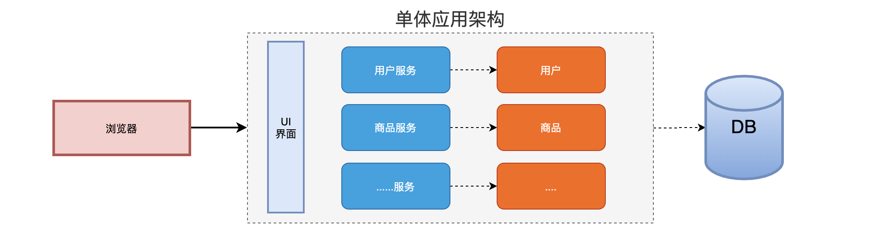
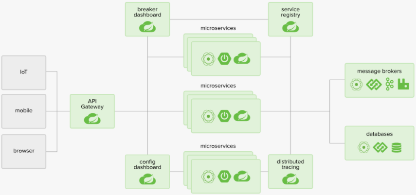
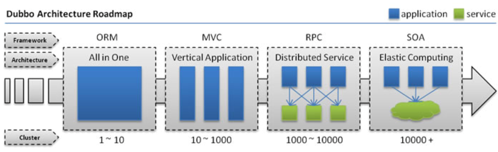
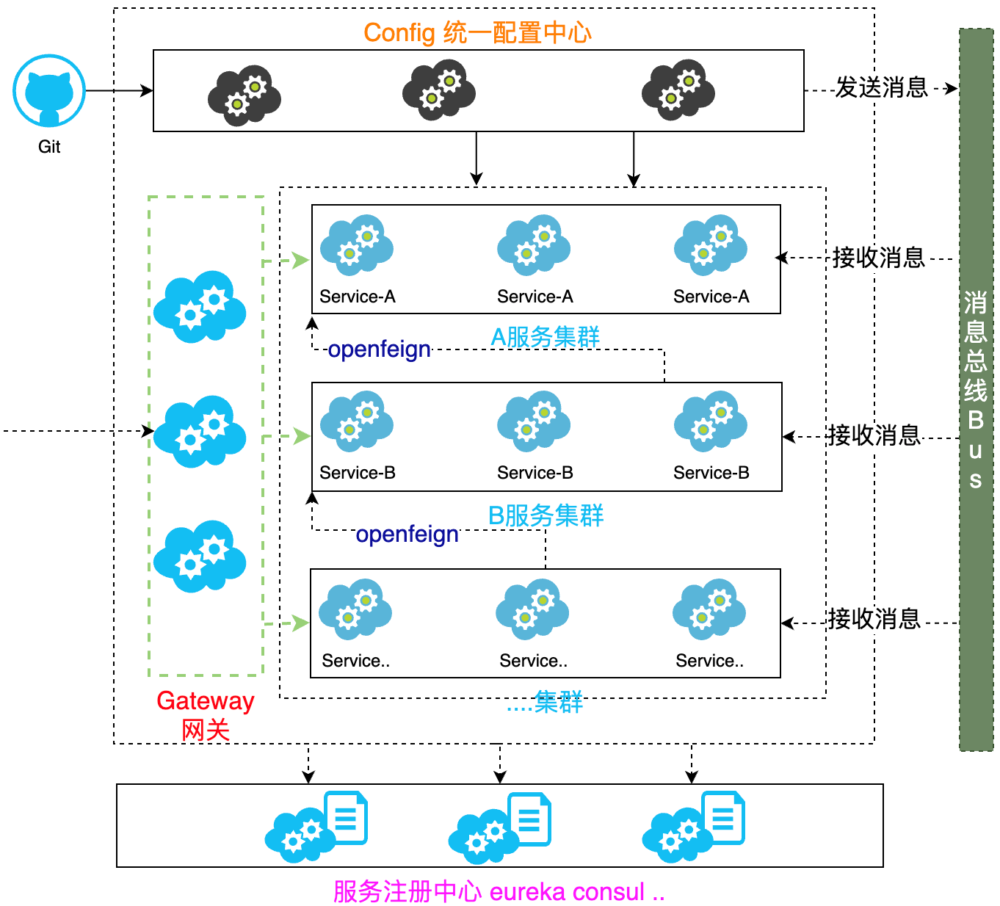
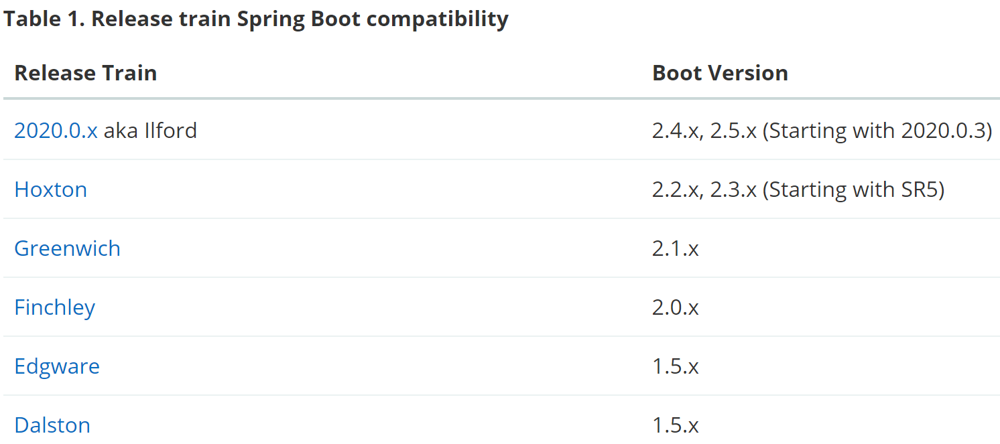

# 什么是微服务

将单体应用基于业务进行拆分，拆分成一个个微小的服务，每一个服务都是一个独立的应用、独立开发、独立部署，独立运行在自己的计算机进程中。对于这些服务，都是进行分布式管理。

- 软件服务集群：同一种软件服务的多个服务节点，共同为系统提供服务（厨房里三个厨子做菜）
- 分布式：不同软件集群共同为一个系统提供服务（厨房了有切菜、炒菜、端盘的师傅）

微服务是一种架构，这种架构是将`单个的整体应用程序`分割成更小的项目关联的`独立的服务`。一个服务通常实现一组独立的特性或功能，包含自己的业务逻辑和适配器。==各个微服务之间的关联通过暴露 API 来实现==。这些独立的微服务不需要部署在同一个虚拟机，同一个系统和同一个应用服务器中。

# 为什么要使用微服务

## 单体应用



优点：

-  单一架构模式在项目初期很小的时候，开发方便，测试方便，部署方便，运行良好。

缺点：

- 应用随着时间的推进，加入的功能越来越多，最终会变得巨大，一个项目中可能有数百万行代码，互相之间繁琐的 jar 包依赖。久而久之，开发效率低，代码维护困难；
- 如果想整体应用采用新的技术，新的框架或者语言，那是不可能的。
- 任意模块的漏洞或者错误都会影响这个应用，降低系统的可靠性。

## 微服务架构应用



优点：
- 将服务拆分成多个单一职责的小的服务，进行单独部署，服务之间通过网络进行通信
  - 例如==“商品服务”相较于“广告服务”访问量会更大，因此可以多部署集群节点==。
- 每个服务应该有自己单独的管理团队，高度自治；
- 服务各自有自己单独的职责，==服务之间松耦合==，避免因一个模块的问题导致服务崩溃。

缺点：
- 开发人员要处理分布式系统的复杂性；
- 多服务运维难度，随着服务的增加，运维的压力也在增大；
- `服务治理`和`服务监控`是关键
  - 难点：负载均衡调用、服务雪崩解决（一个服务瘫痪影响其他服务崩溃）、服务配置管理、服务的监控。

## 架构的演变



- All in One Application：单一架构
  - 起初当网站流量很小时，将所有功能都写在一个应用里面，对整个应用进行部署，以减少部署节点和成本。对于这个架构，简化增删改查工作量的数据访问（ORM——Object Relation Mapping）是关键。


- Vertical Application：垂直架构
  - 当访问量逐渐增大，单一应用增加机器带来的加速度越来越小，提升效率的方法之一是将应用拆成互不相干的几个应用，以提升效率。此时，用于加速前端页面开发的Web框架（MVC）是关键。


- Distributed Service：分布式服务架构
  - 当垂直应用越来越多，应用之间交互不可避免，将核心业务抽取出来，作为独立的服务，逐渐形成稳定的==服务中心==，使前端应用能更快速的响应多变的市场需求。此时，用于提高业务复用及整合的分布式服务框架（RPC——服务间通信手段，提高传输性能——传输层）是关键。


- Elastic Computing：流动计算架构即微服务架构
  - 当服务越来越多，容量的评估，小服务资源的浪费等问题逐渐显现，此时需增加一个调度中心基于访问压力实时管理集群容量，提高集群利用率。此时，用于提高机器利用率的资源调度和治理中心（SOA——面向服务的体系架构）是关键。


## 微服务的解决方案

### Dubbo（阿里系）

- 初出茅庐：2011年末，阿里巴巴开源了基于 Java 的分布式服务治理框架 Dubbo，其致力于提供高性能和透明化的 ==RPC 远程服务==调用方案，以及 SOA 服务治理方案，使得应用可通过高性能 RPC 实现服务的输出、输入功能和 Spring 框架无缝集成。Dubbo包含远程通讯、集群容错和自动发现三个核心部分。
- 2018年1月8日，Dubbo 创始人透露了 Dubbo 3.0 正在动工的消息。Dubbo 3.0 内核与 Dubbo 2.0 完全不同，但兼容 Dubbo 2.0。Dubbo 3.0 将以 Streaming 为内核，不再是 Dubbo 时代的 RPC，但是 RPC 会在 Dubbo 3.0 中变成远程 Streaming 对接的一种可选形态。从 Dubbo 新版本的路线规划上可以看出，新版本的 Dubbo 在原有服务治理的功能基础上，将全面拥抱微服务解决方案。

当前由于 ==RPC 协议、注册中心元数据不匹配==等问题，在面临微服务基础框架选型时 Dubbo 与 Spring Cloud 是只能二选一，这也是为什么大家总是拿 Dubbo 和 Spring Cloud 做对比的原因之一。

Dubbo 积极寻求适配到 Spring Cloud 生态，比如作为 Spring Cloud 的二进制通信方案来发挥 Dubbo 的性能优势，或者 Dubbo 通过模块化以及对 HTTP 的支持适配到 Spring Cloud。

### Spring Cloud

- Spring Cloud NetFlix  
  - 基于美国 Netflix 公司开源的组件进行封装，提供了微服务一栈式的解决方案。
  - Spring Netflix 维护、闭源。

- Spring Cloud
  - Spring 官方正在逐渐吸收 Netflix 组件的精华，并在此基础进行二次封装优化，打造 Spring 专有的解决方案
- Spring Cloud Alibaba
  在 Spring Cloud Netflix 基础上封装了阿里巴巴的微服务解决方案。


# 什么是 Spring Cloud

## 概述

> **Spring Cloud provides tools for developers to quickly build some of the common patterns in distributed systems** (e.g. `configuration management`(配置网络), ` service discovery`(注册中心), `circuit breakers`(服务熔断), `intelligent routing`(网关), `micro-proxy`, `control bus`). Coordination of distributed systems leads to boiler plate patterns, and using Spring Cloud developers can quickly stand up services and applications that implement those patterns. ——[官方网址](https://cloud.spring.io/spring-cloud-static/Hoxton.SR5/reference/html/)

Spring Cloud 是一个含概多个子项目的==开发工具集==，集合了众多的开源框架。它利用了 Spring Boot 开发的便利性实现了很多功能，如服务注册、服务注册发现、负载均衡等。Spring Cloud 的出现真正的简化了分布式架构的开发。

Spring Cloud 在整合过程中主要是针对 Netflix（耐非）开源组件的封装。NetFlix 是美国的一个在线视频网站，微服务业的翘楚，它是公认的大规模生产级微服务的杰出实践者。NetFlix 的开源组件已经在其大规模分布式微服务环境中经过多年的生产实战验证，因此 Spring Cloud 中很多组件都是基于 NetFlix 的。

## 核心架构及其组件

- Eureka Server、Consul、Nacos：服务注册中心（全局管理服务）组件，记录服务名、IP和端口；
- Rabbion、Openfeign：服务负载均衡（将请求均分到集群节点上）和服务调用组件；
- Hystrix、Hystrix Dashboard：服务断路器（解决某个服务不可用、执行业务逻辑时间过长产生雪崩）和服务监控组件；
- Zuul、Gateway：服务网关组件（==管理微服务统一入口==，前端系统访问网关地址，网关进行路由转发）；
- Config：统一配置中心组件；
- Bus：消息总线组件，自动配置刷新。



# 版本与环境搭建

## 版本选择

版本选择官方建议：https://spring.io/projects/spring-cloud



## 创建父项目

选用`SpringBoot 2.2.5.RELEASE`、`SpringCloud Hoxton.SR8`

- 创建`Empty Project`：D:\Learning\SpringCloud\SpringCloudCode\SpringCloudDemo

- 创建`Modules`：选择 Maven 创建（D:\Learning\SpringCloud\SpringCloudCode\SpringCloudDemo\SpringCloudParent）

- 删除 SpringCloudParent 中的`src`；

- 在 pom.xml 中进行全局配置：

  ```xml
  <!--定义 SpringCloud 使用版本号-->
  <properties>
      <maven.compiler.source>8</maven.compiler.source>
      <maven.compiler.target>8</maven.compiler.target>
  
      <spring.cloud-version>Hoxton.SR8</spring.cloud-version>
  </properties>
  
  <!--继承SpringBoot的父项目-->
  <parent>
      <groupId>org.springframework.boot</groupId>
      <artifactId>spring-boot-starter-parent</artifactId>
      <version>2.2.5.RELEASE</version>
  </parent>
  
  <!--全局管理SpringCloud版本，并不会引入具体依赖-->
  <dependencyManagement>
      <dependencies>
          <dependency>
              <groupId>org.springframework.cloud</groupId>
              <artifactId>spring-cloud-dependencies</artifactId>
              <version>${spring.cloud-version}</version>
              <type>pom</type>
              <scope>import</scope>
          </dependency>
      </dependencies>
  </dependencyManagement>
  ```

  

