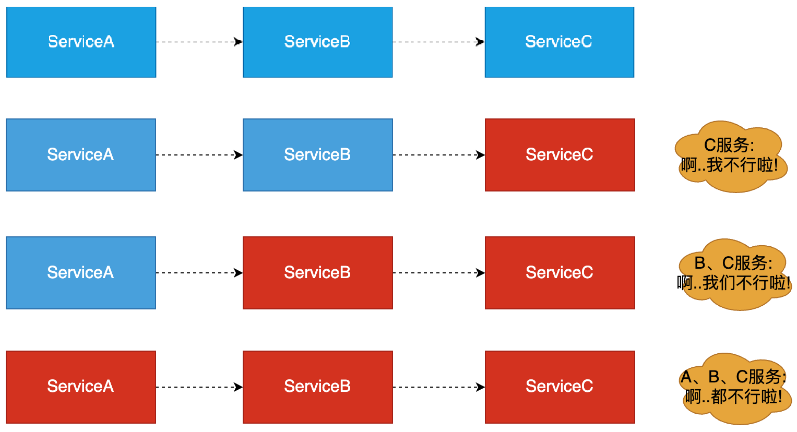
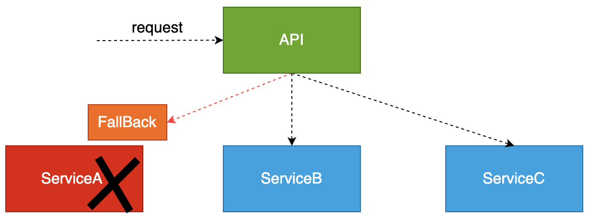
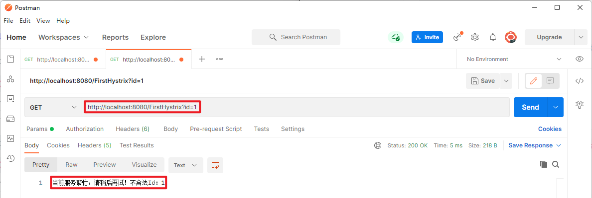
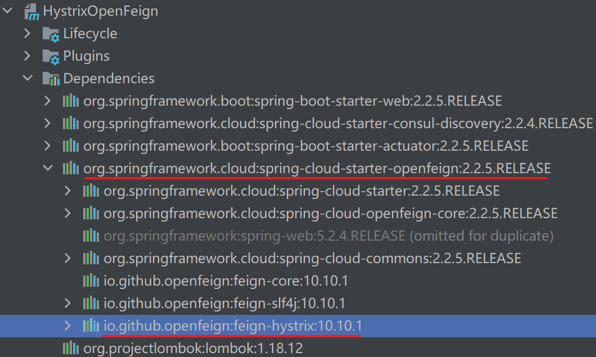
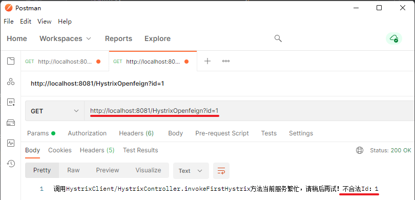
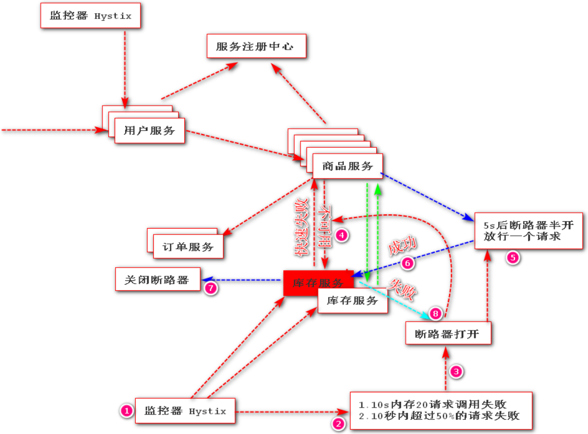
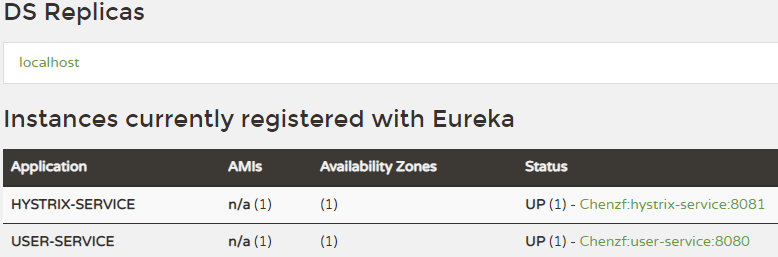

# Hystrix 简介

在微服务架构中，服务与服务之间通过远程调用的方式进行通信，一旦某个被调用的服务发生了故障，其依赖服务也会发生故障，此时就会发生故障的蔓延，最终导致系统瘫痪。

Hystrix 是一个用于==处理分布式系统的延迟和容错==的开源库。它实现了==断路器模式==，当某个服务发生故障（调用失败，超时、异常等）时，==通过断路器的监控，给调用方返回一个错误响应，而不是长时间的等待==，这样就不会使得调用方由于长时间得不到响应而占用线程，从而==防止故障的蔓延，避免级联故障（服务雪崩现象）==。

Hystrix 具备服务降级、服务熔断、线程隔离、请求缓存、请求合并及服务监控等强大功能。

# 基本概念

## 服务雪崩

在微服务之间进行服务调用时，==由于某一个服务故障，导致级联服务故障的现象==，称为雪崩效应。

雪崩效应描述的是提供方不可用，导致消费方不可用，并将不可用逐渐放大的过程。



Service A 的流量波动很大，流量经常会突然性增加！在这种情况下，就算 Service A 能扛得住请求压力，Service B 和 Service C 也未必能扛得住这突发的请求。

如果 Service C 因为抗不住请求，变得不可用，那么 Service B 的请求也会阻塞，慢慢耗尽 Service B 的线程资源，Service B 就会变得不可用。紧接着，Service A 也会不可用。

## 服务熔断

熔断器本身是一种==开关装置==，当某个服务单元发生故障之后，通过断路器（Hystrix）的故障监控，某个异常条件被触发直接熔断整个服务：即**<font color=red>向调用方法返回一个符合预期的、可处理的备选响应（FallBack）</font>>**，而不是长时间的等待或者抛出调用方法无法处理的异常。
- 保证了==服务调用方的线程不会被长时间占用==，避免故障在分布式系统中蔓延，乃至雪崩。如果目标服务情况好转，则恢复调用。
- ==服务熔断==是==解决服务雪崩==的重要手段。


## 服务降级

服务压力剧增的时候，根据当前的业务情况及流量，==对一些服务和页面有策略的降级==，以此缓解服务器的压力，以==保证核心任务的进行==。同时保证部分，甚至大部分任务客户能得到正确的响应。也就是当前的请求处理不了了或者出错了，给一个默认的返回。

- 服务降级：<font color=red>**关闭**微服务系统中某些**边缘服务**</font>，保证系统==核心服务==正常运行；

- 例如双十一，为了确保==下单服务==的正常运行，==关闭评价以往订单服务==！




## 降级和熔断总结

### 共同点

- 目的一致
  - 都是从可用性可靠性着想，为防止系统的整体缓慢甚至崩溃，采用的技术手段；
- 最终表现类似
  - 对于两者来说，最终让用户体验到的是==某些功能暂时不可达或不可用==；
- 粒度一般都是服务级别
  - 业界也有不少更细粒度的做法，比如做到数据持久层（允许查询，不允许增删改）；
- 自治性要求很高
  - 熔断模式一般都是服务基于策略的==自动触发==；
  - 降级虽说可人工干预，但在微服务架构下，完全靠人显然不可能，==开关预置、配置中心==都是必要手段。

### 不同点

- 触发原因不一样
  - 服务熔断一般是==某个服务（下游服务）故障==引起；
  - 而服务降级一般是从==整体负荷==考虑；
- 管理目标的层次不一样
  - 熔断是一个==框架级==的处理，每个微服务都需要（无层级之分）；
  - 而降级一般需要==对业务有层级之分==（比如降级一般是从最外围服务、边缘服务开始）

# 服务熔断的实现

在【所有微服务】中引入 hystrix 依赖，并开启熔断器（断路器）。

## 示例 HystrixClient

### 创建 HystrixClient 项目、引入依赖

项目地址：D:\Learning\SpringCloud\SpringCloudCode\SpringCloudDemo\SpringCloudDemoParent\HystrixClient

依赖：

```xml
<dependencies>
    <!--SpringBootWeb-->
    <dependency>
        <groupId>org.springframework.boot</groupId>
        <artifactId>spring-boot-starter-web</artifactId>
    </dependency>

    <!--引入Consul依赖-->
    <dependency>
        <groupId>org.springframework.cloud</groupId>
        <artifactId>spring-cloud-starter-consul-discovery</artifactId>
    </dependency>

    <!--引入健康检查依赖-->
    <dependency>
        <groupId>org.springframework.boot</groupId>
        <artifactId>spring-boot-starter-actuator</artifactId>
    </dependency>

    <dependency>
        <groupId>org.projectlombok</groupId>
        <artifactId>lombok</artifactId>
    </dependency>
</dependencies>
```

### 添加配置、创建入口类

#### 配置

```properties
spring.application.name=HystrixClient

# 注册Consul服务的主机
spring.cloud.consul.host=localhost
# 注册Consul服务的端口号
spring.cloud.consul.port=8500
```

#### 入口类

```java
package com.example;

import org.springframework.boot.SpringApplication;
import org.springframework.boot.autoconfigure.SpringBootApplication;
import org.springframework.cloud.client.circuitbreaker.EnableCircuitBreaker;
import org.springframework.cloud.client.discovery.EnableDiscoveryClient;

/**
 * @author chenzufeng
 * @SpringBootApplication：代表SpringBoot应用
 * @EnableDiscoveryClient：代表服务注册中心Consul客户端
 */
@SpringBootApplication
@EnableDiscoveryClient
public class HystrixApplication {
    public static void main(String[] args) {
        SpringApplication.run(HystrixApplication.class, args);
    }
}
```

### 引入 hystrix 依赖

```xml
<!--引入hystrix-->
<dependency>
  <groupId>org.springframework.cloud</groupId>
  <artifactId>spring-cloud-starter-netflix-hystrix</artifactId>
</dependency>
```

### 开启断路器

在入口类加入注解`@EnableCircuitBreaker`：

```java
package com.example;

import org.springframework.boot.SpringApplication;
import org.springframework.boot.autoconfigure.SpringBootApplication;
import org.springframework.cloud.client.circuitbreaker.EnableCircuitBreaker;
import org.springframework.cloud.client.discovery.EnableDiscoveryClient;

/**
 * @author chenzufeng
 * @SpringBootApplication：代表SpringBoot应用
 * @EnableDiscoveryClient：代表服务注册中心Consul客户端
 * @EnableCircuitBreaker：开启Hystrix断路器
 */
@SpringBootApplication
@EnableDiscoveryClient
@EnableCircuitBreaker
public class HystrixApplication {
    public static void main(String[] args) {
        SpringApplication.run(HystrixApplication.class, args);
    }
}
```

### 使用 HystrixCommand 注解实现断路

```java
package com.example.controller;

import com.netflix.hystrix.contrib.javanica.annotation.HystrixCommand;
import lombok.extern.slf4j.Slf4j;
import org.springframework.web.bind.annotation.GetMapping;
import org.springframework.web.bind.annotation.RestController;

@RestController
@Slf4j
public class HystrixController {

    /**
     * 通过localhost:8080/FirstHystrix?id=xx的方式传递Id
     * @HystrixCommand：指定熔断时快速返回方法；
     * 		该方法参数列表、返回值需与@HystrixCommand修饰的方法一致；
     * 		默认先执行自定义的备选处理。
     * @return String
     */
    @GetMapping("FirstHystrix")
    @HystrixCommand(fallbackMethod = "testFallBack", defaultFallback = "defaultFallback")
    public String invokeFirstHystrix(Integer id) {
        log.info("============================");
        log.info("First Hystrix Demo !");
        if (id < 0) {
            throw new RuntimeException("无效Id！");
        }
        log.info("============================");
        return "First Hystrix demo is done !";
    }

    /**
     * 自定义备选处理
     * 一旦熔断后，不再运行throw new RuntimeException("无效Id！")，而运行testFallBack
     * @param id id
     * @return String
     */
    public String testFallBack(Integer id) {
        return "当前服务繁忙，请稍后再试！不合法Id：" + id;
    }

    /**
     * 使用Hystrix默认的备选处理
     */
    public String defaultFallback() {
        return "执行Hystrix默认的备选处理";
    }
}
```

### 测试

- 开启 Consul 服务注册中心：`consul agent -dev`

- 启动 HystrixClient；

- 登录 Consul：http://localhost:8500/，检查服务是否已经注册到 Consul。

- 访问测试

  - 正常参数访问：http://localhost:8080/FirstHystrix?id=1，输出：

    ```markdown
    First Hystrix demo is done !
    ```

  - 错误参数访问（==服务不停止==）：http://localhost:8080/FirstHystrix?id=-1，输出：

    ```markdown
    当前服务繁忙，请稍后再试！不合法Id：-1

<font color=red>频繁使用错误参数访问，触发熔断，再使用正常参数访问，但出现熔断现象</font>：



如果触发一定条件，断路器会自动打开，过了一点时间正常之后又会关闭。

## OpenFeign 整合 Hystrix 实现服务熔断

OpenFeign 默认依赖了 hystrix，无需显式引入：



### 创建 HystrixOpenfeign 项目

创建`HystrixOpenfeign`项目（Module），调用`HystrixClient`服务。

#### 引入 OpenFeign 依赖

```xml
<dependencies>
    <!--SpringBootWeb-->
    <dependency>
        <groupId>org.springframework.boot</groupId>
        <artifactId>spring-boot-starter-web</artifactId>
    </dependency>

    <!--引入Consul-->
    <dependency>
        <groupId>org.springframework.cloud</groupId>
        <artifactId>spring-cloud-starter-consul-discovery</artifactId>
    </dependency>

    <!--引入健康检查依赖-->
    <dependency>
        <groupId>org.springframework.boot</groupId>
        <artifactId>spring-boot-starter-actuator</artifactId>
    </dependency>

    <!--Open Feign依赖-->
    <dependency>
        <groupId>org.springframework.cloud</groupId>
        <artifactId>spring-cloud-starter-openfeign</artifactId>
    </dependency>

    <dependency>
        <groupId>org.projectlombok</groupId>
        <artifactId>lombok</artifactId>
    </dependency>
</dependencies>
```

#### 入口类加 @EnableFeignClients

入口类加入`@EnableFeignClients`注解，开启 OpenFeign 调用：

```java
package com.example;

import org.springframework.boot.SpringApplication;
import org.springframework.boot.autoconfigure.SpringBootApplication;
import org.springframework.cloud.client.discovery.EnableDiscoveryClient;
import org.springframework.cloud.openfeign.EnableFeignClients;

/**
 * @EnableDiscoveryClient：代表服务注册中心Consul客户端
 * @EnableFeignClients：开启OpenFeogn客户端调用
 */
@SpringBootApplication
@EnableDiscoveryClient
@EnableFeignClients
public class HystrixOpenFeignApplication {
    public static void main(String[] args) {
        SpringApplication.run(HystrixOpenFeignApplication.class, args);
    }
}
```

### 服务调用者创建接口、调用服务

#### 创建接口

com/example/feignclient/HystrixOpenFeignClient.java：

```java
package com.example.feignclient;

import org.springframework.cloud.openfeign.FeignClient;
import org.springframework.web.bind.annotation.GetMapping;
import org.springframework.web.bind.annotation.RequestParam;

/**
 * @author chenzufeng
 */
@FeignClient("HystrixClient")
public interface HystrixOpenFeignClient {
    /**
     * 调用HystrixClient/HystrixController.invokeFirstHystrix服务
     * RequestParam("id")：底层数据传递方式Query String
     * @param id id
     * @return String
     */
    @GetMapping("FirstHystrix")
    String invokeFirstHystrix(@RequestParam("id") Integer id);
}
```

### 服务调用者调用服务

在`HystrixOpenfeignController`注入 OpenFeign 客户端对象，并调用服务：

```java
package com.example.controller;

import com.example.feignclient.HystrixOpenFeignClient;
import lombok.extern.slf4j.Slf4j;
import org.springframework.beans.factory.annotation.Autowired;
import org.springframework.web.bind.annotation.GetMapping;
import org.springframework.web.bind.annotation.RestController;

@RestController
@Slf4j
public class HystrixOpenfeignController {
    @Autowired
    private HystrixOpenFeignClient hystrixOpenFeignClient;

    @GetMapping("HystrixOpenfeign")
    public String testHystrixOpenfeign() {
        log.info("调用HystrixClient/HystrixController.invokeFirstHystrix方法");
        String invokeFirstHystrix = hystrixOpenFeignClient.invokeFirstHystrix(-1);
        log.info("HystrixClient/HystrixController.invokeFirstHystrix方法结果：{}", invokeFirstHystrix);
        return "调用HystrixClient/HystrixController.invokeFirstHystrix方法";
    }
}
```

### 服务提供者实现服务

[服务提供者](# 服务熔断的实现)实现被调用的服务：

```java
package com.example.controller;

import com.netflix.hystrix.contrib.javanica.annotation.HystrixCommand;
import lombok.extern.slf4j.Slf4j;
import org.springframework.web.bind.annotation.GetMapping;
import org.springframework.web.bind.annotation.RestController;

/**
 * @author chenzufeng
 */

@RestController
@Slf4j
public class HystrixController {

    /**
     * 通过localhost:8080/FirstHystrix?id=xx的方式传递Id
     * HystrixCommand：指定熔断时快速返回方法；
     *                             该方法参数列表、返回值需与HystrixCommand修饰的方法一致
     *                             默认先执行自定义的备选处理
     * @return String
     */
    @GetMapping("FirstHystrix")
    @HystrixCommand(fallbackMethod = "testFallBack", defaultFallback = "defaultFallback")
    public String invokeFirstHystrix(Integer id) {
        log.info("============================");
        log.info("First Hystrix Demo !");
        if (id < 0) {
            throw new RuntimeException("无效Id！");
        }
        log.info("============================");
        return "First Hystrix demo is done !";
    }

    /**
     * 自定义备选处理
     * 一旦熔断后，不再运行throw new RuntimeException("无效Id！")，而运行testFallBack
     * @param id id
     * @return String
     */
    public String testFallBack(Integer id) {
        return "当前服务繁忙，请稍后再试！不合法Id：" + id;
    }

    /**
     * 使用Hystrix默认的备选处理
     */
    public String defaultFallback() {
        return "执行Hystrix默认的备选处理";
    }
}
```

### 测试

- 开启 Consul 服务注册中心：`consul agent -dev`

- 启动 HystrixClient（8080）、HystrixOpenFeignApplication（8081）；

- 登录 Consul：http://localhost:8500/，检查服务是否已经注册到 Consul。

- 访问测试

  - 正常参数访问：http://localhost:8081/HystrixOpenfeign?id=1，输出：

    ```markdown
    调用HystrixClient/HystrixController.invokeFirstHystrix方法First Hystrix demo is done !
    ```

  - 错误参数访问：http://localhost:8081/HystrixOpenfeign?id=-1，输出：

    ```markdown
    调用HystrixClient/HystrixController.invokeFirstHystrix方法当前服务繁忙，请稍后再试！不合法Id：-1
    ```

<font color=red>频繁使用错误参数访问，触发熔断，再使用正常参数访问，但出现熔断现象</font>：




## 断路器工作流程

1、当满足一定的阀值的时候（默认 10 秒内超过 20 个请求次数）

2、当失败率达到一定的时候（默认 10 秒内超过 50% 的请求失败）

3、到达以上阀值，断路器将会开启。==当开启的时候，所有请求都不会进行转发==。

4、一段时间之后（默认是 5 秒），这个时候断路器是==半开状态==，会让其中【一个请求】进行转发。如果成功，断路器会关闭；若失败，继续开启。重复 3 和 4。




# 服务降级的实现

## 示例一

OpenFeign + hystrix 实现服务降级实现
- 引入 hystrix 依赖（==OpenFeign 默认依赖了 hystrix，无需显式引入==）；
- 配置文件开启 Feign 支持 hystrix；
- 在 Feign 客户端调用加入 fallback 指定降级处理；
- 开发降级处理方法（服务调用失败默认处理的实现类）。


项目地址：D:\Learning\SpringCloud\SpringCloudCode\SpringCloudDemo\SpringCloudDemoParent\HystrixOpenFeign

### 配置文件开启 Feign 支持 hystrix

```properties
server.port=8081
spring.application.name=HystrixOpenfeign

# 注册Consul服务的主机
spring.cloud.consul.host=localhost
# 注册Consul服务的端口号
spring.cloud.consul.port=8500

# 开启OpenFeign支持降级
feign.hystrix.enabled=true
```

### 开发 fallback 处理类

```java
package com.example.feignclient;

import org.springframework.context.annotation.Configuration;

/**
 * @author chenzufeng
 * @date 2021/8/3
 * @usage HystrixOpenFeignClientFallBack fallback处理类
 */
@Configuration
public class HystrixOpenFeignClientFallBack implements HystrixOpenFeignClient {
    @Override
    public String invokeFirstHystrix(Integer id) {
        return "正在进行服务降级处理！";
    }
}
```


### 在 HystrixOpenFeign 接口上添加 fallback

```java
@FeignClient(value = "HystrixClient", fallback = HystrixOpenFeignClientFallBack.class)
```

具体的：

```java
package com.example.feignclient;

import org.springframework.cloud.openfeign.FeignClient;
import org.springframework.web.bind.annotation.GetMapping;
import org.springframework.web.bind.annotation.RequestParam;

/**
 * @author chenzufeng
 */
@FeignClient(value = "HystrixClient", fallback = HystrixOpenFeignClientFallBack.class)
public interface HystrixOpenFeignClient {
    /**
     * 调用HystrixClient/HystrixController.invokeFirstHystrix服务
     * RequestParam("id")：底层数据传递方式Query String
     * @param id id
     * @return String
     */
    @GetMapping("FirstHystrix")
    String invokeFirstHystrix(@RequestParam("id") Integer id);
}
```

### 测试

- 开启 Consul 服务注册中心：`consul agent -dev`

- 启动 HystrixClient（8080）、HystrixOpenFeignApplication（8081）；

- 登录 Consul：http://localhost:8500/，检查服务是否已经注册到 Consul。

- 访问测试

  - 正常访问：http://localhost:8081/HystrixOpenfeign?id=1，输出：

    ```markdown
    调用HystrixClient/HystrixController.invokeFirstHystrix方法First Hystrix demo is done !
    ```

  - ==停止 HystrixClient 服务==，再调用http://localhost:8081/HystrixOpenfeign?id=1，输出：

    ```markdown
    调用HystrixClient/HystrixController.invokeFirstHystrix方法调用服务不可用，正在进行服务降级处理！
    ```

## 示例二

### 创建项目、添加依赖

创建 hystrix-service 模块：D:\Learning\SpringCloud\SpringCloudCode\SpringCloudMall\MallParent\hystrix-service

添加依赖：

```xml
<dependencies>
    <dependency>
        <groupId>org.springframework.boot</groupId>
        <artifactId>spring-boot-starter-web</artifactId>
    </dependency>

    <dependency>
        <groupId>org.springframework.cloud</groupId>
        <artifactId>spring-cloud-starter-netflix-eureka-client</artifactId>
    </dependency>

    <!--引入hystrix-->
    <dependency>
        <groupId>org.springframework.cloud</groupId>
        <artifactId>spring-cloud-starter-netflix-hystrix</artifactId>
    </dependency>

    <dependency>
        <groupId>org.projectlombok</groupId>
        <artifactId>lombok</artifactId>
    </dependency>
    
    <!--hutool-->
    <dependency>
            <groupId>cn.hutool</groupId>
            <artifactId>hutool-all</artifactId>
            <version>5.7.5</version>
        </dependency>
</dependencies>
```

### 添加配置、创建启动类

在配置文件中配置端口、注册中心地址及 user-service 的调用路径：

```yaml
# 1. 配置端口、注册中心地址及 user-service 的调用路径
server:
  port: 8081

spring:
  application:
    name: hystrix-service

eureka:
  client:
    service-url:
      defaultZone: http://localhost:8761/eureka/
    register-with-eureka: true
    fetch-registry: true

service-url:
  user-service: http://user-service
```

在启动类上添加`@EnableCircuitBreaker`来==开启 Hystrix 的断路器功能==：

```java
package com.example;

import org.springframework.boot.SpringApplication;
import org.springframework.boot.autoconfigure.SpringBootApplication;
import org.springframework.cloud.client.circuitbreaker.EnableCircuitBreaker;
import org.springframework.cloud.netflix.eureka.EnableEurekaClient;

/**
 * @author chenzufeng
 * @date 2021/8/7
 * @usage HystrixServiceApplication
 * @EnableCircuitBreaker 开启 Hystrix 的断路器功能
 */
@SpringBootApplication
@EnableEurekaClient
@EnableCircuitBreaker
public class HystrixServiceApplication {
    public static void main(String[] args) {
        SpringApplication.run(HystrixServiceApplication.class, args);
    }
}
```

### 创建实体类

`User`

```java
package com.example.entity;

import lombok.AllArgsConstructor;
import lombok.Data;
import lombok.NoArgsConstructor;

/**
 * @author chenzufeng
 * @date 2021/8/7
 * @usage User
 */
@Data
@AllArgsConstructor
@NoArgsConstructor
public class User {
    private Long id;
    private String userName;
    private String password;
}
```


`CommonResult`

```java
package com.example.entity;

/**
 * @author chenzufeng
 * @date 2021/8/7
 * @usage CommonResult
 */
public class CommonResult<T> {
    private T data;
    private String message;
    private Integer code;

    public CommonResult() {
    }

    public CommonResult(T data, String message, Integer code) {
        this.data = data;
        this.message = message;
        this.code = code;
    }

    public CommonResult(String message, Integer code) {
        this(null, message, code);
    }

    public CommonResult(T data) {
        this(data, "操作成功", 200);
    }

    // Getter & Setter
}
```

### config 服务间通信

`RibbonConfig`

```java
package com.example.config;

import org.springframework.cloud.client.loadbalancer.LoadBalanced;
import org.springframework.context.annotation.Bean;
import org.springframework.context.annotation.Configuration;
import org.springframework.web.client.RestTemplate;

/**
 * @author chenzufeng
 * @date 2021/8/7
 * @usage RibbonConfig
 */
@Configuration
public class RibbonConfig {
    @Bean
    @LoadBalanced
    public RestTemplate restTemplate() {
        return new RestTemplate();
    }
}
```

### 服务降级

#### service

在 UserService 中添加调用方法与服务降级方法，方法上需要添加 `@HystrixCommand` 注解；注意添加`@Service`注解：

```java
package com.example.service;

import com.example.entity.CommonResult;
import com.example.entity.User;
import com.netflix.hystrix.contrib.javanica.annotation.HystrixCommand;
import org.springframework.beans.factory.annotation.Autowired;
import org.springframework.beans.factory.annotation.Value;
import org.springframework.stereotype.Service;
import org.springframework.web.bind.annotation.PathVariable;
import org.springframework.web.client.RestTemplate;

/**
 * @author chenzufeng
 * @date 2021/8/7
 * @usage UserService
 */
@Service
public class UserService {
    @Autowired
    private RestTemplate restTemplate;

    @Value("${service-url.user-service}")
    private String userServiceUrl;

    /**
     * 1. 添加调用方法与服务降级方法
     */
    @HystrixCommand(fallbackMethod = "getDefaultUser")
    public CommonResult getUser(Long id) {
        return restTemplate.getForObject(userServiceUrl + "/User/{1}", CommonResult.class, id);
    }
    
    public CommonResult getDefaultUser(@PathVariable Long id) {
        User defaultUser = new User(-1L, "defaultUser", "123456");
        return new CommonResult<>(defaultUser);
    }
}
```

#### controller

在 UserHystrixController 中添加用于测试服务降级的接口：

```java
package com.example.controller;

import com.example.entity.CommonResult;
import com.example.service.UserService;
import org.springframework.beans.factory.annotation.Autowired;
import org.springframework.web.bind.annotation.GetMapping;
import org.springframework.web.bind.annotation.PathVariable;
import org.springframework.web.bind.annotation.RequestMapping;
import org.springframework.web.bind.annotation.RestController;

/**
 * @author chenzufeng
 * @date 2021/8/7
 * @usage UserHystrixController
 */
@RestController
@RequestMapping("/User")
public class UserHystrixController {
    @Autowired
    private UserService userService;

    /**
     * 1. 用于测试服务降级的接口
     */
    @GetMapping("/TestFallback/{id}")
    public CommonResult testFallback(@PathVariable Long id) {
        return userService.getUser(id);
    }
}
```

#### 演示

启动 [eureka-server](服务注册中心.md)、[user-service(基于Ribbon的服务调用--实例二)](负载均衡的服务调用.md)、hystrix-service 服务：



调用接口进行测试：[http://localhost:8081/User/TestFallback/1]()

```json
{
    "data": {
        "id": 1,
        "userName": "chen",
        "password": "123"
    },
    "message": "操作成功",
    "code": 200
}
```

关闭 user-service 服务，重新测试该接口，发现已经发生了服务降级：

```json
{
    "data": {
        "id": -1,
        "userName": "defaultUser",
        "password": "123456"
    },
    "message": "操作成功",
    "code": 200
}
```

# @HystrixCommand 常用参数

- `fallbackMethod`：指定服务降级处理方法；
- `ignoreExceptions`：忽略某些异常，不发生服务降级；
- `commandKey`：命令名称，用于区分不同的命令；
- `groupKey`：分组名称，Hystrix 会根据不同的分组来统计命令的告警及仪表盘信息；
- `threadPoolKey`：线程池名称，用于划分线程池。

使用项目：D:\Learning\SpringCloud\SpringCloudCode\SpringCloudMall\MallParent\hystrix-service

## 设置命令、分组及线程池名称

### service

```java
package com.example.service;

import com.example.entity.CommonResult;
import com.example.entity.User;
import com.netflix.hystrix.contrib.javanica.annotation.HystrixCommand;
import lombok.extern.slf4j.Slf4j;
import org.springframework.beans.factory.annotation.Autowired;
import org.springframework.beans.factory.annotation.Value;
import org.springframework.stereotype.Service;
import org.springframework.web.bind.annotation.PathVariable;
import org.springframework.web.client.RestTemplate;

/**
 * @author chenzufeng
 * @date 2021/8/7
 * @usage UserService
 */
@Service
@Slf4j
public class UserService {
    @Autowired
    private RestTemplate restTemplate;

    @Value("${service-url.user-service}")
    private String userServiceUrl;

    /**
     * 1. 添加调用方法与服务降级方法
     */

    @HystrixCommand(fallbackMethod = "getDefaultUser")
    public CommonResult getUser(Long id) {
        return restTemplate.getForObject(userServiceUrl + "/User/{1}", CommonResult.class, id);
    }

    public CommonResult getDefaultUser(@PathVariable Long id) {
        User defaultUser = new User(-1L, "defaultUser", "123456");
        return new CommonResult<>(defaultUser);
    }

    /**
     * 2.  设置命令、分组及线程池名称
     */

    @HystrixCommand(
            fallbackMethod = "getDefaultUser",
            commandKey = "getUserCommand",
            groupKey = "getUserGroup",
            threadPoolKey = "getUserThreadPool"
    )
    public CommonResult getUserCommand(@PathVariable Long id) {
        log.info("getUserCommand id: {}", id);
        return restTemplate.getForObject(userServiceUrl + "/User/{1}", CommonResult.class, id);
    }
}
```

### controller

```java
package com.example.controller;

import com.example.entity.CommonResult;
import com.example.service.UserService;
import org.springframework.beans.factory.annotation.Autowired;
import org.springframework.web.bind.annotation.GetMapping;
import org.springframework.web.bind.annotation.PathVariable;
import org.springframework.web.bind.annotation.RequestMapping;
import org.springframework.web.bind.annotation.RestController;

/**
 * @author chenzufeng
 * @date 2021/8/7
 * @usage UserHystrixController
 */
@RestController
@RequestMapping("/User")
public class UserHystrixController {
    @Autowired
    private UserService userService;

    /**
     * 1. 用于测试服务降级的接口
     */
    @GetMapping("/TestFallback/{id}")
    public CommonResult testFallback(@PathVariable Long id) {
        return userService.getUser(id);
    }

    /**
     * 2. 测试设置命令、分组及线程池名称
     */
    @GetMapping("/TestCommand/{id}")
    public CommonResult testCommand(@PathVariable Long id) {
        return userService.getUserCommand(id);
    }
}
```


## 使用 ignoreExceptions 忽略某些异常降级

### service

当 id 为 1 时抛出 IndexOutOfBoundsException，id 为 2 时抛出NullPointerException。==使用 ignoreExceptions 忽略 NullPointerException==：

```java
package com.example.service;

import com.example.entity.CommonResult;
import com.example.entity.User;
import com.netflix.hystrix.contrib.javanica.annotation.HystrixCommand;
import lombok.extern.slf4j.Slf4j;
import org.springframework.beans.factory.annotation.Autowired;
import org.springframework.beans.factory.annotation.Value;
import org.springframework.stereotype.Service;
import org.springframework.web.bind.annotation.PathVariable;
import org.springframework.web.client.RestTemplate;

/**
 * @author chenzufeng
 * @date 2021/8/7
 * @usage UserService
 */
@Service
@Slf4j
public class UserService {
    @Autowired
    private RestTemplate restTemplate;

    @Value("${service-url.user-service}")
    private String userServiceUrl;

    /**
     * 1. 添加调用方法与服务降级方法
     */

    @HystrixCommand(fallbackMethod = "getDefaultUser")
    public CommonResult getUser(Long id) {
        return restTemplate.getForObject(userServiceUrl + "/User/{1}", CommonResult.class, id);
    }

    public CommonResult getDefaultUser(@PathVariable Long id) {
        User defaultUser = new User(-1L, "defaultUser", "123456");
        return new CommonResult<>(defaultUser);
    }

    /**
     * 2.  设置命令、分组及线程池名称
     */

    @HystrixCommand(
            fallbackMethod = "getDefaultUser",
            commandKey = "getUserCommand",
            groupKey = "getUserGroup",
            threadPoolKey = "getUserThreadPool"
    )
    public CommonResult getUserCommand(@PathVariable Long id) {
        log.info("getUserCommand id: {}", id);
        return restTemplate.getForObject(userServiceUrl + "/User/{1}", CommonResult.class, id);
    }

    /**
     * 3.  使用 ignoreExceptions 忽略某些异常降级
     * 这里忽略了 NullPointerException
     */

    @HystrixCommand(
            fallbackMethod = "getDefaultUser2",
            ignoreExceptions = {NullPointerException.class}
    )
    public CommonResult getUserException(Long id) {
        if (id == 1) {
            throw new IndexOutOfBoundsException();
        } else if (id == 2) {
            throw new NullPointerException();
        }
        return restTemplate.getForObject(userServiceUrl + "/User/{1}", CommonResult.class, id);
    }
    
    public CommonResult getDefaultUser2(@PathVariable Long id, Throwable throwable) {
        log.info("getDefaultUser2 id: {}, throwable class: {}", id, throwable.getClass());
        User defaultUser2 = new User(-2L, "defaultUser2", "123456");
        return new CommonResult<>(defaultUser2);
    }
}
```


### controller

```java
package com.example.controller;

import com.example.entity.CommonResult;
import com.example.service.UserService;
import org.springframework.beans.factory.annotation.Autowired;
import org.springframework.web.bind.annotation.GetMapping;
import org.springframework.web.bind.annotation.PathVariable;
import org.springframework.web.bind.annotation.RequestMapping;
import org.springframework.web.bind.annotation.RestController;

/**
 * @author chenzufeng
 * @date 2021/8/7
 * @usage UserHystrixController
 */
@RestController
@RequestMapping("/User")
public class UserHystrixController {
    @Autowired
    private UserService userService;

    /**
     * 1. 用于测试服务降级的接口
     */
    @GetMapping("/TestFallback/{id}")
    public CommonResult testFallback(@PathVariable Long id) {
        return userService.getUser(id);
    }

    /**
     * 2. 测试设置命令、分组及线程池名称
     */
    @GetMapping("/TestCommand/{id}")
    public CommonResult testCommand(@PathVariable Long id) {
        return userService.getUserCommand(id);
    }

    /**
     * 3. 使用 ignoreExceptions 忽略某些异常降级
     */
    @GetMapping("/TestException/{id}")
    public CommonResult testException(@PathVariable Long id) {
        return userService.getUserException(id);
    }
}
```


### 测试

启动 [eureka-server](服务注册中心.md)、[user-service(基于Ribbon的服务调用--实例二)](负载均衡的服务调用.md)、hystrix-service 服务；

调用接口进行测试：[http://localhost:8081/User/TestException/1]()，==异常被处理，导致服务降级==

```json
{
    "data": {
        "id": -2,
        "userName": "defaultUser2",
        "password": "123456"
    },
    "message": "操作成功",
    "code": 200
}
```

调用接口进行测试：[http://localhost:8081/User/TestException/2]()，==异常被忽略==

```json
{
    "timestamp": "2021-08-07T14:13:35.239+0000",
    "status": 500,
    "error": "Internal Server Error",
    "message": "No message available",
    "path": "/User/TestException/2"
}
```

# Hystrix 的请求缓存

当系统并发量越来越大时，需要使用缓存来优化系统，达到==减轻并发请求线程数==，提供响应速度的效果。

- `@CacheResult`：开启缓存，默认所有参数作为缓存的 key，cacheKeyMethod 可以通过返回 String 类型的方法指定 key；
- `@CacheKey`：指定缓存的 key，可以指定参数或指定参数中的属性值为缓存 key，cacheKeyMethod 还可以通过返回 String 类型的方法指定；
- `@CacheRemove`：移除缓存，需要指定 commandKey。

使用项目：D:\Learning\SpringCloud\SpringCloudCode\SpringCloudMall\MallParent\hystrix-service

## 使用缓存

### service

```java
package com.example.service;

import com.example.entity.CommonResult;
import com.example.entity.User;
import com.netflix.hystrix.contrib.javanica.annotation.HystrixCommand;
import com.netflix.hystrix.contrib.javanica.cache.annotation.CacheResult;
import lombok.extern.slf4j.Slf4j;
import org.springframework.beans.factory.annotation.Autowired;
import org.springframework.beans.factory.annotation.Value;
import org.springframework.stereotype.Service;
import org.springframework.web.bind.annotation.PathVariable;
import org.springframework.web.client.RestTemplate;

/**
 * @author chenzufeng
 * @date 2021/8/7
 * @usage UserService
 */
@Service
@Slf4j
public class UserService {
    @Autowired
    private RestTemplate restTemplate;

    @Value("${service-url.user-service}")
    private String userServiceUrl;

    /**
     * 1. 添加调用方法与服务降级方法
     */

    @HystrixCommand(fallbackMethod = "getDefaultUser")
    public CommonResult getUser(Long id) {
        // getForObject(String url, Class<T> responseType, Object... uriVariables)
        return restTemplate.getForObject(userServiceUrl + "/User/{1}", CommonResult.class, id);
        // return restTemplate.getForObject(userServiceUrl + "/User/{"+ id +"}", CommonResult.class, id);
    }

    public CommonResult getDefaultUser(@PathVariable Long id) {
        User defaultUser = new User(-1L, "defaultUser", "123456");
        return new CommonResult<>(defaultUser);
    }

    /**
     * 2.  设置命令、分组及线程池名称
     */

    @HystrixCommand(
            fallbackMethod = "getDefaultUser",
            commandKey = "getUserCommand",
            groupKey = "getUserGroup",
            threadPoolKey = "getUserThreadPool"
    )
    public CommonResult getUserCommand(@PathVariable Long id) {
        log.info("getUserCommand id: {}", id);
        return restTemplate.getForObject(userServiceUrl + "/User/{1}", CommonResult.class, id);
    }

    /**
     * 3.  使用 ignoreExceptions 忽略某些异常降级
     * 这里忽略了 NullPointerException
     */

    @HystrixCommand(
            fallbackMethod = "getDefaultUser2",
            ignoreExceptions = {NullPointerException.class}
    )
    public CommonResult getUserException(Long id) {
        if (id == 1) {
            throw new IndexOutOfBoundsException();
        } else if (id == 2) {
            throw new NullPointerException();
        }
        return restTemplate.getForObject(userServiceUrl + "/User/{1}", CommonResult.class, id);
    }

    public CommonResult getDefaultUser2(@PathVariable Long id, Throwable throwable) {
        log.info("getDefaultUser2 id: {}, throwable class: {}", id, throwable.getClass());
        User defaultUser2 = new User(-2L, "defaultUser2", "123456");
        return new CommonResult<>(defaultUser2);
    }

    /**
     * 4. 使用缓存
     */

    @CacheResult(cacheKeyMethod = "getCacheKey")
    @HystrixCommand(fallbackMethod = "getDefaultUser", commandKey = "getUserCache")
    public CommonResult getUserCache(Long id) {
        log.info("getUserCache id: {}", id);
        return restTemplate.getForObject(userServiceUrl + "/User/{1}", CommonResult.class, id);
    }

    /**
     * 为缓存生成 key
     */
    public String getCacheKey(Long id) {
        return String.valueOf(id);
    }
}
```

### controller

```java
package com.example.controller;

import com.example.entity.CommonResult;
import com.example.service.UserService;
import org.springframework.beans.factory.annotation.Autowired;
import org.springframework.web.bind.annotation.GetMapping;
import org.springframework.web.bind.annotation.PathVariable;
import org.springframework.web.bind.annotation.RequestMapping;
import org.springframework.web.bind.annotation.RestController;

/**
 * @author chenzufeng
 * @date 2021/8/7
 * @usage UserHystrixController
 */
@RestController
@RequestMapping("/User")
public class UserHystrixController {
    @Autowired
    private UserService userService;

    /**
     * 1. 用于测试服务降级的接口
     */
    @GetMapping("/TestFallback/{id}")
    public CommonResult testFallback(@PathVariable Long id) {
        return userService.getUser(id);
    }

    /**
     * 2. 测试设置命令、分组及线程池名称
     */
    @GetMapping("/TestCommand/{id}")
    public CommonResult testCommand(@PathVariable Long id) {
        return userService.getUserCommand(id);
    }

    /**
     * 3. 使用 ignoreExceptions 忽略某些异常降级
     */
    @GetMapping("/TestException/{id}")
    public CommonResult testException(@PathVariable Long id) {
        return userService.getUserException(id);
    }

    /**
     * 4. 使用缓存
     */
    @GetMapping("/TestCache/{id}")
    public CommonResult testCache(@PathVariable Long id) {
        userService.getUserCache(id);
        userService.getUserCache(id);
        userService.getUserCache(id);
        userService.getUserCache(id);
        userService.getUserCache(id);
        userService.getUserCache(id);
        return new CommonResult("操作成功！", 200);
    }
}
```

### 测试

启动 [eureka-server](服务注册中心.md)、[user-service(基于Ribbon的服务调用--实例二)](负载均衡的服务调用.md)、hystrix-service 服务；

调用接口测试：[http://localhost:8081/User/TestCache/1]()

[出现问题](# 缓存使用过程中的问题)：

```markdown
Request caching is not available. Maybe you need to initialize the HystrixRequestContext?
```

[解决问题](# 使用过滤器)后，再次调用接口测试。

这个接口中调用了多次 getUserCache 方法，但是==只打印了一次日志，说明其余次走的是缓存==：

```markdown
com.example.service.UserService          : getUserCache id: 1
```


## 移除缓存

### service

```java
package com.example.service;

import com.example.entity.CommonResult;
import com.example.entity.User;
import com.netflix.hystrix.contrib.javanica.annotation.HystrixCommand;
import com.netflix.hystrix.contrib.javanica.cache.annotation.CacheRemove;
import com.netflix.hystrix.contrib.javanica.cache.annotation.CacheResult;
import lombok.extern.slf4j.Slf4j;
import org.springframework.beans.factory.annotation.Autowired;
import org.springframework.beans.factory.annotation.Value;
import org.springframework.stereotype.Service;
import org.springframework.web.bind.annotation.PathVariable;
import org.springframework.web.client.RestTemplate;

/**
 * @author chenzufeng
 * @date 2021/8/7
 * @usage UserService
 */
@Service
@Slf4j
public class UserService {
    @Autowired
    private RestTemplate restTemplate;

    @Value("${service-url.user-service}")
    private String userServiceUrl;

    // ......

    /**
     * 4. 使用缓存
     */

    @CacheResult(cacheKeyMethod = "getCacheKey")
    @HystrixCommand(fallbackMethod = "getDefaultUser", commandKey = "getUserCache")
    public CommonResult getUserCache(Long id) {
        log.info("getUserCache id: {}", id);
        return restTemplate.getForObject(userServiceUrl + "/User/{1}", CommonResult.class, id);
    }

    /**
     * 为缓存生成 key
     */
    public String getCacheKey(Long id) {
        return String.valueOf(id);
    }

    /**
     * 5. 删除缓存
     */
    @CacheRemove(commandKey = "getUserCache", cacheKeyMethod = "getCacheKey")
    @HystrixCommand
    public CommonResult removeCache(Long id) {
        log.info("removeCache id: {}", id);
        return restTemplate.postForObject(userServiceUrl + "/User/Delete/{1}", null, CommonResult.class, id);
    }
}
```


### controller

```java
package com.example.controller;

import com.example.entity.CommonResult;
import com.example.service.UserService;
import org.springframework.beans.factory.annotation.Autowired;
import org.springframework.web.bind.annotation.GetMapping;
import org.springframework.web.bind.annotation.PathVariable;
import org.springframework.web.bind.annotation.RequestMapping;
import org.springframework.web.bind.annotation.RestController;

/**
 * @author chenzufeng
 * @date 2021/8/7
 * @usage UserHystrixController
 */
@RestController
@RequestMapping("/User")
public class UserHystrixController {
    @Autowired
    private UserService userService;

    /**
     * 1. 用于测试服务降级的接口
     */
    @GetMapping("/TestFallback/{id}")
    public CommonResult testFallback(@PathVariable Long id) {
        return userService.getUser(id);
    }

    /**
     * 2. 测试设置命令、分组及线程池名称
     */
    @GetMapping("/TestCommand/{id}")
    public CommonResult testCommand(@PathVariable Long id) {
        return userService.getUserCommand(id);
    }

    /**
     * 3. 使用 ignoreExceptions 忽略某些异常降级
     */
    @GetMapping("/TestException/{id}")
    public CommonResult testException(@PathVariable Long id) {
        return userService.getUserException(id);
    }

    /**
     * 4. 使用缓存
     */
    @GetMapping("/TestCache/{id}")
    public CommonResult testCache(@PathVariable Long id) {
        userService.getUserCache(id);
        userService.getUserCache(id);
        userService.getUserCache(id);
        userService.getUserCache(id);
        userService.getUserCache(id);
        userService.getUserCache(id);
        return new CommonResult("操作成功！", 200);
    }

    /**
     * 5. 删除缓存
     */
    @GetMapping("/TestRemoveCache/{id}")
    public CommonResult testRemoveCache(@PathVariable Long id) {
        userService.getUserCache(id);
        userService.removeCache(id);
        userService.getUserCache(id);
        return new CommonResult("操作成功！", 200);
    }
}
```

### 测试

启动 [eureka-server](服务注册中心.md)、[user-service(基于Ribbon的服务调用--实例二)](负载均衡的服务调用.md)、hystrix-service 服务；

调用接口测试：[http://localhost:8081/User/TestRemoveCache/1]()，可以发现==有两次查询==都走的是接口：

```markdown
com.example.service.UserService          : getUserCache id: 1
com.example.service.UserService          : removeCache id: 1
com.example.service.UserService          : getUserCache id: 1
```


## 过滤器

### 缓存使用过程中的问题

在缓存使用过程中，==需要在每次使用缓存的请求前后对 HystrixRequestContext 进行初始化和关闭==，否则会出现如下异常：

```markdown
java.lang.IllegalStateException: Request caching is not available. Maybe you need to initialize the HystrixRequestContext?
    at com.netflix.hystrix.HystrixRequestCache.get(HystrixRequestCache.java:104) ~[hystrix-core-1.5.18.jar:1.5.18]
    at com.netflix.hystrix.AbstractCommand$7.call(AbstractCommand.java:478) ~[hystrix-core-1.5.18.jar:1.5.18]
    at com.netflix.hystrix.AbstractCommand$7.call(AbstractCommand.java:454) ~[hystrix-core-1.5.18.jar:1.5.18]
```

### 使用过滤器

通过使用==过滤器==，在每个请求前后初始化和关闭 HystrixRequestContext 来解决该问题：

```java
package com.example.filter;

import com.netflix.hystrix.strategy.concurrency.HystrixRequestContext;
import org.springframework.stereotype.Component;

import javax.servlet.*;
import javax.servlet.annotation.WebFilter;
import java.io.IOException;

/**
 * @author chenzufeng
 * @date 2021/8/7
 * @usage HystrixRequestContextFilter 使用过滤器
 *              在每次使用缓存的请求前后对 HystrixRequestContext 进行初始化和关闭
 */
@Component
@WebFilter(urlPatterns = "/*", asyncSupported = true)
public class HystrixRequestContextFilter implements Filter {
    @Override
    public void doFilter(ServletRequest servletRequest, ServletResponse servletResponse, FilterChain filterChain) throws IOException, ServletException {
        HystrixRequestContext hystrixRequestContext = HystrixRequestContext.initializeContext();
        try {
            filterChain.doFilter(servletRequest, servletResponse);
        } finally {
            hystrixRequestContext.close();
        }
    }
}
```

# 请求合并

微服务系统中的服务间通信，需要通过远程调用来实现，==随着调用次数越来越多，占用线程资源也会越来越多==。Hystrix 中提供了`@HystrixCollapser`用于合并请求，从而达到==减少通信消耗及线程数量==的效果。

@HystrixCollapser 的常用属性：

- `batchMethod`：用于设置请求合并的方法；
- `collapserProperties`：请求合并属性，用于控制实例属性，有很多；
- `timerDelayInMilliseconds`：collapserProperties 中的属性，用于控制每隔多少时间合并一次请求。

## service

使用`@HystrixCollapser`实现请求合并，==所有对 getUserFuture 的的多次调用都会转化为对 getUserByIds 的单次调用==：

```java
package com.example.service;

import cn.hutool.core.bean.BeanUtil;
import cn.hutool.core.collection.CollUtil;
import com.example.entity.CommonResult;
import com.example.entity.User;
import com.netflix.hystrix.contrib.javanica.annotation.HystrixCollapser;
import com.netflix.hystrix.contrib.javanica.annotation.HystrixCommand;
import com.netflix.hystrix.contrib.javanica.annotation.HystrixProperty;
import com.netflix.hystrix.contrib.javanica.cache.annotation.CacheRemove;
import com.netflix.hystrix.contrib.javanica.cache.annotation.CacheResult;
import com.netflix.hystrix.contrib.javanica.command.AsyncResult;
import lombok.extern.slf4j.Slf4j;
import org.springframework.beans.factory.annotation.Autowired;
import org.springframework.beans.factory.annotation.Value;
import org.springframework.stereotype.Service;
import org.springframework.web.bind.annotation.PathVariable;
import org.springframework.web.client.RestTemplate;

import java.util.List;
import java.util.Map;
import java.util.concurrent.Future;

/**
 * @author chenzufeng
 * @date 2021/8/7
 * @usage UserService
 */
@Service
@Slf4j
public class UserService {
    @Autowired
    private RestTemplate restTemplate;

    @Value("${service-url.user-service}")
    private String userServiceUrl;

    /**
     * 1. 添加调用方法与服务降级方法
     */

    @HystrixCommand(fallbackMethod = "getDefaultUser")
    public CommonResult getUser(Long id) {
        // getForObject(String url, Class<T> responseType, Object... uriVariables)
        return restTemplate.getForObject(userServiceUrl + "/User/{1}", CommonResult.class, id);
        // return restTemplate.getForObject(userServiceUrl + "/User/{"+ id +"}", CommonResult.class, id);
    }

    public CommonResult getDefaultUser(@PathVariable Long id) {
        User defaultUser = new User(-1L, "defaultUser", "123456");
        return new CommonResult<>(defaultUser);
    }

    /**
     * 2.  设置命令、分组及线程池名称
     */

    @HystrixCommand(
            fallbackMethod = "getDefaultUser",
            commandKey = "getUserCommand",
            groupKey = "getUserGroup",
            threadPoolKey = "getUserThreadPool"
    )
    public CommonResult getUserCommand(@PathVariable Long id) {
        log.info("getUserCommand id: {}", id);
        return restTemplate.getForObject(userServiceUrl + "/User/{1}", CommonResult.class, id);
    }

    /**
     * 3.  使用 ignoreExceptions 忽略某些异常降级
     * 这里忽略了 NullPointerException
     */

    @HystrixCommand(
            fallbackMethod = "getDefaultUser2",
            ignoreExceptions = {NullPointerException.class}
    )
    public CommonResult getUserException(Long id) {
        if (id == 1) {
            throw new IndexOutOfBoundsException();
        } else if (id == 2) {
            throw new NullPointerException();
        }
        return restTemplate.getForObject(userServiceUrl + "/User/{1}", CommonResult.class, id);
    }

    public CommonResult getDefaultUser2(@PathVariable Long id, Throwable throwable) {
        log.info("getDefaultUser2 id: {}, throwable class: {}", id, throwable.getClass());
        User defaultUser2 = new User(-2L, "defaultUser2", "123456");
        return new CommonResult<>(defaultUser2);
    }

    /**
     * 4. 使用缓存
     */

    @CacheResult(cacheKeyMethod = "getCacheKey")
    @HystrixCommand(fallbackMethod = "getDefaultUser", commandKey = "getUserCache")
    public CommonResult getUserCache(Long id) {
        log.info("getUserCache id: {}", id);
        return restTemplate.getForObject(userServiceUrl + "/User/{1}", CommonResult.class, id);
    }

    /**
     * 为缓存生成 key
     */
    public String getCacheKey(Long id) {
        return String.valueOf(id);
    }

    /**
     * 5. 删除缓存
     */
    @CacheRemove(commandKey = "getUserCache", cacheKeyMethod = "getCacheKey")
    @HystrixCommand
    public CommonResult removeCache(Long id) {
        log.info("removeCache id: {}", id);
        return restTemplate.postForObject(userServiceUrl + "/User/Delete/{1}", null, CommonResult.class, id);
    }

    /**
     * 6. 请求合并
     */
    @HystrixCollapser(
            batchMethod = "getUserByIds",
            collapserProperties = {
                    @HystrixProperty(
                            name = "timerDelayInMilliseconds",
                            value = "100"
                    )
            }
    )
    public Future<User> getUserFuture(Long id) {
        return new AsyncResult<User>() {
            @Override
            public User invoke() {
                CommonResult commonResult = restTemplate.getForObject(userServiceUrl + "/User/{1}", CommonResult.class, id);
                Map data = (Map) commonResult.getData();
                User user = BeanUtil.mapToBean(data, User.class, true);
                log.info("getUserById userName: {}", user.getUserName());
                return user;
            }
        };
    }

    @HystrixCommand
    public List<User> getUserByIds(List<Long> ids) {
        log.info("getUserByIds: {}", ids);
        CommonResult commonResult = restTemplate.getForObject(
                userServiceUrl + "/User/GetUserByIds?ids={1}",
                CommonResult.class,
                CollUtil.join(ids, ","));
        return (List<User>) commonResult.getData();
    }
}
```


## controller

```java
package com.example.controller;

import cn.hutool.core.thread.ThreadUtil;
import com.example.entity.CommonResult;
import com.example.entity.User;
import com.example.service.UserService;
import org.springframework.beans.factory.annotation.Autowired;
import org.springframework.web.bind.annotation.GetMapping;
import org.springframework.web.bind.annotation.PathVariable;
import org.springframework.web.bind.annotation.RequestMapping;
import org.springframework.web.bind.annotation.RestController;

import java.util.concurrent.ExecutionException;
import java.util.concurrent.Future;

/**
 * @author chenzufeng
 * @date 2021/8/7
 * @usage UserHystrixController
 */
@RestController
@RequestMapping("/User")
public class UserHystrixController {
    @Autowired
    private UserService userService;

    /**
     * 1. 用于测试服务降级的接口
     */
    @GetMapping("/TestFallback/{id}")
    public CommonResult testFallback(@PathVariable Long id) {
        return userService.getUser(id);
    }

    /**
     * 2. 测试设置命令、分组及线程池名称
     */
    @GetMapping("/TestCommand/{id}")
    public CommonResult testCommand(@PathVariable Long id) {
        return userService.getUserCommand(id);
    }

    /**
     * 3. 使用 ignoreExceptions 忽略某些异常降级
     */
    @GetMapping("/TestException/{id}")
    public CommonResult testException(@PathVariable Long id) {
        return userService.getUserException(id);
    }

    /**
     * 4. 使用缓存
     */
    @GetMapping("/TestCache/{id}")
    public CommonResult testCache(@PathVariable Long id) {
        userService.getUserCache(id);
        userService.getUserCache(id);
        userService.getUserCache(id);
        userService.getUserCache(id);
        userService.getUserCache(id);
        userService.getUserCache(id);
        return new CommonResult("操作成功！", 200);
    }

    /**
     * 5. 删除缓存
     */
    @GetMapping("/TestRemoveCache/{id}")
    public CommonResult testRemoveCache(@PathVariable Long id) {
        userService.getUserCache(id);
        userService.removeCache(id);
        userService.getUserCache(id);
        return new CommonResult("操作成功！", 200);
    }

    /**
     * 6. 请求合并
     */
    @GetMapping("/TestCollapser")
    public CommonResult testCollapser() throws ExecutionException, InterruptedException {
        Future<User> future1 = userService.getUserFuture(1L);
        Future<User> future2 = userService.getUserFuture(2L);
        future1.get();
        future2.get();
        ThreadUtil.safeSleep(200);
        Future<User> future3 = userService.getUserFuture(3L);
        future3.get();
        return new CommonResult("操作成功！", 200);
    }
}
```


## 测试

启动 [eureka-server](服务注册中心.md)、[user-service(基于Ribbon的服务调用--实例二)](负载均衡的服务调用.md)、hystrix-service 服务；

访问接口测试：[http://localhost:8081/User/TestCollapser]()，由于设置了 100 毫秒进行一次请求合并，前两次被合并，最后一次自己单独合并了：

```markdown
com.example.service.UserService          : getUserByIds: [2, 1]
com.example.service.UserService          : getUserByIds: [3]
```


# Hystrix 的常用配置

## 全局配置

```yaml
hystrix:
	# 用于控制 HystrixCommand 的行为
	command: 
		default:
			execution:
				isolation:
					# 控制 HystrixCommand的隔离策略
					# THREAD：线程池隔离策略（默认）
					# SEMAPHORE：信号量隔离策略
					strategy: THREAD
					
					thread:
						# 配置HystrixCommand执行的超时时间
						# 执行超过该时间会进行服务降级处理
						timeoutInMilliseconds: 1000 
						# 配置 HystrixCommand执行超时的时候是否要中断
						interruptOnTimeout: true 
						# 配置 HystrixCommand 执行被取消的时候是否要中断
						interruptOnCancel: true 
					
					timeout:
						# 配置 HystrixCommand 的执行是否启用超时时间
						enabled: true 
					
					semaphore:
						# 当使用信号量隔离策略时，用来控制并发量的大小
						# 超过该并发量的请求会被拒绝
						maxConcurrentRequests: 10 
				
				fallback:
					# 用于控制是否启用服务降级
					enabled: true 
				
				# 用于控制 HystrixCircuitBreaker 的行为
				circuitBreaker: 
					# 用于控制断路器是否跟踪健康状况以及熔断请求
					enabled: true 
					# 超过该请求数的请求会被拒绝
					requestVolumeThreshold: 20 
					# 强制打开断路器，拒绝所有请求
					forceOpen: false 
					# 强制关闭断路器，接收所有请求
					forceClosed: false 
				
				requestCache:
					# 用于控制是否开启请求缓存
					enabled: true 
		
		# 用于控制 HystrixCollapser 的执行行为
		collapser: 
			default:
				# 控制一次合并请求合并的最大请求数
				maxRequestsInBatch: 100 
				# 控制多少毫秒内的请求会被合并成一个
				timerDelayinMilliseconds: 10 
				requestCache:
					# 控制合并请求是否开启缓存
					enabled: true 
		
		# 用于控制 HystrixCommand 执行所在线程池的行为
		threadpool: 
			default:
				# 线程池的核心线程数
				coreSize: 10 
				# 线程池的最大线程数，超过该线程数的请求会被拒绝
				maximumSize: 10 
				# 用于设置线程池的最大队列大小，
				# -1采用SynchronousQueue，其他正数采用LinkedBlockingQueue
				maxQueueSize: -1 
				# 用于设置线程池队列的拒绝阀值，
				# 由于LinkedBlockingQueue不能动态改版大小，使用时需要用该参数来控制线程数
				queueSizeRejectionThreshold: 5 
```

### 实例配置

实例配置只需要将全局配置中的 default 换成与之对应的 key 即可：

```yaml
hystrix:
	command:
		# 将 default 换成 HystrixComrnandKey
		# 对应 @HystrixCommand 中的 commandKey 属性
		HystrixComandKey: 
			execution:
				isolation:
					strategy: THREAD
	
	collapser:
		# 将 default 换成 HystrixCollapserKey
		# 对应 @HystrixCollapser 注解中的 collapserKey 属性
		HystrixCollapserKey: 
			maxRequestsInBatch: 100
	threadpool:
		# 将 default 换成 HystrixThreadPoolKey
		# 对应 @HystrixCommand 中的 threadPoolKey 属性
		HystrixThreadPoolKey: 
			coreSize: 10
```

