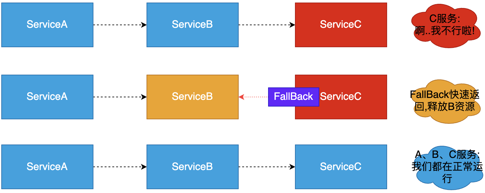

# Hystrix 简介

在微服务架构中，服务与服务之间通过远程调用的方式进行通信，一旦某个被调用的服务发生了故障，其依赖服务也会发生故障，此时就会发生故障的蔓延，最终导致系统瘫痪。

Hystrix 是一个用于==处理分布式系统的延迟和容错==的开源库。它实现了==断路器模式==，当某个服务发生故障（调用失败，超时、异常等）时，==通过断路器的监控，给调用方返回一个错误响应，而不是长时间的等待==，这样就不会使得调用方由于长时间得不到响应而占用线程，从而==防止故障的蔓延，避免级联故障（服务雪崩现象）==。

Hystrix 具备服务降级、服务熔断、线程隔离、请求缓存、请求合并及服务监控等强大功能。

# 基本概念

## 服务雪崩

在微服务之间进行服务调用时，==由于某一个服务故障，导致级联服务故障的现象==，称为雪崩效应。

雪崩效应描述的是提供方不可用，导致消费方不可用，并将不可用逐渐放大的过程。


Service A 的流量波动很大，流量经常会突然性增加！在这种情况下，就算 Service A 能扛得住请求压力，Service B 和 Service C 也未必能扛得住这突发的请求。

如果 Service C 因为抗不住请求，变得不可用，那么 Service B 的请求也会阻塞，慢慢耗尽 Service B 的线程资源，Service B 就会变得不可用。紧接着，Service A 也会不可用。

## 服务熔断

熔断器本身是一种==开关装置==，当某个服务单元发生故障之后，通过断路器（Hystrix）的故障监控，某个异常条件被触发，==直接熔断整个服务：即向调用方法返回一个符合预期的、可处理的备选响应（FallBack），而不是长时间的等待或者抛出调用方法无法处理的异常==。
- 保证了==服务调用方的线程不会被长时间占用==，避免故障在分布式系统中蔓延，乃至雪崩。如果目标服务情况好转，则恢复调用。
- ==服务熔断==是==解决服务雪崩==的重要手段。



## 服务降级

服务压力剧增的时候，根据当前的业务情况及流量，==对一些服务和页面有策略的降级==，以此缓解服务器的压力，以==保证核心任务的进行==。同时保证部分，甚至大部分任务客户能得到正确的响应。也就是当前的请求处理不了了或者出错了，给一个默认的返回。

- 服务降级：关闭微服务系统中某些==边缘服务==，保证系统==核心服务==正常运行；

- 例如双十一，为了确保==下单服务==的正常运行，==关闭评价以往订单服务==！


## 降级和熔断总结

### 共同点

- 目的一致
  - 都是从可用性可靠性着想，为防止系统的整体缓慢甚至崩溃，采用的技术手段；
- 最终表现类似
  - 对于两者来说，最终让用户体验到的是==某些功能暂时不可达或不可用==；
- 粒度一般都是服务级别
  - 业界也有不少更细粒度的做法，比如做到数据持久层（允许查询，不允许增删改）；
- 自治性要求很高
  - 熔断模式一般都是服务基于策略的==自动触发==；
  - 降级虽说可人工干预，但在微服务架构下，完全靠人显然不可能，==开关预置、配置中心==都是必要手段。

### 不同点

- 触发原因不一样
  - 服务熔断一般是==某个服务（下游服务）故障==引起；
  - 而服务降级一般是从==整体负荷==考虑；
- 管理目标的层次不一样
  - 熔断是一个==框架级==的处理，每个微服务都需要（无层级之分）；
  - 而降级一般需要==对业务有层级之分==（比如降级一般是从最外围服务、边缘服务开始）

# 服务熔断的实现

在【所有微服务】中引入 hystrix 依赖，并开启熔断器（断路器）。

## 创建 HystrixClient 项目、引入依赖

项目地址：D:\Learning\SpringCloud\SpringCloudCode\SpringCloudDemo\SpringCloudDemoParent\HystrixClient

依赖：

```xml
<dependencies>
    <!--SpringBootWeb-->
    <dependency>
        <groupId>org.springframework.boot</groupId>
        <artifactId>spring-boot-starter-web</artifactId>
    </dependency>

    <!--引入Consul依赖-->
    <dependency>
        <groupId>org.springframework.cloud</groupId>
        <artifactId>spring-cloud-starter-consul-discovery</artifactId>
    </dependency>

    <!--引入健康检查依赖-->
    <dependency>
        <groupId>org.springframework.boot</groupId>
        <artifactId>spring-boot-starter-actuator</artifactId>
    </dependency>

    <dependency>
        <groupId>org.projectlombok</groupId>
        <artifactId>lombok</artifactId>
    </dependency>
</dependencies>
```

## 添加配置、创建入口类

### 配置

```properties
spring.application.name=HystrixClient

# 注册Consul服务的主机
spring.cloud.consul.host=localhost
# 注册Consul服务的端口号
spring.cloud.consul.port=8500
```

### 入口类

```java
package com.example;

import org.springframework.boot.SpringApplication;
import org.springframework.boot.autoconfigure.SpringBootApplication;
import org.springframework.cloud.client.circuitbreaker.EnableCircuitBreaker;
import org.springframework.cloud.client.discovery.EnableDiscoveryClient;

/**
 * @author chenzufeng
 * @SpringBootApplication：代表SpringBoot应用
 * @EnableDiscoveryClient：代表服务注册中心Consul客户端
 */
@SpringBootApplication
@EnableDiscoveryClient
public class HystrixApplication {
    public static void main(String[] args) {
        SpringApplication.run(HystrixApplication.class, args);
    }
}
```

## 引入 hystrix 依赖

```xml
<!--引入hystrix-->
<dependency>
  <groupId>org.springframework.cloud</groupId>
  <artifactId>spring-cloud-starter-netflix-hystrix</artifactId>
</dependency>
```

## 开启断路器

在入口类加入注解`@EnableCircuitBreaker`：

```java
package com.example;

import org.springframework.boot.SpringApplication;
import org.springframework.boot.autoconfigure.SpringBootApplication;
import org.springframework.cloud.client.circuitbreaker.EnableCircuitBreaker;
import org.springframework.cloud.client.discovery.EnableDiscoveryClient;

/**
 * @author chenzufeng
 * @SpringBootApplication：代表SpringBoot应用
 * @EnableDiscoveryClient：代表服务注册中心Consul客户端
 * @EnableCircuitBreaker：开启Hystrix断路器
 */
@SpringBootApplication
@EnableDiscoveryClient
@EnableCircuitBreaker
public class HystrixApplication {
    public static void main(String[] args) {
        SpringApplication.run(HystrixApplication.class, args);
    }
}
```

## 使用 HystrixCommand 注解实现断路

```java
package com.example.controller;

import com.netflix.hystrix.contrib.javanica.annotation.HystrixCommand;
import lombok.extern.slf4j.Slf4j;
import org.springframework.web.bind.annotation.GetMapping;
import org.springframework.web.bind.annotation.RestController;

@RestController
@Slf4j
public class HystrixController {

    /**
     * 通过localhost:8080/FirstHystrix?id=xx的方式传递Id
     * @HystrixCommand：指定熔断时快速返回方法；
     * 		该方法参数列表、返回值需与@HystrixCommand修饰的方法一致；
     * 		默认先执行自定义的备选处理。
     * @return String
     */
    @GetMapping("FirstHystrix")
    @HystrixCommand(fallbackMethod = "testFallBack", defaultFallback = "defaultFallback")
    public String invokeFirstHystrix(Integer id) {
        log.info("============================");
        log.info("First Hystrix Demo !");
        if (id < 0) {
            throw new RuntimeException("无效Id！");
        }
        log.info("============================");
        return "First Hystrix demo is done !";
    }

    /**
     * 自定义备选处理
     * 一旦熔断后，不再运行throw new RuntimeException("无效Id！")，而运行testFallBack
     * @param id id
     * @return String
     */
    public String testFallBack(Integer id) {
        return "当前服务繁忙，请稍后再试！不合法Id：" + id;
    }

    /**
     * 使用Hystrix默认的备选处理
     */
    public String defaultFallback() {
        return "执行Hystrix默认的备选处理";
    }
}
```

## 测试

- 开启 Consul 服务注册中心：`consul agent -dev`

- 启动 HystrixClient；

- 登录 Consul：http://localhost:8500/，检查服务是否已经注册到 Consul。

- 访问测试

  - 正常参数访问：http://localhost:8080/FirstHystrix?id=1，输出：

    ```markdown
    First Hystrix demo is done !
    ```

  - 错误参数访问：http://localhost:8080/FirstHystrix?id=-1，输出：

    ```markdown
    当前服务繁忙，请稍后再试！不合法Id：-1

<font color=red>频繁使用错误参数访问，触发熔断，再使用正常参数访问，但出现熔断现象</font>：


如果触发一定条件，断路器会自动打开，过了一点时间正常之后又会关闭。


## 断路器工作流程

1、当满足一定的阀值的时候（默认 10 秒内超过 20 个请求次数）

2、当失败率达到一定的时候（默认 10 秒内超过 50% 的请求失败）

3、到达以上阀值，断路器将会开启。==当开启的时候，所有请求都不会进行转发==。

4、一段时间之后（默认是 5 秒），这个时候断路器是==半开状态==，会让其中【一个请求】进行转发。如果成功，断路器会关闭；若失败，继续开启。重复 3 和 4。


# OpenFeign 整合 Hystrix

OpenFeign 默认依赖了 hystrix，无需显式引入：


## 创建 HystrixOpenfeign 项目

创建`HystrixOpenfeign`项目（Module），调用`HystrixClient`服务。

### 引入 OpenFeign 依赖

```xml
<dependencies>
    <!--SpringBootWeb-->
    <dependency>
        <groupId>org.springframework.boot</groupId>
        <artifactId>spring-boot-starter-web</artifactId>
    </dependency>

    <!--引入Consul-->
    <dependency>
        <groupId>org.springframework.cloud</groupId>
        <artifactId>spring-cloud-starter-consul-discovery</artifactId>
    </dependency>

    <!--引入健康检查依赖-->
    <dependency>
        <groupId>org.springframework.boot</groupId>
        <artifactId>spring-boot-starter-actuator</artifactId>
    </dependency>

    <!--Open Feign依赖-->
    <dependency>
        <groupId>org.springframework.cloud</groupId>
        <artifactId>spring-cloud-starter-openfeign</artifactId>
    </dependency>

    <dependency>
        <groupId>org.projectlombok</groupId>
        <artifactId>lombok</artifactId>
    </dependency>
</dependencies>
```

### 入口类加 @EnableFeignClients

入口类加入`@EnableFeignClients`注解，开启 OpenFeign 调用：

```java
package com.example;

import org.springframework.boot.SpringApplication;
import org.springframework.boot.autoconfigure.SpringBootApplication;
import org.springframework.cloud.client.discovery.EnableDiscoveryClient;
import org.springframework.cloud.openfeign.EnableFeignClients;

/**
 * @EnableDiscoveryClient：代表服务注册中心Consul客户端
 * @EnableFeignClients：开启OpenFeogn客户端调用
 */
@SpringBootApplication
@EnableDiscoveryClient
@EnableFeignClients
public class HystrixOpenFeignApplication {
    public static void main(String[] args) {
        SpringApplication.run(HystrixOpenFeignApplication.class, args);
    }
}
```

## 服务调用者创建接口、调用服务

### 创建接口

com/example/feignclient/HystrixOpenFeignClient.java：

```java
package com.example.feignclient;

import org.springframework.cloud.openfeign.FeignClient;
import org.springframework.web.bind.annotation.GetMapping;
import org.springframework.web.bind.annotation.RequestParam;

/**
 * @author chenzufeng
 */
@FeignClient("HystrixClient")
public interface HystrixOpenFeignClient {
    /**
     * 调用HystrixClient/HystrixController.invokeFirstHystrix服务
     * RequestParam("id")：底层数据传递方式Query String
     * @param id id
     * @return String
     */
    @GetMapping("FirstHystrix")
    String invokeFirstHystrix(@RequestParam("id") Integer id);
}
```

## 服务调用者调用服务

在`HystrixOpenfeignController`注入 OpenFeign 客户端对象，并调用服务：

```java
package com.example.controller;

import com.example.feignclient.HystrixOpenFeignClient;
import lombok.extern.slf4j.Slf4j;
import org.springframework.beans.factory.annotation.Autowired;
import org.springframework.web.bind.annotation.GetMapping;
import org.springframework.web.bind.annotation.RestController;

@RestController
@Slf4j
public class HystrixOpenfeignController {
    @Autowired
    private HystrixOpenFeignClient hystrixOpenFeignClient;

    @GetMapping("HystrixOpenfeign")
    public String testHystrixOpenfeign() {
        log.info("调用HystrixClient/HystrixController.invokeFirstHystrix方法");
        String invokeFirstHystrix = hystrixOpenFeignClient.invokeFirstHystrix(-1);
        log.info("HystrixClient/HystrixController.invokeFirstHystrix方法结果：{}", invokeFirstHystrix);
        return "调用HystrixClient/HystrixController.invokeFirstHystrix方法";
    }
}
```

## 服务提供者实现服务

[服务提供者](# 服务熔断的实现)实现被调用的服务：

```java
package com.example.controller;

import com.netflix.hystrix.contrib.javanica.annotation.HystrixCommand;
import lombok.extern.slf4j.Slf4j;
import org.springframework.web.bind.annotation.GetMapping;
import org.springframework.web.bind.annotation.RestController;

/**
 * @author chenzufeng
 */

@RestController
@Slf4j
public class HystrixController {

    /**
     * 通过localhost:8080/FirstHystrix?id=xx的方式传递Id
     * HystrixCommand：指定熔断时快速返回方法；
     *                             该方法参数列表、返回值需与HystrixCommand修饰的方法一致
     *                             默认先执行自定义的备选处理
     * @return String
     */
    @GetMapping("FirstHystrix")
    @HystrixCommand(fallbackMethod = "testFallBack", defaultFallback = "defaultFallback")
    public String invokeFirstHystrix(Integer id) {
        log.info("============================");
        log.info("First Hystrix Demo !");
        if (id < 0) {
            throw new RuntimeException("无效Id！");
        }
        log.info("============================");
        return "First Hystrix demo is done !";
    }

    /**
     * 自定义备选处理
     * 一旦熔断后，不再运行throw new RuntimeException("无效Id！")，而运行testFallBack
     * @param id id
     * @return String
     */
    public String testFallBack(Integer id) {
        return "当前服务繁忙，请稍后再试！不合法Id：" + id;
    }

    /**
     * 使用Hystrix默认的备选处理
     */
    public String defaultFallback() {
        return "执行Hystrix默认的备选处理";
    }
}
```

## 测试

- 开启 Consul 服务注册中心：`consul agent -dev`

- 启动 HystrixClient（8080）、HystrixOpenFeignApplication（8081）；

- 登录 Consul：http://localhost:8500/，检查服务是否已经注册到 Consul。

- 访问测试

  - 正常参数访问：http://localhost:8081/HystrixOpenfeign?id=1，输出：

    ```markdown
    调用HystrixClient/HystrixController.invokeFirstHystrix方法First Hystrix demo is done !
    ```

  - 错误参数访问：http://localhost:8081/HystrixOpenfeign?id=-1，输出：

    ```markdown
    调用HystrixClient/HystrixController.invokeFirstHystrix方法当前服务繁忙，请稍后再试！不合法Id：-1
    ```

<font color=red>频繁使用错误参数访问，触发熔断，再使用正常参数访问，但出现熔断现象</font>：


# 服务降级的实现

OpenFeign + hystrix 实现服务降级实现
- 引入 hystrix 依赖（==OpenFeign 默认依赖了 hystrix，无需显式引入==）；
- 配置文件开启 Feign 支持 hystrix；
- 在 Feign 客户端调用加入 fallback 指定降级处理；
- 开发降级处理方法（服务调用失败默认处理的实现类）。


项目地址：D:\Learning\SpringCloud\SpringCloudCode\SpringCloudDemo\SpringCloudDemoParent\HystrixOpenFeign

## 配置文件开启 Feign 支持 hystrix

```properties
server.port=8081
spring.application.name=HystrixOpenfeign

# 注册Consul服务的主机
spring.cloud.consul.host=localhost
# 注册Consul服务的端口号
spring.cloud.consul.port=8500

# 开启OpenFeign支持降级
feign.hystrix.enabled=true
```

## 开发 fallback 处理类

```java
package com.example.feignclient;

import org.springframework.context.annotation.Configuration;

/**
 * @author chenzufeng
 * @date 2021/8/3
 * @usage HystrixOpenFeignClientFallBack fallback处理类
 */
@Configuration
public class HystrixOpenFeignClientFallBack implements HystrixOpenFeignClient {
    @Override
    public String invokeFirstHystrix(Integer id) {
        return "正在进行服务降级处理！";
    }
}
```


## 在 HystrixOpenFeign 接口上添加 fallback

```java
@FeignClient(value = "HystrixClient", fallback = HystrixOpenFeignClientFallBack.class)
```

具体的：

```java
package com.example.feignclient;

import org.springframework.cloud.openfeign.FeignClient;
import org.springframework.web.bind.annotation.GetMapping;
import org.springframework.web.bind.annotation.RequestParam;

/**
 * @author chenzufeng
 */
@FeignClient(value = "HystrixClient", fallback = HystrixOpenFeignClientFallBack.class)
public interface HystrixOpenFeignClient {
    /**
     * 调用HystrixClient/HystrixController.invokeFirstHystrix服务
     * RequestParam("id")：底层数据传递方式Query String
     * @param id id
     * @return String
     */
    @GetMapping("FirstHystrix")
    String invokeFirstHystrix(@RequestParam("id") Integer id);
}
```

## 测试

- 开启 Consul 服务注册中心：`consul agent -dev`

- 启动 HystrixClient（8080）、HystrixOpenFeignApplication（8081）；

- 登录 Consul：http://localhost:8500/，检查服务是否已经注册到 Consul。

- 访问测试

  - 正常访问：http://localhost:8081/HystrixOpenfeign?id=1，输出：

    ```markdown
    调用HystrixClient/HystrixController.invokeFirstHystrix方法First Hystrix demo is done !
    ```

  - 停止 HystrixClient 服务，再调用http://localhost:8081/HystrixOpenfeign?id=1，输出：

    ```markdown
    调用HystrixClient/HystrixController.invokeFirstHystrix方法调用服务不可用，正在进行服务降级处理！
    ```


