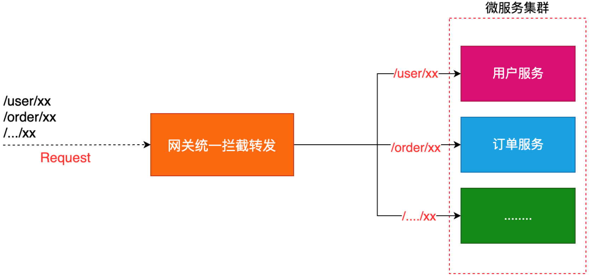
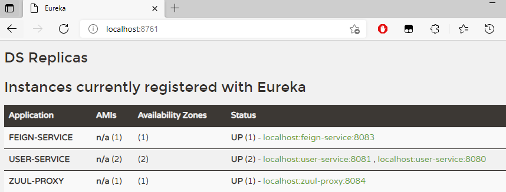
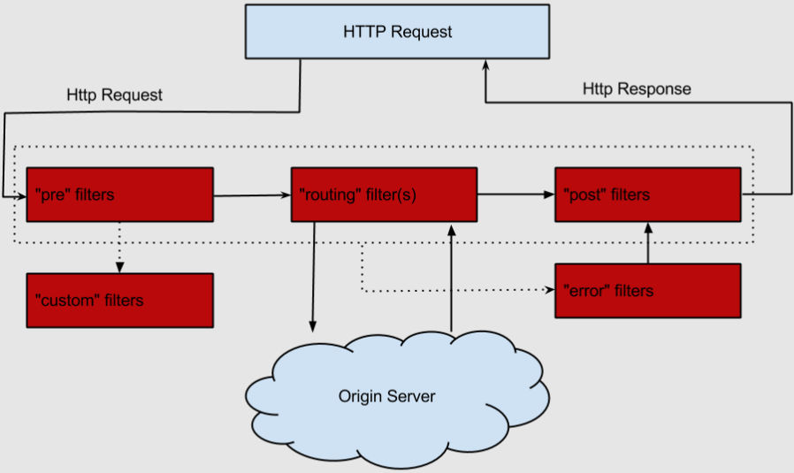

# 什么是网关

网关==统一服务入口路径——对所有服务进行集中管控==（前端 Vue 不可能一个个去直接调用后端集群服务的地址），可方便实现==对平台众多服务接口进行管控==；对访问服务的==身份认证==、防报文重发与防数据篡改、==功能调用的业务鉴权==、响应数据的脱敏、流量与并发控制，甚至基于 API 调用的计量或者计费等等。



网关 =  路由转发 + 过滤器
	

- 路由转发：接收一切外界请求，转发到后端的微服务上去，实现对服务的统一管理；
  
- 在服务网关中可以完成一系列的==横切功能==，例如权限校验、限流以及监控等，这些都可以通过过滤器完成。

# Zuul

API 网关为微服务架构中的服务==提供了统一的访问入口==，客户端通过 API 网关访问相关服务。API 网关相当于整个微服务架构中的门面，所有客户端的访问都通过它来进行路由及过滤。它实现了请求路由、负载均衡、校验过滤、服务容错、服务聚合等功能。

## Zuul 路由

### 创建 zuul-proxy 项目、引入依赖

项目地址：D:\Learning\SpringCloud\SpringCloudCode\SpringCloudMall\MallParent\zuul-proxy

依赖：

```xml
<dependencies>
    <!-- Eureka -->
    <dependency>
        <groupId>org.springframework.cloud</groupId>
        <artifactId>spring-cloud-starter-netflix-eureka-client</artifactId>
    </dependency>

    <!-- Zuul -->
    <dependency>
        <groupId>org.springframework.cloud</groupId>
        <artifactId>spring-cloud-starter-netflix-zuul</artifactId>
    </dependency>
    
    <dependency>
        <groupId>org.projectlombok</groupId>
        <artifactId>lombok</artifactId>
    </dependency>
</dependencies>
```

### 添加配置文件、创建入口类

配置文件：

```yaml
# 1. 基本配置

server:
  port: 8084

spring:
  application:
    name: ZuulProxy
eureka:
  client:
    register-with-eureka: true
    fetch-registry: true
    service-url: 
      defaultZone: http://localhost:8761/eureka
```

在启动类上添加`@EnableZuulProxy`注解来启用 Zuul 的 API 网关功能：

```java
package com.example;

import org.springframework.boot.SpringApplication;
import org.springframework.boot.autoconfigure.SpringBootApplication;
import org.springframework.cloud.netflix.eureka.EnableEurekaClient;
import org.springframework.cloud.netflix.zuul.EnableZuulProxy;

@SpringBootApplication
@EnableEurekaClient
@EnableZuulProxy
public class ZuulProxyApplication {
    public static void main(String[] args) {
        SpringApplication.run(ZuulProxyApplication.class, args);
    }
}
```

### 启动相关服务

通过启动

- [eureka-server](服务注册中心.md)，
- 两个 [user-service(基于Ribbon的服务调用--实例二)](f负载均衡的服务调用.md)，
- [feign-service(基于 Ribbon 和 Hystrix 的声明式服务调用)](OpenFeign声明式服务调用.md)
- zuul-proxy 

来演示 Zuul 的常用功能，启动后注册中心显示如下：




### 配置路由规则

可以通过修改 application.yml 中的配置来配置路由规则，这里将匹配`/userService/**`的请求（==自定义的路径==）路由到 user-service 服务上去，匹配`/feignService/**`的请求路由到 feign-service 上去：

```yaml
# 1. 基本配置

server:
  port: 8084

spring:
  application:
    name: zuul-proxy

eureka:
  client:
    service-url:
      defaultZone: http://localhost:8761/eureka
    register-with-eureka: true
    fetch-registry: true

# 2.  配置路由规则
zuul:
  routes:
    user-service:
      path: /userService/**
    feign-service:
      path: /feignService/**
```

- 访问[http://localhost:8084/userService/User/1]()可以发现请求路由到了 user-service 上了

  ```markdown
  Client: user-service instantiated a LoadBalancer
  ```

  

- 访问[http://localhost:8084/feignService/User/1]()可以发现请求路由到了 feign-service 上了。

  ```markdown
  Client: feign-service instantiated a LoadBalancer
  ```

**默认路由规则**：

Zuul 和 Eureka 结合使用，可以实现==路由的自动配置==，自动配置的路由==以服务名称为匹配路径==，相当于如下配置：

```yaml
zuul:
  routes:
    user-service:
      path: /user-service/**
    feign-service:
      path: /feign-service/**
```

- 访问[http://localhost:8084/userService/User/1]()可以发现请求路由到了 user-service 上了；
- 访问[http://localhost:8084/feignService/User/1]()可以发现请求路由到了 feign-service 上了。

如果不想使用默认的路由规则，可以添加以下配置来忽略默认路由配置：

```properties
zuul:
  ignored-services: RibbonService, FeignService # 关闭默认路由配置
```

### 负载均衡功能

多次调用http://localhost:8084/feignService/User/1进行测试，可以发现运行在 8080 和 8081 的 feign-service服务交替打印：

```markdown
根据id获取用户信息，用户名称为：chen
```

### 配置访问前缀

可以通过以下配置来给网关路径添加前缀：

```yaml
zuul:

  routes:
    user-service:
      path: /userService/**
    feign-service:
      path: /feignService/**
      
  prefix: /Zuul-Proxy
```

此处添加了`/Zuul-Proxy`前缀，这样需要访问http://localhost:8084/Zuul-Proxy/feignService/1才能访问到 feign-service 中的接口。

### Header 过滤及重定向添加 Host

- Zuul 在请求路由时，默认会过滤掉一些敏感的头信息，以下配置可以==防止路由时的 Cookie 及 Authorization 的丢失==：

    ```yaml
    zuul:
    	# 配置过滤敏感的请求头信息，设置为空就不会过滤
    	sensitive-headers: Cookie,Set-Cookie,Authorization 
    ```

    

- Zuul 在请求路由时，不会设置最初的 host 头信息，以下配置可以解决：

    ```yaml
    zuul:
    	# 设置为true重定向是会添加host请求头
    	add-host-header: true 
    ```

### 查看路由信息

可以通过`SpringBoot Actuator`来查看 Zuul 中的路由信息。

#### 添加依赖

在`zuul-proxy#pom.xml`中添加相关依赖：

```xml
<!--Actuator-->
<dependency>
    <groupId>org.springframework.boot</groupId>
    <artifactId>spring-boot-starter-actuator</artifactId>
</dependency>
```

#### 修改配置文件

修改`zuul-proxy#application.yml`配置文件，开启查看路由的端点：

```yaml
# 1. 基本配置

server:
  port: 8084

spring:
  application:
    name: zuul-proxy

eureka:
  client:
    service-url:
      defaultZone: http://localhost:8761/eureka
    register-with-eureka: true
    fetch-registry: true

# 2.  配置路由规则
zuul:
  routes:
    user-service:
      path: /userService/**
    feign-service:
      path: /feignService/**
  prefix: /Zuul-Proxy

# 3. 开启查看路由的端点
management:
  endpoints:
    web:
      exposure:
        include: 'routes'
```

通过访问[http://localhost:8084/actuator/routes]()查看简单路由信息：

```json
{
    "/Zuul-Proxy/userService/**": "user-service",
    "/Zuul-Proxy/feignService/**": "feign-service",
    "/Zuul-Proxy/feign-service/**": "feign-service",
    "/Zuul-Proxy/user-service/**": "user-service"
}
```

通过访问[http://localhost:8084/actuator/routes/details]()查看详细路由信息：

```json
{
    "/Zuul-Proxy/userService/**": {
        "id": "user-service",
        "fullPath": "/Zuul-Proxy/userService/**",
        "location": "user-service",
        "path": "/**",
        "prefix": "/Zuul-Proxy/userService",
        "retryable": false,
        "customSensitiveHeaders": false,
        "prefixStripped": true
    },
    "/Zuul-Proxy/feignService/**": {
        "id": "feign-service",
        "fullPath": "/Zuul-Proxy/feignService/**",
        "location": "feign-service",
        "path": "/**",
        "prefix": "/Zuul-Proxy/feignService",
        "retryable": false,
        "customSensitiveHeaders": false,
        "prefixStripped": true
    },
    "/Zuul-Proxy/feign-service/**": {
        "id": "feign-service",
        "fullPath": "/Zuul-Proxy/feign-service/**",
        "location": "feign-service",
        "path": "/**",
        "prefix": "/Zuul-Proxy/feign-service",
        "retryable": false,
        "customSensitiveHeaders": false,
        "prefixStripped": true
    },
    "/Zuul-Proxy/user-service/**": {
        "id": "user-service",
        "fullPath": "/Zuul-Proxy/user-service/**",
        "location": "user-service",
        "path": "/**",
        "prefix": "/Zuul-Proxy/user-service",
        "retryable": false,
        "customSensitiveHeaders": false,
        "prefixStripped": true
    }
}
```


## 过滤器

路由与过滤是 Zuul 的两大核心功能。

- 路由功能负责将外部请求转发到具体的服务实例上去，是实现统一访问入口的基础；
- 过滤功能负责对请求过程进行额外的处理，是请求校验过滤及服务聚合的基础。

### 过滤器类型与生命周期

Zuul 中有以下几种典型的过滤器类型：

- pre：在请求被路由到目标服务前执行，比如权限校验、打印日志等功能；
- routing：在请求被路由到目标服务时执行，这是使用 Apache HttpClient 或 Netflix Ribbon 构建和发送原始 HTTP 请求的地方；
- post：在请求被路由到目标服务后执行，比如给目标服务的响应添加头信息，收集统计数据等功能；
- error：请求在其他阶段发生错误时执行。

一个 HTTP 请求到达 API 网关后，如何在各种不同类型的过滤器中流转的过程：



### 自定义过滤器

添加 PreLogFilter 类继承 ZuulFilter 实现一个前置过滤器，用于在请求路由到目标服务前打印请求日志。

```java
package com.example.filter;

import com.netflix.zuul.ZuulFilter;
import com.netflix.zuul.context.RequestContext;
import com.netflix.zuul.exception.ZuulException;
import lombok.extern.slf4j.Slf4j;
import org.springframework.stereotype.Component;

import javax.servlet.http.HttpServletRequest;

@Component
@Slf4j
public class PreLogFilter extends ZuulFilter {
    /**
     * 过滤器类型，有pre、routing、post、error四种。
     * @return 过滤器类型
     */
    @Override
    public String filterType() {
        return "pre";
    }

    /**
     * 过滤器执行顺序，数值越小优先级越高。
     * @return 过滤器执行顺序
     */
    @Override
    public int filterOrder() {
        return 1;
    }

    /**
     * 是否进行过滤，返回true会执行过滤。
     * @return 是否进行过滤
     */
    @Override
    public boolean shouldFilter() {
        return true;
    }

    /**
     * 自定义的过滤器逻辑，当shouldFilter()返回true时会执行。
     * @return null
     * @throws ZuulException ZuulException
     */
    @Override
    public Object run() throws ZuulException {
        RequestContext requestContext = RequestContext.getCurrentContext();
        HttpServletRequest request = requestContext.getRequest();
        String remoteHost = request.getRemoteHost();
        String method = request.getMethod();
        String requestURI = request.getRequestURI();
        log.info("Remote host: {}, method: {}, uri: {}", remoteHost, method, requestURI);
        return null;
    }
}
```

访问http://localhost:8084/Zuul-Proxy/feignService/User/1，会打印日志：

```markdown
com.example.filter.PreLogFilter          : Remote host: 0:0:0:0:0:0:0:1, method: GET, uri: /Zuul-Proxy/feignService/User/1
```


# Spring Cloud Gateway

Gateway 是在 Spring 生态系统之上构建的 API 网关服务，基于Spring 5，Spring Boot 2 和 Project Reactor 等技术。

Gateway 旨在提供一种简单而有效的方式来对 API 进行路由，以及提供一些强大的过滤器功能， 例如：熔断、限流、重试等。

Spring Cloud Gateway 具有如下特性：

- 基于 Spring Framework 5、Project Reactor 和 Spring Boot 2.0 进行构建；
- 动态路由：能够匹配任何请求属性；
- 可以对路由指定 Predicate（断言）和 Filter（过滤器）；
  - Route（路由）：路由是构建网关的基本模块，它由ID，目标URI，一系列的断言和过滤器组成，如果断言为 true 则匹配该路由；
  - Predicate（断言）：指的是 Java 8 的 Function Predicate。 输入类型是 Spring 框架中的 ServerWebExchange。这使开发人员可以匹配 HTTP 请求中的所有内容，例如请求头或请求参数。如果请求与断言相匹配，则进行路由；
  - Filter（过滤器）：指的是 Spring 框架中 GatewayFilter 的实例，使用过滤器，可以在请求被路由前后对请求进行修改。
- 集成 Hystrix 的断路器功能；
- 集成 Spring Cloud 服务发现功能；
- 易于编写的 Predicate（断言）和 Filter（过滤器）；
- 请求限流功能；
- 支持路径重写。
