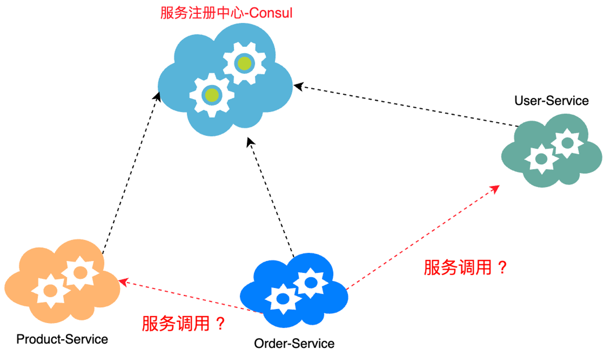
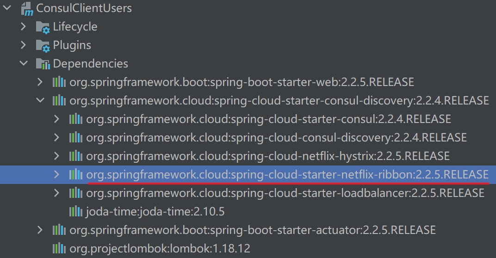
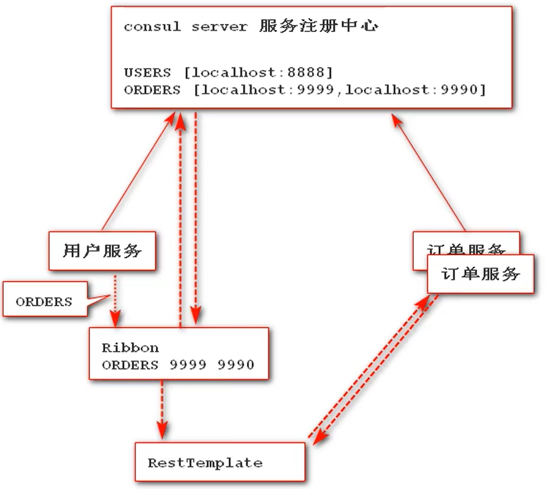

# 服务间通信方式

在整个微服务（基于单体业务，围绕业务进行服务拆分，拆分出来的每一个服务独立应用、独立运行、独立部署，并运行在自己的计算机进程中，基于分布式管理）架构中，我们比较关心的就是==服务间的服务该如何调用，有哪些调用方式==？



- 基于 HTTP 协议、使用 REST 方式通信
    - 使用 HTTP 协议进行数据传输——JSON（<font color=red>Spring Cloud 使用 HTTP  协议传输数据！</font>只要都支持 HTTP 协议，而不要求统一由 Java、Python、C++ 等开发实现——<font color=red>解耦合</font>），但效率较 RPC 低。
- RPC：远程过程调用
    - 传输二进制对象序列化形式数据（传输效率高，但对硬件要求高——<font color=red>服务必须都基于同一种语言开发</font>：Java 对 Java）

总结：在 Spring Cloud 中服务间调用方式主要是使用 HTTP、REST 方式进行服务间调用！


# 基于 RestTemplate 的服务调用

Spring 框架提供的 RestTemplate 类是==一个 HTTP 客户端==，使用它可以方便的调用 HTTP 接口，支持 GET、POST、PUT、DELETE 等方法。

RestTemplate 可用于在应用中调用 REST 服务，它简化了与 HTTP 服务的通信方式，统一了 RESTful 的标准，封装了 HTTP 链接， 只需要传入 url 及返回值类型即可。

相较于之前常用的 HttpClient，RESTTemplate 是一种更优雅的调用 RESTful 服务的方式。

## GET 请求方法

```java
<T> T getForObject(String url, Class<T> responseType, Object... uriVariables);

<T> T getForObject(String url, Class<T> responseType, Map<String, ?> uriVariables);

<T> T getForObject(URI url, Class<T> responseType);

<T> ResponseEntity<T> getForEntity(String url, Class<T> responseType, Object... uriVariables);

<T> ResponseEntity<T> getForEntity(String url, Class<T> responseType, Map<String, ?> uriVariables);

<T> ResponseEntity<T> getForEntity(URI var1, Class<T> responseType);
```

### getForObject 方法

返回对象为响应体中==数据转化成的对象==：

```java
@GetMapping("/{id}")
public CommonResult getUser(@PathVariable Long id) {
    return restTemplate.getForObject(userServiceUrl + "/user/{1}", CommonResult.class, id);
}
```

### getForEntity 方法

返回对象为 ResponseEntity 对象，包含了响应中的一些重要信息，比如==响应头、响应状态码、响应体==等：

```java
@GetMapping("/getEntityByUsername")
public CommonResult getEntityByUsername(@RequestParam String username) {
    ResponseEntity<CommonResult> entity = restTemplate.getForEntity(userServiceUrl + "/user/getByUsername?username={1}", CommonResult.class, username);
    if (entity.getStatusCode().is2xxSuccessful()) {
        return entity.getBody();
    } else {
        return new CommonResult("操作失败", 500);
    }
}
```

## POST 请求方法

```java
<T> T postForObject(String url, @Nullable Object request, Class<T> responseType, Object... uriVariables);

<T> T postForObject(String url, @Nullable Object request, Class<T> responseType, Map<String, ?> uriVariables);

<T> T postForObject(URI url, @Nullable Object request, Class<T> responseType);

<T> ResponseEntity<T> postForEntity(String url, @Nullable Object request, Class<T> responseType, Object... uriVariables);

<T> ResponseEntity<T> postForEntity(String url, @Nullable Object request, Class<T> responseType, Map<String, ?> uriVariables);

<T> ResponseEntity<T> postForEntity(URI url, @Nullable Object request, Class<T> responseType);
```

### postForObject 方法

```java
@PostMapping("/create")
public CommonResult create(@RequestBody User user) {
    return restTemplate.postForObject(userServiceUrl + "/user/create", user, CommonResult.class);
}
```

### postForEntity 方法

```java
@PostMapping("/create")
public CommonResult create(@RequestBody User user) {
    return restTemplate.postForEntity(userServiceUrl + "/user/create", user, CommonResult.class).getBody();
}
```

## 实例

### 创建项目、引入依赖、写配置

创建两个服务并注册到 consul 注册中心中：

依赖：

```xml
<dependencies>
    <!--引入SpringBootWeb依赖-->
    <dependency>
        <groupId>org.springframework.boot</groupId>
        <artifactId>spring-boot-starter-web</artifactId>
    </dependency>

    <!--引入Consul依赖-->
    <dependency>
        <groupId>org.springframework.cloud</groupId>
        <artifactId>spring-cloud-starter-consul-discovery</artifactId>
    </dependency>

    <!-- 引入健康监控依赖-->
    <dependency>
        <groupId>org.springframework.boot</groupId>
        <artifactId>spring-boot-starter-actuator</artifactId>
    </dependency>

    <dependency>
        <groupId>org.projectlombok</groupId>
        <artifactId>lombok</artifactId>
    </dependency>
</dependencies>
```


- ConsulClientUser：代表用户服务，端口为 9998

- ConsulClientOrder：代表订单服务，端口为 9999

    - 配置文件

    ```properties
    server.port=9999
    spring.application.name=ConsulClientOrder
    
    # 注册consul服务主机
    spring.cloud.consul.host=localhost
    # 注册consul服务注册中心的端口号
    spring.cloud.consul.port=8500
    ```

    - 入口类

    ```java
    package com.example;
    
    import org.springframework.boot.SpringApplication;
    import org.springframework.boot.autoconfigure.SpringBootApplication;
    import org.springframework.cloud.client.discovery.EnableDiscoveryClient;
    
    @SpringBootApplication
    @EnableDiscoveryClient
    public class ConsulClientOrderApplication {
        public static void main(String[] args) {
            SpringApplication.run(ConsulClientOrderApplication.class, args);
        }
    }
    ```

### 在订单服务中提供服务方法

```java
package com.example.controller;

import lombok.extern.slf4j.Slf4j;
import org.springframework.beans.factory.annotation.Value;
import org.springframework.web.bind.annotation.GetMapping;
import org.springframework.web.bind.annotation.RestController;

import java.util.HashMap;
import java.util.Map;

@RestController
@Slf4j
public class OrderController {
    @Value("${server.port}")
    private Integer port;

    @GetMapping("FindOrder")
    public Map<String, Object> findOrder() {
        log.info("查询所有订单，调用成功！当前服务端口：{}", port);
        Map<String, Object> map = new HashMap<>();
        map.put("message", "服务调用成功，服务提供端口为：" + port);
        map.put("state", true);
        return map;
    }
}
```

### 在用户服务中使用 restTemplate 进行订单服务调用

```java
package com.example.controller;

import lombok.extern.slf4j.Slf4j;
import org.springframework.web.bind.annotation.GetMapping;
import org.springframework.web.bind.annotation.RestController;
import org.springframework.web.client.RestTemplate;

@RestController
@Slf4j
public class UserController {
    @GetMapping("UserInvokeOrder")
    public String invokeOrder() {
        log.info("用户信息服务调用订单服务。。。");
        // 使用 restTemplate 发起请求，调用商品服务
        RestTemplate restTemplate = new RestTemplate();
        // <T> T getForObject(URI url, Class<T> responseType)
        String orderResult = restTemplate.getForObject("http://localhost:9999/FindOrder", String.class);
        return "调用订单服务成功，结果为：" + orderResult;
    }
}
```

### 测试

==先启动“服务注册中心”==，再启动两个服务！

```markdown
>consul agent -dev
```

浏览器访问用户服务http://localhost:9998/UserInvokeOrder，页面输出

```markdown
调用订单服务成功，结果为：{"state":true,"message":"服务调用成功，服务提供端口为：9999"}
```

`ConsulClientUserApplication :9998/`后台输出

```markdown
com.example.controller.UserController    : 用户信息服务调用订单服务。。。
```

`ConsulClientOrderApplication :9999/`后台输出

```markdown
com.example.controller.OrderController   : 查询所有订单，调用成功！当前服务端口：9999
```


### 基于 RestTemplate 调用服务的弊端

==RestTemplate 是直接基于服务地址调用，没有在服务注册中心获取服务，也没有办法完成服务的负载均衡==。如果需要实现服务的负载均衡，需要自己书写服务负载均衡策略。

- ==调用服务的请求路径**写死在代码中**==，日后提供服务的服务路径发生改变时，不利于后续维护工作！

    ```java
    RestTemplate restTemplate = new RestTemplate();
    // RestTemplate 将地址与端口写死了
    String orderResult = restTemplate.getForObject("http://localhost:9999/FindOrder", String.class);
    ```

    

- `RestTemplate`在进行服务间通信时，调用服务的路径主机和服务端口直接被写死在`url`中，==无法实现在服务集群情况下的请求**负载均衡**==！

    - 自定义负载均衡策略（例如随机选择节点）

        ```java
        public String randomHost() {
            List<String> hosts = new ArrayList<>();
            hosts.add("localhost:8888");
            hosts.add("localhost:8889");
            int i = new Random.nextInt(hosts.size());
            return hosts.get(i);
        }
        ```

        

    - 使用 Spring Cloud 提供的组件：Ribbon（推荐）


# 基于 Ribbon 的服务调用

Spring Cloud Ribbon 是一个==基于 HTTP 和 TCP 的客户端负载均衡工具==，它在 Netflix Ribbon 的基础上实现。通过 Spring Cloud 的封装，可以让我们轻松地==将面向服务的 REST 模版请求，自动转换成客户端负载均衡的服务调用==。

Ribbon 是完成负载均衡的客户端组件（==客户端负载均衡==），仅仅完成了==请求的负载均衡节点选择==，还是需用==通过 RestTemplate 来发起请求==。

- 使用 `DiscoveryClient` 进行客户端调用
  - 服务发现客户端对象：根据服务id，去服务中心获取对应服务的服务列表到本地，但需要自己去实现负载均衡！
- 使用`LoadBalancerClient`进行客户端调用
  - 负载均衡客户端对象：根据服务id去服务中心获取对应服务的服务列表，然后根据默认负载均衡策略选择列表中一个对象
  	使用时，每次需要先选择，再使用 Restemplate。
- 使用`@LoadBalanced`进行客户端调用
  - 负载均衡客户端注解：直接根据服务id，底层实现负载均衡
  - 修饰范围：方法；
  - 作用：让当前对象具有 Ribbon 负载均衡特性。


## 引入依赖

1. 如果使用的是 ==Eureka Client 和 Consul Client，无须引入依赖==。因为在Eureka、Consul 中默认集成了 Ribbon 组件，如果引入，会造成冲突！！！！！！
   	

   

2. 如果使用的 Client 中没有 Ribbon 依赖，需要显式引入如下依赖：

   ```xml
   <!-- https://mvnrepository.com/artifact/org.springframework.cloud/spring-cloud-starter-netflix-ribbon -->
   <dependency>
       <groupId>org.springframework.cloud</groupId>
       <artifactId>spring-cloud-starter-netflix-ribbon</artifactId>
       <version>2.2.5.RELEASE</version>
   </dependency>
   ```


## 实例一

### 运行原理

`用户服务`和`订单服务`在服务注册中心进行注册，接着==集成了 Ribbon 的**用户服务**==，根据服务名，从服务注册中心获取对应服务的列表，然后根据特定的策略选择相应的服务（==选择众多订单服务中的一个==），通过 RestTemplate 向其发送请求！



### 使用 DiscoveryClient


```java
package com.example.controller;

import lombok.extern.slf4j.Slf4j;
import org.springframework.beans.factory.annotation.Autowired;
import org.springframework.cloud.client.ServiceInstance;
import org.springframework.cloud.client.discovery.DiscoveryClient;
import org.springframework.web.bind.annotation.GetMapping;
import org.springframework.web.bind.annotation.RestController;
import org.springframework.web.client.RestTemplate;

import java.util.List;

/**
 * @author chenzufeng
 * @date 2021/06/10
 * 调用订单服务
 */

@RestController
@Slf4j
public class UsersController {
    /**
     * 服务注册与发现客户端对象
     */
    @Autowired
    private DiscoveryClient discoveryClient;

    @GetMapping("UsersServerInvokeOrdersServer")
    public String invokeOrdersServer() {
        log.info("=========================================");
        log.info("用户信息服务调用订单服务。。。");
        /******************************************
         * 1. 使用RestTemplate发起请求，调用商品服务  *
         ******************************************/
        /*
        RestTemplate restTemplate = new RestTemplate();
        // <T> T getForObject(URI url, Class<T> responseType)
        String orderResult = restTemplate.getForObject("http://localhost:9999/FindOrders", String.class);
        log.info("调用订单服务成功，结果为{}", orderResult);
        log.info("=========================================");
        return "调用订单服务成功，结果为：" + orderResult;
         */

        /**************************************************
         * 2. 使用 RestTemplate + Ribbon进行服务调用                 *
         * 使用 DiscoveryClient 将服务注册中心的信息拉取到本地 *
         * 但【没有实现负载均衡】                                                *
         **************************************************/
        List<ServiceInstance> consulClientOrders = discoveryClient.getInstances("ConsulClientOrders");
        for (ServiceInstance consulClientOrder : consulClientOrders) {
            log.info("服务主机：[{}]", consulClientOrder.getHost());
            log.info("服务端口：[{}]", consulClientOrder.getPort());
            log.info("服务地址：[{}]", consulClientOrder.getUri());
            log.info("=========================================");
        }
	// DiscoveryClient将服务注册中心的信息全部拉取到本地：使用-Dserver.port创建了两个订单服务
        String orderResult = new RestTemplate().getForObject(consulClientOrders.get(0).getUri() + "/FindOrders", String.class);
        log.info("调用订单服务成功，结果为{}", orderResult);
        log.info("=========================================");
        return "调用订单服务成功，结果为：" + orderResult;
    }
}
```

### 使用 LoadBalancerClient

```java
package com.example.controller;

import lombok.extern.slf4j.Slf4j;
import org.springframework.beans.factory.annotation.Autowired;
import org.springframework.cloud.client.ServiceInstance;
import org.springframework.cloud.client.discovery.DiscoveryClient;
import org.springframework.cloud.client.loadbalancer.LoadBalancerClient;
import org.springframework.web.bind.annotation.GetMapping;
import org.springframework.web.bind.annotation.RestController;
import org.springframework.web.client.RestTemplate;

import java.util.List;

/**
 * @author chenzufeng
 * @date 2021/06/10
 * 调用订单服务
 */

@RestController
@Slf4j
public class UsersController {
    /**
     * 服务注册与发现客户端对象
     */
    @Autowired
    private DiscoveryClient discoveryClient;

    /**
     * 具有负载均衡策略的客户端对象
     * import org.springframework.cloud.client.loadbalancer.LoadBalancerClient;
     */
    @Autowired
    private LoadBalancerClient loadBalancerClient;

    @GetMapping("UsersServerInvokeOrdersServer")
    public String invokeOrdersServer() {
        log.info("=========================================");
        log.info("用户信息服务调用订单服务。。。");
        /******************************************
         * 1. 使用RestTemplate发起请求，调用商品服务  *
         ******************************************/
        /*
        RestTemplate restTemplate = new RestTemplate();
        String orderResult = restTemplate.getForObject("http://localhost:9999/FindOrders", String.class);
        log.info("调用订单服务成功，结果为{}", orderResult);
        log.info("=========================================");
        return "调用订单服务成功，结果为：" + orderResult;
         */

        /**************************************************
         * 2. 使用 RestTemplate + Ribbon进行服务调用                 *
         * 使用 DiscoveryClient 将服务注册中心的信息拉取到本地 *
         * 但【没有实现负载均衡】                                                *
         **************************************************/
        /*
        List<ServiceInstance> consulClientOrders = discoveryClient.getInstances("ConsulClientOrders");
        for (ServiceInstance consulClientOrder : consulClientOrders) {
            log.info("服务主机：[{}]", consulClientOrder.getHost());
            log.info("服务端口：[{}]", consulClientOrder.getPort());
            log.info("服务地址：[{}]", consulClientOrder.getUri());
            log.info("=========================================");
        }

        String orderResult = new RestTemplate().getForObject(consulClientOrders.get(0).getUri() + "/FindOrders", String.class);

        log.info("调用订单服务成功，结果为{}", orderResult);
        log.info("=========================================");
        return "调用订单服务成功，结果为：" + orderResult;
         */

        /******************************************
         * 3. 使用 RestTemplate + Ribbon进行服务调用   *
         * 使用 LoadBalancerClient 进行服务调用            *
         * 默认策略是轮询                                               *
         ******************************************/
        ServiceInstance serviceInstance = loadBalancerClient.choose("ConsulClientOrders");
        log.info("服务主机：[{}]；服务端口：[{}]；服务地址：[{}]", serviceInstance.getHost(), serviceInstance.getPort(), serviceInstance.getUri());
        String orderResult = new RestTemplate().getForObject(serviceInstance.getUri() + "/FindOrders", String.class);

        log.info("调用订单服务成功，结果为{}", orderResult);
        log.info("=========================================");
        return "调用订单服务成功，结果为：" + orderResult;
    }
}
```

### 使用 @LoadBalanced

在`config`包中创建`BeansConfig`：

```java
package com.example.config;

import org.springframework.context.annotation.Bean;
import org.springframework.context.annotation.Configuration;
import org.springframework.web.client.RestTemplate;

/**
 * 1. 整合RestTemplate + Ribbon
 */

@Configuration
public class BeansConfig {
    @Bean
    @LoadBalanced
    public RestTemplate restTemplate() {
        return new RestTemplate();
    }
}
```

在`UsersController`中：

```java
// 2. 调用服务位置注入 RestTemplate
@Autowired
private RestTemplate restTemplate;
// 3. 调用
String forObject = restTemplate.getForObject("http://服务ID/hello/hello?name=" + name, String.class);
```

具体的：

```java
package com.example.controller;

import lombok.extern.slf4j.Slf4j;
import org.springframework.beans.factory.annotation.Autowired;
import org.springframework.cloud.client.ServiceInstance;
import org.springframework.cloud.client.discovery.DiscoveryClient;
import org.springframework.cloud.client.loadbalancer.LoadBalancerClient;
import org.springframework.web.bind.annotation.GetMapping;
import org.springframework.web.bind.annotation.RestController;
import org.springframework.web.client.RestTemplate;

import java.util.List;

/**
 * @author chenzufeng
 * @date 2021/06/10
 * 调用订单服务
 */

@RestController
@Slf4j
public class UsersController {
    /**
     * 服务注册与发现客户端对象
     */
    @Autowired
    private DiscoveryClient discoveryClient;

    /**
     * 具有负载均衡策略的客户端对象
     */
    @Autowired
    private LoadBalancerClient loadBalancerClient;

    @Autowired
    private RestTemplate restTemplate;

    @GetMapping("UsersServerInvokeOrdersServer")
    public String invokeOrdersServer() {
        log.info("=========================================");
        log.info("用户信息服务调用订单服务。。。");
        /******************************************
         * 1. 使用RestTemplate发起请求，调用商品服务  *
         ******************************************/
        /*
        RestTemplate restTemplate = new RestTemplate();
        String orderResult = restTemplate.getForObject("http://localhost:9999/FindOrders", String.class);
        log.info("调用订单服务成功，结果为{}", orderResult);
        log.info("=========================================");
        return "调用订单服务成功，结果为：" + orderResult;
         */

        /**************************************************
         * 2. 使用 RestTemplate + Ribbon进行服务调用                 *
         * 使用 DiscoveryClient 将服务注册中心的信息拉取到本地 *
         * 但【没有实现负载均衡】                                                *
         **************************************************/
        /*
        List<ServiceInstance> consulClientOrders = discoveryClient.getInstances("ConsulClientOrders");
        for (ServiceInstance consulClientOrder : consulClientOrders) {
            log.info("服务主机：[{}]", consulClientOrder.getHost());
            log.info("服务端口：[{}]", consulClientOrder.getPort());
            log.info("服务地址：[{}]", consulClientOrder.getUri());
            log.info("=========================================");
        }

        String orderResult = new RestTemplate().getForObject(consulClientOrders.get(0).getUri() + "/FindOrders", String.class);

        log.info("调用订单服务成功，结果为{}", orderResult);
        log.info("=========================================");
        return "调用订单服务成功，结果为：" + orderResult;
         */

        /******************************************
         * 3. 使用 RestTemplate + Ribbon进行服务调用   *
         * 使用 LoadBalancerClient 进行服务调用            *
         * 默认策略是轮询                                               *
         ******************************************/
        /*
        ServiceInstance serviceInstance = loadBalancerClient.choose("ConsulClientOrders");
        log.info("服务主机：[{}]；服务端口：[{}]；服务地址：[{}]", serviceInstance.getHost(), serviceInstance.getPort(), serviceInstance.getUri());
        String orderResult = new RestTemplate().getForObject(serviceInstance.getUri() + "/FindOrders", String.class);

        log.info("调用订单服务成功，结果为{}", orderResult);
        log.info("=========================================");
        return "调用订单服务成功，结果为：" + orderResult;
	 */
        
        /******************************************
         * 4. 使用 RestTemplate + Ribbon进行服务调用   *
         * 使用 @LoadBalanced 注解                               *
         * 让当前对象具有 Ribbon 负载均衡特性               *
         *******************************************/
        String result = restTemplate.getForObject("http://ConsulClientOrders/FindOrders", String.class);
        log.info("调用订单服务成功，结果为{}", result);
        log.info("=========================================");
        return "调用订单服务成功，结果为：" + result;
    }
}
```

## 实例二

参考链接：[http://www.macrozheng.com/#/cloud/ribbon?id=%e5%88%9b%e5%bb%ba%e4%b8%80%e4%b8%aauser-service%e6%a8%a1%e5%9d%97](http://www.macrozheng.com/#/cloud/ribbon?id=%e5%88%9b%e5%bb%ba%e4%b8%80%e4%b8%aauser-service%e6%a8%a1%e5%9d%97)

创建`RibbonService`（链接中`user-service`）提供服务调用接口，创建`RibbonConsumer`（链接中`ribbon-service`）调用服务。

### RibbonService

#### 创建 Maven 项目、添加依赖

Parent：SpringCloudDemoParent

Location：D:\Learning\SpringCloudNotes\SpringCloudDemo\SpringCloudDemoParent\RibbonService

依赖：

```xml
<dependencies>
    <!--引入SpringBootWeb-->
    <dependency>
        <groupId>org.springframework.boot</groupId>
        <artifactId>spring-boot-starter-web</artifactId>
    </dependency>

    <!--引入Eureka Client-->
    <dependency>
        <groupId>org.springframework.cloud</groupId>
        <artifactId>spring-cloud-starter-netflix-eureka-client</artifactId>
    </dependency>

    <dependency>
        <groupId>org.projectlombok</groupId>
        <artifactId>lombok</artifactId>
    </dependency>
</dependencies>
```

#### 入口类

```java
package com.example;

import org.springframework.boot.SpringApplication;
import org.springframework.boot.autoconfigure.SpringBootApplication;
import org.springframework.cloud.netflix.eureka.EnableEurekaClient;

/**
 * @author chenzufeng
 * @date 2021/8/2
 * @usage com.example.RibbonServiceApplication 服务提供者
 */
@SpringBootApplication
@EnableEurekaClient
public class RibbonServiceApplication {
    public static void main(String[] args) {
        SpringApplication.run(RibbonServiceApplication.class, args);
    }
}
```

#### 写 application.yml 配置

配置端口和注册中心地址：

```xml
server:
  port: 8080
spring:
  application:
    name: RibbonService
eureka:
  client:
    register-with-eureka: true
    fetch-registry: true
    service-url:
      defaultZone: http://localhost:8761/eureka/
```

#### domain

`User`

```java
package com.example.domain;

import lombok.AllArgsConstructor;
import lombok.Data;
import lombok.NoArgsConstructor;

/**
 * @author chenzufeng
 * @date 2021/8/2
 * @usage User
 */
@Data
@AllArgsConstructor
@NoArgsConstructor
public class User {
    private Long id;
    private String userName;
    private String password;
}
```

`CommonResult`

```java
package com.example.domain;

public class CommonResult<T> {
    private T data;
    private String message;
    private Integer code;

    public CommonResult() {}

    public CommonResult(T data, String message, Integer code) {
        this.data = data;
        this.message = message;
        this.code = code;
    }

    public CommonResult(T data) {
        this(data, "操作成功", 200);
    }
    public CommonResult(String message, Integer code) {
        this(null, message, code);
    }

    // Getter and Setter
}
```

#### service

`UserService`

```java
package com.example.service;

import com.example.domain.User;

import java.util.List;

public interface UserService {
    void create(User user);
    User getUser(Long id);
    void update(User user);
    void delete(Long id);
    User getByUserName(String userName);
    List<User> getUserById(List<Long> ids);
}
```

`UserServiceImpl`

```java
package com.example.service;

import com.example.domain.User;
import org.springframework.util.CollectionUtils;
import org.springframework.stereotype.Service;

import javax.annotation.PostConstruct;
import java.util.ArrayList;
import java.util.List;
import java.util.stream.Collectors;

@Service
public class UserServiceImpl implements UserService{
    private List<User> userList;

    @PostConstruct
    public void initData() {
        userList = new ArrayList<>();
        userList.add(new User(1L, "chen", "123"));
    }

    @Override
    public void create(User user) {
        userList.add(user);
    }

    @Override
    public User getUser(Long id) {
        List<User> userCollect = userList.stream().filter(user -> user.getId().equals(id)).collect(Collectors.toList());
        if (!CollectionUtils.isEmpty(userCollect)) {
            return userCollect.get(0);
        }
        return null;
    }

    @Override
    public void update(User user) {
        userList.stream().filter(userItem -> userItem.getId().equals(user.getId())).forEach(userItem -> {
            userItem.setUserName(user.getUserName());
            userItem.setPassword(user.getPassword());
        });
    }

    @Override
    public void delete(Long id) {
        User user = getUser(id);
        if (user != null) {
            userList.remove(user);
        }
    }

    @Override
    public User getByUserName(String userName) {
        List<User> userCollect = userList.stream().filter(user -> user.getUserName().equals(userName)).collect(Collectors.toList());
        if (! CollectionUtils.isEmpty(userCollect)) {
            return userCollect.get(0);
        }
        return null;
    }

    @Override
    public List<User> getUserById(List<Long> ids) {
        return userList.stream().filter(user -> ids.contains(user.getId())).collect(Collectors.toList());
    }
}
```

#### controller

```java
package com.example.controller;

import com.example.domain.CommonResult;
import com.example.domain.User;
import com.example.service.UserService;
import lombok.extern.slf4j.Slf4j;
import org.springframework.beans.factory.annotation.Autowired;
import org.springframework.web.bind.annotation.*;

import java.util.List;

@RestController
@Slf4j
public class UserController {
    @Autowired
    private UserService userService;

    @PostMapping("/Create")
    public CommonResult create(@RequestBody User user) {
        userService.create(user);
        return new CommonResult("操作成功", 200);
    }

    @GetMapping("/{id}")
    public CommonResult<User> getUser(@PathVariable Long id) {
        User user = userService.getUser(id);
        log.info("根据id获取用户信息，用户名称为：{}", user.getUserName());
        return new CommonResult<>(user);
    }

    @GetMapping("/GetUserByIds")
    public CommonResult<List<User>> getUserByIds(@RequestParam List<Long> ids) {
        List<User> userList = userService.getUserById(ids);
        log.info("根据ids获取用户信息，用户列表为：{}", userList);
        return new CommonResult<>(userList);
    }

    @GetMapping("/GetByUserName")
    public CommonResult<User> getByUserName(@RequestParam String userName) {
        User user = userService.getByUserName(userName);
        return new CommonResult<>(user);
    }

    @PostMapping("Update")
    public CommonResult update(@RequestBody User user) {
        userService.update(user);
        return new CommonResult("操作成功", 200);
    }

    @PostMapping("/Delete/{id}")
    public CommonResult delete(@PathVariable Long id) {
        userService.delete(id);
        return new CommonResult("操作成功", 200);
    }
}
```

### RibbonConsumer

#### 创建 Maven 项目、添加依赖

Parent：SpringCloudDemoParent

Location：D:\Learning\SpringCloudNotes\SpringCloudDemo\SpringCloudDemoParent\RibbonConsumer

依赖：

```xml
<dependencies>
    <!--引入SpringBootWeb-->
    <dependency>
        <groupId>org.springframework.boot</groupId>
        <artifactId>spring-boot-starter-web</artifactId>
    </dependency>

    <!--引入Eureka Client-->
    <dependency>
        <groupId>org.springframework.cloud</groupId>
        <artifactId>spring-cloud-starter-netflix-eureka-client</artifactId>
    </dependency>

    <dependency>
        <groupId>org.projectlombok</groupId>
        <artifactId>lombok</artifactId>
    </dependency>
</dependencies>
```

#### 入口类

```java
package com.example;

import org.springframework.boot.SpringApplication;
import org.springframework.boot.autoconfigure.SpringBootApplication;
import org.springframework.cloud.netflix.eureka.EnableEurekaClient;

@SpringBootApplication
@EnableEurekaClient
public class RibbonConsumerApplication {
    public static void main(String[] args) {
        SpringApplication.run(RibbonConsumerApplication.class, args);
    }
}
```

#### 配置文件

主要是配置了端口、注册中心地址及 RibbonService 的调用路径。

```yml
server:
  port: 8081
spring:
  application:
    name: RibbonConsumer
eureka:
  client:
    service-url:
      defaultZone: http://localhost:8761/eureka
    fetch-registry: true
    register-with-eureka: true
service-url:
  RibbonService: http://RibbonService
```

#### domain

`User`

```java
package com.example.domain;

public class User {
    private Long id;
    private String userName;
    private String password;

    public User() {}
    
    public User(Long id, String userName, String password) {
        this.id = id;
        this.userName = userName;
        this.password = password;
    }

    // Getter and Setter
}
```

`CommonResult`

```java
package com.example.domain;

public class CommonResult<T> {
    private T data;
    private String message;
    private Integer code;

    public CommonResult(){}

    public CommonResult(T data, String message, Integer code) {
        this.data = data;
        this.message = message;
        this.code = code;
    }

    public CommonResult(String message, Integer code) {
        this(null, message, code);
    }

    public CommonResult(T data) {
        this(data, "操作成功", 200);
    }

    // Getter and Setter
}
```

#### config(@LoadBalanced注解)

==使用`@LoadBalanced`注解赋予 RestTemplate 负载均衡的能力==：

```java
package com.example.config;

import org.springframework.cloud.client.loadbalancer.LoadBalanced;
import org.springframework.context.annotation.Bean;
import org.springframework.context.annotation.Configuration;
import org.springframework.web.client.RestTemplate;

@Configuration
public class RibbonConfig {
    @Bean
    @LoadBalanced
    public RestTemplate restTemplate() {
        return new RestTemplate();
    }
}
```

#### controller

`RibbonConsumerController`

```java
package com.example.controller;

import com.example.domain.CommonResult;
import com.example.domain.User;
import lombok.extern.slf4j.Slf4j;
import org.springframework.beans.factory.annotation.Autowired;
import org.springframework.beans.factory.annotation.Value;
import org.springframework.http.ResponseEntity;
import org.springframework.web.bind.annotation.*;
import org.springframework.web.client.RestTemplate;

@RestController
@Slf4j
public class RibbonConsumerController {
    @Autowired
    private RestTemplate restTemplate;

    @Value("${service-url.RibbonService}")
    private String serviceUrl;

    /**
     * http://localhost:8082/1
     * @param id id
     * @return CommonResult
     */
    @GetMapping("/{id}")
    public CommonResult getUser(@PathVariable Long id) {
        return restTemplate.getForObject(serviceUrl + "/{1}", CommonResult.class, id);
    }

    /**
     * http://localhost:8082/GetByUserName?userName="chen"
     * @param userName userName
     * @return CommonResult
     */
    @GetMapping("/GetByUserName")
    public CommonResult getByUserName(@RequestParam String userName) {
        return restTemplate.getForObject(serviceUrl + "/GetByUserName?userName={1}", CommonResult.class, userName);
    }

    /**
     * http://localhost:8082/GetEntityByUserName?userName="chen"
     * @param userName userName
     * @return CommonResult
     */
    @GetMapping("/GetEntityByUserName")
    public CommonResult getEntityByUserName(@RequestParam String userName) {
        ResponseEntity<CommonResult> entity = restTemplate.getForEntity(serviceUrl
                + "/GetByUserName?userName={1}", CommonResult.class, userName);
        if (entity.getStatusCode().is2xxSuccessful()) {
            return entity.getBody();
        } else {
            return new CommonResult("操作失败", 500);
        }
    }

    /**
     * Post: http://localhost:8082/Create
     * Body: {"id": 2, "userName": "zufeng", "password": "123"}
     * @param user user
     * @return CommonResult
     */
    @PostMapping("/Create")
    public CommonResult create(@RequestBody User user) {
        return restTemplate.postForObject(serviceUrl + "/Create", user, CommonResult.class);
    }

    /**
     * Post: http://localhost:8082/Update
     * Body: {"id": 2, "userName": "chenzufeng", "password": "123"}
     * @param user user
     * @return CommonResult
     */
    @PostMapping("/Update")
    public CommonResult update(@RequestBody User user) {
        return restTemplate.postForObject(serviceUrl + "/Update", user, CommonResult.class);
    }

    @PostMapping("/Delete/{id}")
    public CommonResult delete(@PathVariable Long id) {
        return restTemplate.postForObject(serviceUrl + "/Delete/{1}", null, CommonResult.class, id);
    }
}
```

### 负载均衡功能测试

启动服务注册中心：`EurekaServerApplication`；

启动服务提供者：`RibbonServiceApplication8080`、`RibbonServiceApplication8081`（`Override parameters`: `server.port: 8081`）；

启动服务调用者：`RibbonConsumerApplication`；

调用接口进行测试：例如`http://localhost:8082/1`

运行结果：`RibbonServiceApplication8080`和`RibbonServiceApplication8081`控制台交替打印：

```markdown
根据id获取用户信息，用户名称为：chen
```


# Ribbon 负载均衡策略

## 策略

- `RoundRobinRule`（轮训策略）：按顺序循环选择 Server；
- `RandomRule`（随机策略）：随机选择 Server；
- `AvailabilityFilteringRule`（可用过滤策略）：会先过滤由于多次访问故障而处于断路器跳闸状态的服务，还有并发的连接数量超过阈值的服务，然后对剩余的服务列表按照==轮询策略==进行访问。

- `WeightedResponseTimeRule`（响应时间加权策略）：根据平均响应的时间计算所有服务的权重，==响应时间越快、服务权重越大被选中的概率越高==，刚启动时如果统计信息不足，则使用 RoundRobinRule 策略，等统计信息足够会切换。

- `RetryRule`（重试策略）：先按照 RoundRobinRule 的策略获取服务，如果获取失败，则==在指定时间内进行重试==，获取可用的服务。
	
- `BestAviableRule`（最低并发策略）：会先过滤掉由于多次访问故障而处于断路器跳闸状态的服务，然后选择一个==并发量最小==的服务 。 

## 修改负载均衡策略

在 ConsulClientUsers\src\main\resources\application.properties 中添加：

```properties
ConsulClientOrders.ribbon.NFLoadBalancerRuleClassName=com.netflix.loadbalancer.RandomRule
```

# Ribbon 问题

<font color=red>RestTemplate + Ribbon：路径写死在代码中，不利于维护！</font>

```java
String result = restTemplate.getForObject("http://ConsulClientOrders/FindOrders", String.class);
```

